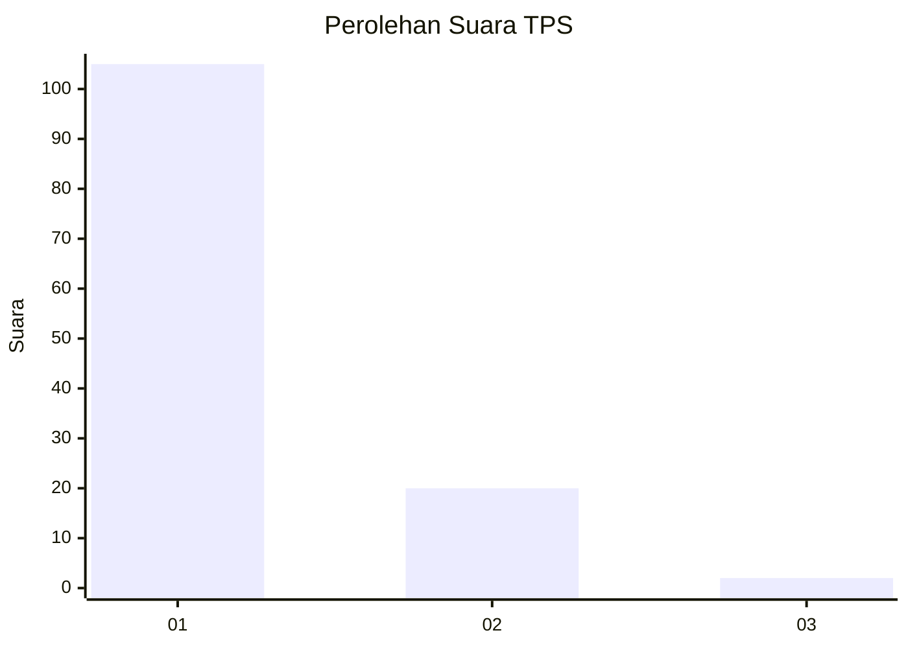
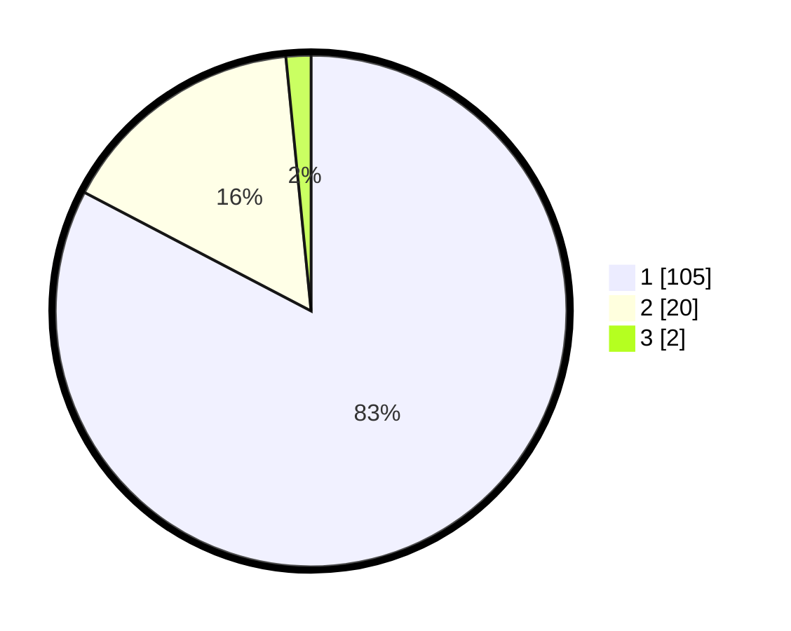

# Hasil

## Grafik

## Tabel

| No. | Nama Paslon    | Suara | Suara (raw) | Persentase |
|:--- |:-------------- | -----:| -----------:| ----------:|
| 1   | ANIES MUHAIMIN | 105   | [105][p-1]  | 82,68      |
| 2   | PRABOWO GIBRAN | 20    | [20][p-2]   | 15,75      |
| 3   | GANJAR MAHFUD  | 2     | [2][p-3]    | 1,57       |

[p-1]: https://github.com/gigit-pemilu/pemilu-2024-11-aceh/blob/main/pilpres/hitung-suara/sub/11-aceh/sub/08-aceh-utara/sub/04-lhoksukon/sub/2070-ulee-gunong/sub/001-tps/sub/paslon-1.txt
[p-2]: https://github.com/gigit-pemilu/pemilu-2024-11-aceh/blob/main/pilpres/hitung-suara/sub/11-aceh/sub/08-aceh-utara/sub/04-lhoksukon/sub/2070-ulee-gunong/sub/001-tps/sub/paslon-2.txt
[p-3]: https://github.com/gigit-pemilu/pemilu-2024-11-aceh/blob/main/pilpres/hitung-suara/sub/11-aceh/sub/08-aceh-utara/sub/04-lhoksukon/sub/2070-ulee-gunong/sub/001-tps/sub/paslon-3.txt

## Foto C Plano

https://sirekap-obj-formc.kpu.go.id/6eee/pemilu/ppwp/11/08/04/20/70/1108042070001-20240214-234340--74bc06ff-6ab1-4edf-b550-2ebe766c8d47.jpg

https://sirekap-obj-formc.kpu.go.id/6eee/pemilu/ppwp/11/08/04/20/70/1108042070001-20240215-000040--1b1af62e-c917-4767-ba28-5c462370cc85.jpg

https://sirekap-obj-formc.kpu.go.id/6eee/pemilu/ppwp/11/08/04/20/70/1108042070001-20240214-234910--05d6bd63-e226-4059-903f-113919de11aa.jpg

## Metadata

| Key        | Value               |
| ---------- | ------------------- |
| Time Stamp | 2024-02-15 17:00:25 |

