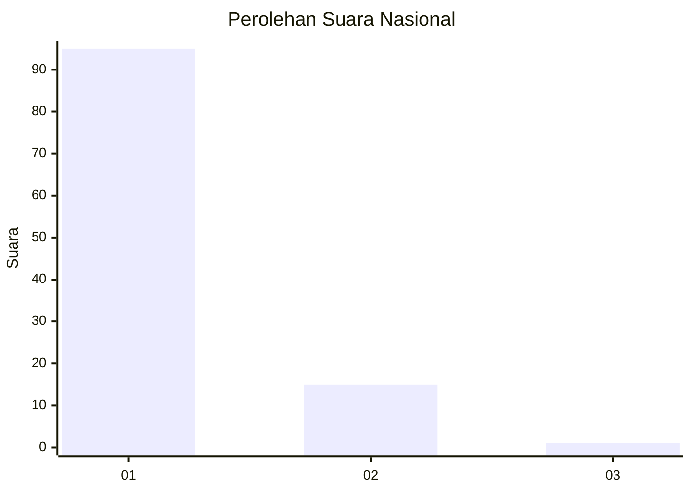
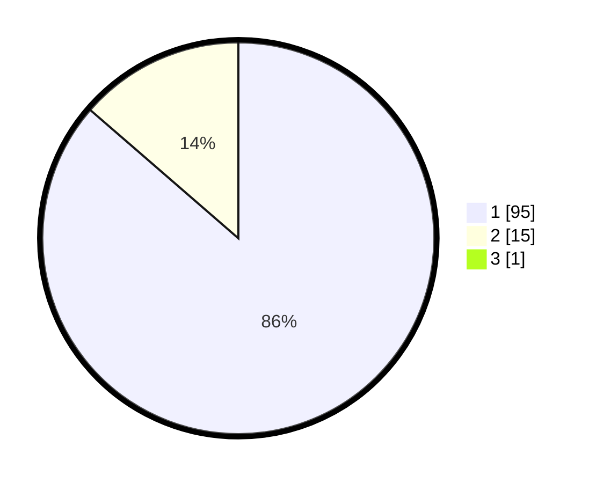

# Hasil

## Grafik

## Tabel

| No. | Nama Paslon    | Suara | Suara (raw) | Persentase |
|:--- |:-------------- | -----:| -----------:| ----------:|
| 1   | ANIES MUHAIMIN | 95    | [95][p-1]   | 85,59      |
| 2   | PRABOWO GIBRAN | 15    | [15][p-2]   | 13,51      |
| 3   | GANJAR MAHFUD  | 1     | [1][p-3]    | 0,90       |

[p-1]: https://github.com/gigit-pemilu/pemilu-2024/blob/main/pilpres/hitung-suara/sub/11-aceh/sub/08-aceh-utara/sub/04-lhoksukon/sub/2070-ulee-gunong/sub/002-tps/sub/paslon-1.txt
[p-2]: https://github.com/gigit-pemilu/pemilu-2024/blob/main/pilpres/hitung-suara/sub/11-aceh/sub/08-aceh-utara/sub/04-lhoksukon/sub/2070-ulee-gunong/sub/002-tps/sub/paslon-2.txt
[p-3]: https://github.com/gigit-pemilu/pemilu-2024/blob/main/pilpres/hitung-suara/sub/11-aceh/sub/08-aceh-utara/sub/04-lhoksukon/sub/2070-ulee-gunong/sub/002-tps/sub/paslon-3.txt

## Foto C Plano

https://sirekap-obj-formc.kpu.go.id/4ed1/pemilu/ppwp/11/08/04/20/70/1108042070002-20240215-014640--f10f9c39-2b66-4f01-ab58-fc5b5c1dbc45.jpg

https://sirekap-obj-formc.kpu.go.id/4ed1/pemilu/ppwp/11/08/04/20/70/1108042070002-20240215-015101--d8970b6d-2aa0-4f53-b1df-7ade3c3a792f.jpg

https://sirekap-obj-formc.kpu.go.id/4ed1/pemilu/ppwp/11/08/04/20/70/1108042070002-20240215-015517--a5cabe21-ee88-48a6-9a15-4350cac4ada7.jpg

## Metadata

| Key        | Value               |
| ---------- | ------------------- |
| Time Stamp | 2024-02-15 17:00:25 |

