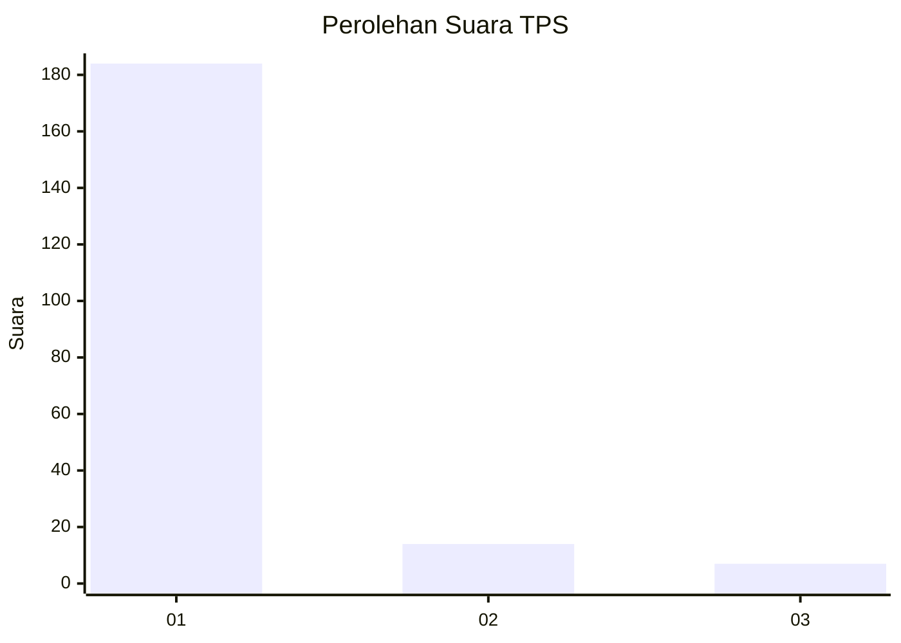
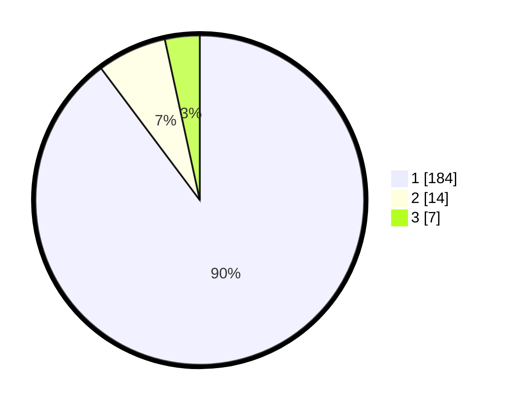

# Hasil

## Grafik

## Tabel

| No. | Nama Paslon    | Suara | Suara (raw) | Persentase |
|:--- |:-------------- | -----:| -----------:| ----------:|
| 1   | ANIES MUHAIMIN | 184   | [184][p-1]  | 89,76      |
| 2   | PRABOWO GIBRAN | 14    | [14][p-2]   | 6,83       |
| 3   | GANJAR MAHFUD  | 7     | [7][p-3]    | 3,41       |

[p-1]: https://github.com/gigit-pemilu/pemilu-2024-11-aceh/blob/main/pilpres/hitung-suara/sub/11-aceh/sub/08-aceh-utara/sub/04-lhoksukon/sub/2071-lhok-seuntang/sub/001-tps/sub/paslon-1.txt
[p-2]: https://github.com/gigit-pemilu/pemilu-2024-11-aceh/blob/main/pilpres/hitung-suara/sub/11-aceh/sub/08-aceh-utara/sub/04-lhoksukon/sub/2071-lhok-seuntang/sub/001-tps/sub/paslon-2.txt
[p-3]: https://github.com/gigit-pemilu/pemilu-2024-11-aceh/blob/main/pilpres/hitung-suara/sub/11-aceh/sub/08-aceh-utara/sub/04-lhoksukon/sub/2071-lhok-seuntang/sub/001-tps/sub/paslon-3.txt

## Foto C Plano

https://sirekap-obj-formc.kpu.go.id/f7e7/pemilu/ppwp/11/08/04/20/71/1108042071001-20240214-232327--aeb37058-90e3-4859-9dad-f962456a5463.jpg

https://sirekap-obj-formc.kpu.go.id/f7e7/pemilu/ppwp/11/08/04/20/71/1108042071001-20240214-232308--744773d7-3e3c-485f-a217-fb268dca1a4b.jpg

https://sirekap-obj-formc.kpu.go.id/f7e7/pemilu/ppwp/11/08/04/20/71/1108042071001-20240214-232248--646214da-a3c3-4bbe-9b79-774f1bca1742.jpg

## Metadata

| Key        | Value               |
| ---------- | ------------------- |
| Time Stamp | 2024-02-24 22:31:28 |

