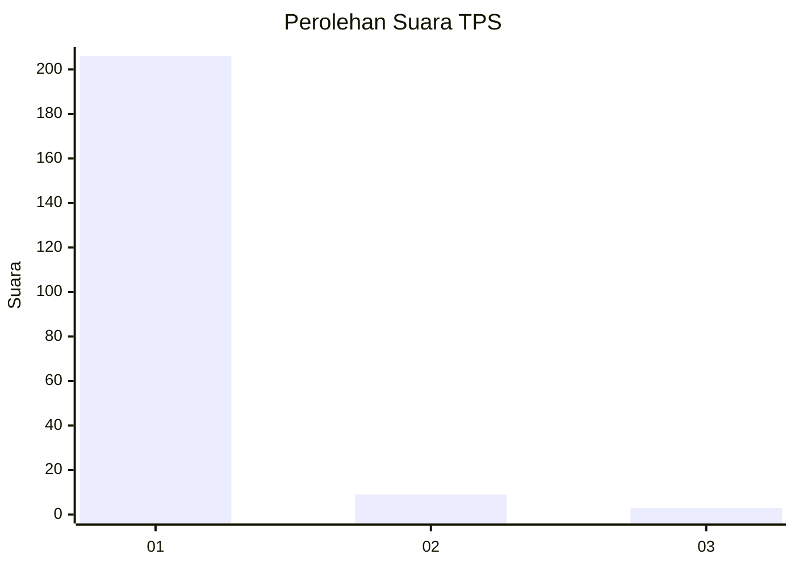
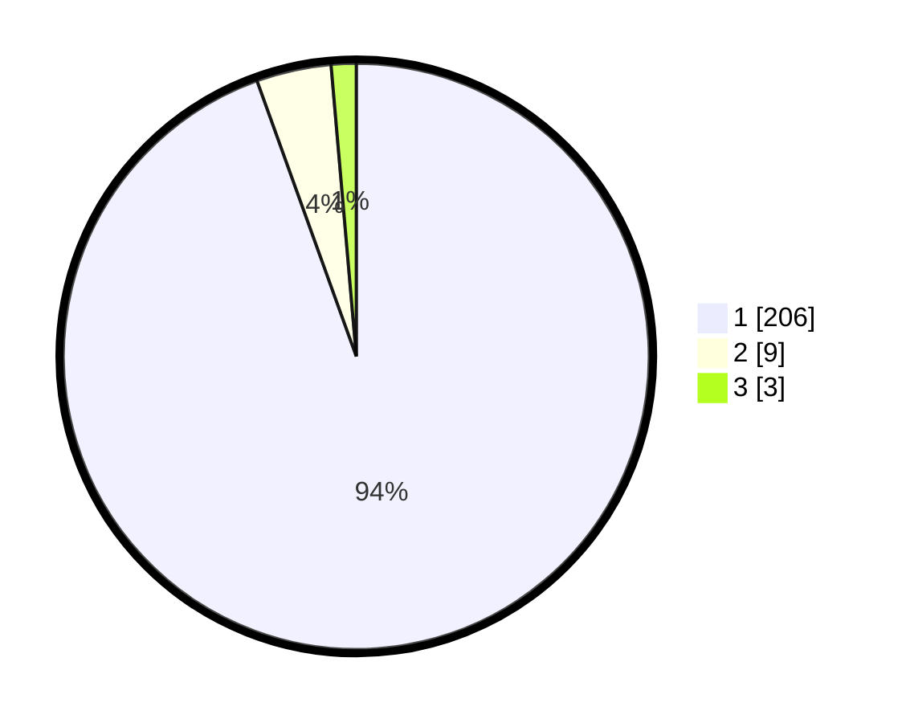

# Hasil

## Grafik

## Tabel

| No. | Nama Paslon    | Suara | Suara (raw) | Persentase |
|:--- |:-------------- | -----:| -----------:| ----------:|
| 1   | ANIES MUHAIMIN | 206   | [206][p-1]  | 94,50      |
| 2   | PRABOWO GIBRAN | 9     | [9][p-2]    | 4,13       |
| 3   | GANJAR MAHFUD  | 3     | [3][p-3]    | 1,38       |

[p-1]: https://github.com/gigit-pemilu/pemilu-2024-11-aceh/blob/main/pilpres/hitung-suara/sub/11-aceh/sub/08-aceh-utara/sub/04-lhoksukon/sub/2072-alue-itam-baroh/sub/001-tps/sub/paslon-1.txt
[p-2]: https://github.com/gigit-pemilu/pemilu-2024-11-aceh/blob/main/pilpres/hitung-suara/sub/11-aceh/sub/08-aceh-utara/sub/04-lhoksukon/sub/2072-alue-itam-baroh/sub/001-tps/sub/paslon-2.txt
[p-3]: https://github.com/gigit-pemilu/pemilu-2024-11-aceh/blob/main/pilpres/hitung-suara/sub/11-aceh/sub/08-aceh-utara/sub/04-lhoksukon/sub/2072-alue-itam-baroh/sub/001-tps/sub/paslon-3.txt

## Foto C Plano

https://sirekap-obj-formc.kpu.go.id/9b95/pemilu/ppwp/11/08/04/20/72/1108042072001-20240215-013636--079eb20c-a122-4ef3-b933-20922d0397bd.jpg

https://sirekap-obj-formc.kpu.go.id/9b95/pemilu/ppwp/11/08/04/20/72/1108042072001-20240215-013752--19b574b3-cff3-4a75-b0e1-e6fde69563d3.jpg

https://sirekap-obj-formc.kpu.go.id/9b95/pemilu/ppwp/11/08/04/20/72/1108042072001-20240215-013840--86292176-d12f-4ddc-9169-8cac277a1e05.jpg

## Metadata

| Key        | Value               |
| ---------- | ------------------- |
| Time Stamp | 2024-02-16 23:00:00 |

