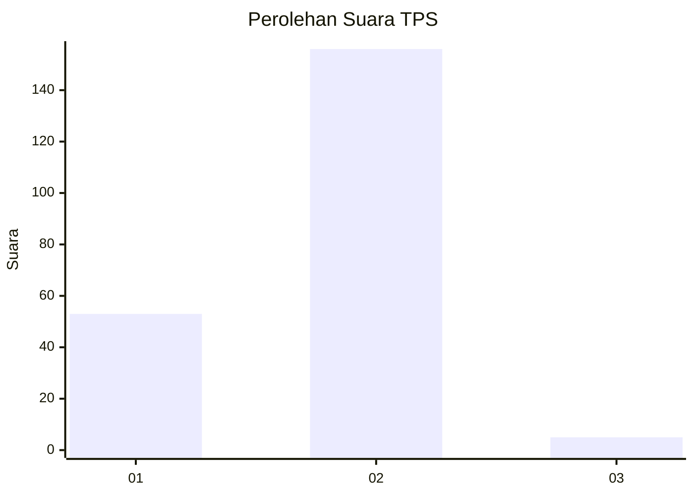
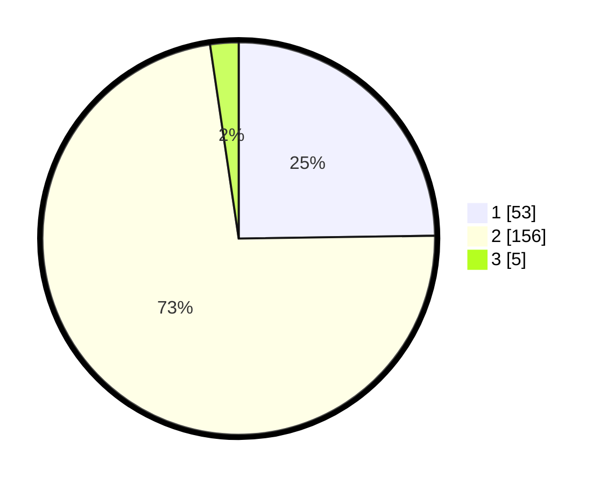

# Hasil

## Grafik

## Tabel

| No. | Nama Paslon    | Suara | Suara (raw) | Persentase |
|:--- |:-------------- | -----:| -----------:| ----------:|
| 1   | ANIES MUHAIMIN | 53    | [53][p-1]   | 24,77      |
| 2   | PRABOWO GIBRAN | 156   | [156][p-2]  | 72,90      |
| 3   | GANJAR MAHFUD  | 5     | [5][p-3]    | 2,34       |

[p-1]: https://github.com/gigit-pemilu/pemilu-2024-11-aceh/blob/main/pilpres/hitung-suara/sub/11-aceh/sub/08-aceh-utara/sub/04-lhoksukon/sub/2075-buket-hagu/sub/001-tps/sub/paslon-1.txt
[p-2]: https://github.com/gigit-pemilu/pemilu-2024-11-aceh/blob/main/pilpres/hitung-suara/sub/11-aceh/sub/08-aceh-utara/sub/04-lhoksukon/sub/2075-buket-hagu/sub/001-tps/sub/paslon-2.txt
[p-3]: https://github.com/gigit-pemilu/pemilu-2024-11-aceh/blob/main/pilpres/hitung-suara/sub/11-aceh/sub/08-aceh-utara/sub/04-lhoksukon/sub/2075-buket-hagu/sub/001-tps/sub/paslon-3.txt

## Foto C Plano

https://sirekap-obj-formc.kpu.go.id/b4bd/pemilu/ppwp/11/08/04/20/75/1108042075001-20240215-064533--9db48356-ecf9-46bb-904d-c97c45304455.jpg

https://sirekap-obj-formc.kpu.go.id/b4bd/pemilu/ppwp/11/08/04/20/75/1108042075001-20240215-064832--05b94807-e95a-4b7b-b864-d73b54bd2d4b.jpg

https://sirekap-obj-formc.kpu.go.id/b4bd/pemilu/ppwp/11/08/04/20/75/1108042075001-20240215-064953--a8902cf2-48bf-4e73-a2e9-1bc6c5f98739.jpg

## Metadata

| Key        | Value               |
| ---------- | ------------------- |
| Time Stamp | 2024-02-16 23:30:00 |

