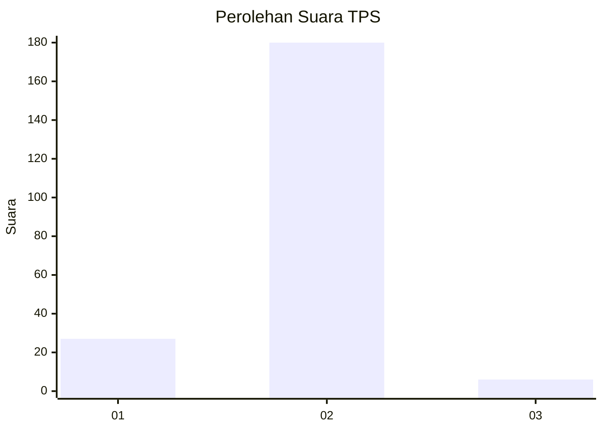
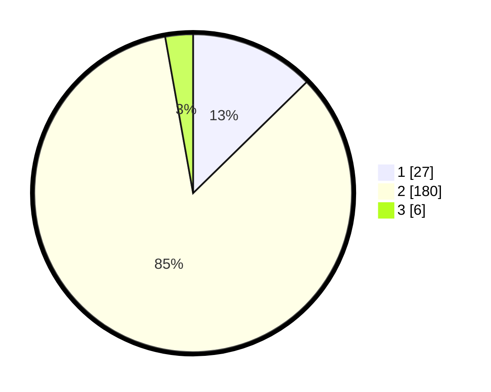

# Hasil

## Grafik

## Tabel

| No. | Nama Paslon    | Suara | Suara (raw) | Persentase |
|:--- |:-------------- | -----:| -----------:| ----------:|
| 1   | ANIES MUHAIMIN | 27    | [27][p-1]   | 12,68      |
| 2   | PRABOWO GIBRAN | 180   | [180][p-2]  | 84,51      |
| 3   | GANJAR MAHFUD  | 6     | [6][p-3]    | 2,82       |

[p-1]: https://github.com/gigit-pemilu/pemilu-2024-11-aceh/blob/main/pilpres/hitung-suara/sub/11-aceh/sub/08-aceh-utara/sub/04-lhoksukon/sub/2075-buket-hagu/sub/002-tps/sub/paslon-1.txt
[p-2]: https://github.com/gigit-pemilu/pemilu-2024-11-aceh/blob/main/pilpres/hitung-suara/sub/11-aceh/sub/08-aceh-utara/sub/04-lhoksukon/sub/2075-buket-hagu/sub/002-tps/sub/paslon-2.txt
[p-3]: https://github.com/gigit-pemilu/pemilu-2024-11-aceh/blob/main/pilpres/hitung-suara/sub/11-aceh/sub/08-aceh-utara/sub/04-lhoksukon/sub/2075-buket-hagu/sub/002-tps/sub/paslon-3.txt

## Foto C Plano

https://sirekap-obj-formc.kpu.go.id/eafd/pemilu/ppwp/11/08/04/20/75/1108042075002-20240215-091359--ebe13cb3-851f-4d4f-88f6-28ee23b4126b.jpg

https://sirekap-obj-formc.kpu.go.id/eafd/pemilu/ppwp/11/08/04/20/75/1108042075002-20240215-091628--7b87f15c-cf36-433b-a840-91814a75d259.jpg

https://sirekap-obj-formc.kpu.go.id/eafd/pemilu/ppwp/11/08/04/20/75/1108042075002-20240215-091754--0707e257-237d-4df3-82e9-4c7458ca08b8.jpg

## Metadata

| Key        | Value               |
| ---------- | ------------------- |
| Time Stamp | 2024-02-15 17:00:25 |

