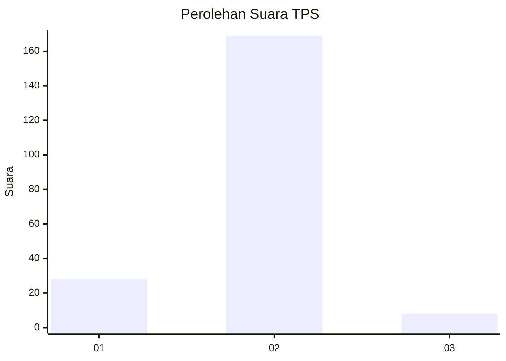
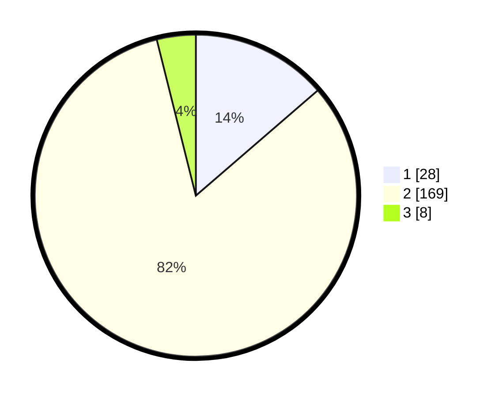

# Hasil

## Grafik

## Tabel

| No. | Nama Paslon    | Suara | Suara (raw) | Persentase |
|:--- |:-------------- | -----:| -----------:| ----------:|
| 1   | ANIES MUHAIMIN | 28    | [28][p-1]   | 13,66      |
| 2   | PRABOWO GIBRAN | 169   | [169][p-2]  | 82,44      |
| 3   | GANJAR MAHFUD  | 8     | [8][p-3]    | 3,90       |

[p-1]: https://github.com/gigit-pemilu/pemilu-2024-11-aceh/blob/main/pilpres/hitung-suara/sub/11-aceh/sub/08-aceh-utara/sub/04-lhoksukon/sub/2075-buket-hagu/sub/004-tps/sub/paslon-1.txt
[p-2]: https://github.com/gigit-pemilu/pemilu-2024-11-aceh/blob/main/pilpres/hitung-suara/sub/11-aceh/sub/08-aceh-utara/sub/04-lhoksukon/sub/2075-buket-hagu/sub/004-tps/sub/paslon-2.txt
[p-3]: https://github.com/gigit-pemilu/pemilu-2024-11-aceh/blob/main/pilpres/hitung-suara/sub/11-aceh/sub/08-aceh-utara/sub/04-lhoksukon/sub/2075-buket-hagu/sub/004-tps/sub/paslon-3.txt

## Foto C Plano

https://sirekap-obj-formc.kpu.go.id/b003/pemilu/ppwp/11/08/04/20/75/1108042075004-20240215-084400--0af4bcd9-e14e-4654-b38f-0561bfa6f408.jpg

https://sirekap-obj-formc.kpu.go.id/b003/pemilu/ppwp/11/08/04/20/75/1108042075004-20240215-084536--eb00c6a2-3a64-46fc-bb51-03953e148eb8.jpg

https://sirekap-obj-formc.kpu.go.id/b003/pemilu/ppwp/11/08/04/20/75/1108042075004-20240215-084709--b477a70e-172a-4fb1-94cb-92c37cebc660.jpg

## Metadata

| Key        | Value               |
| ---------- | ------------------- |
| Time Stamp | 2024-02-15 21:01:18 |

