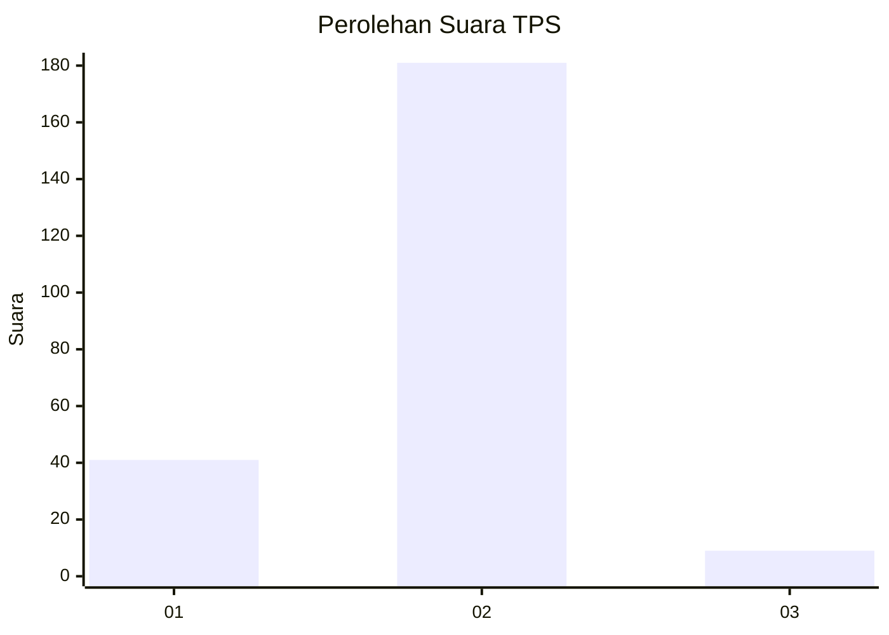
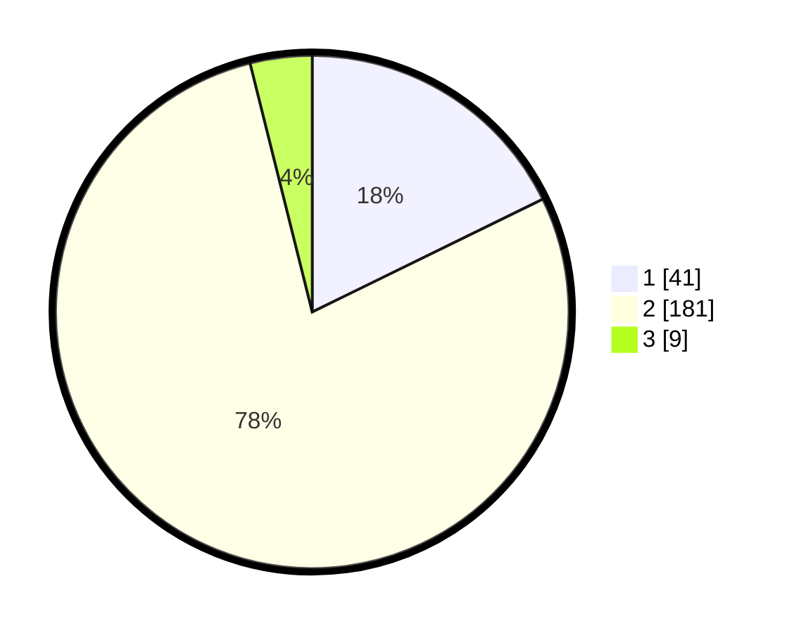

# Hasil

## Grafik

## Tabel

| No. | Nama Paslon    | Suara | Suara (raw) | Persentase |
|:--- |:-------------- | -----:| -----------:| ----------:|
| 1   | ANIES MUHAIMIN | 41    | [41][p-1]   | 17,75      |
| 2   | PRABOWO GIBRAN | 181   | [181][p-2]  | 78,35      |
| 3   | GANJAR MAHFUD  | 9     | [9][p-3]    | 3,90       |

[p-1]: https://github.com/gigit-pemilu/pemilu-2024-11-aceh/blob/main/pilpres/hitung-suara/sub/11-aceh/sub/08-aceh-utara/sub/04-lhoksukon/sub/2075-buket-hagu/sub/005-tps/sub/paslon-1.txt
[p-2]: https://github.com/gigit-pemilu/pemilu-2024-11-aceh/blob/main/pilpres/hitung-suara/sub/11-aceh/sub/08-aceh-utara/sub/04-lhoksukon/sub/2075-buket-hagu/sub/005-tps/sub/paslon-2.txt
[p-3]: https://github.com/gigit-pemilu/pemilu-2024-11-aceh/blob/main/pilpres/hitung-suara/sub/11-aceh/sub/08-aceh-utara/sub/04-lhoksukon/sub/2075-buket-hagu/sub/005-tps/sub/paslon-3.txt

## Foto C Plano

https://sirekap-obj-formc.kpu.go.id/5898/pemilu/ppwp/11/08/04/20/75/1108042075005-20240215-101340--64c670f6-578b-429f-9df4-bad758f3e26b.jpg

https://sirekap-obj-formc.kpu.go.id/5898/pemilu/ppwp/11/08/04/20/75/1108042075005-20240215-101522--2abd49ec-2a8d-4fbd-9625-38bd9728be40.jpg

https://sirekap-obj-formc.kpu.go.id/5898/pemilu/ppwp/11/08/04/20/75/1108042075005-20240215-101643--501a97f2-2775-4302-a7ff-89e905554a17.jpg

## Metadata

| Key        | Value               |
| ---------- | ------------------- |
| Time Stamp | 2024-02-15 17:00:25 |

