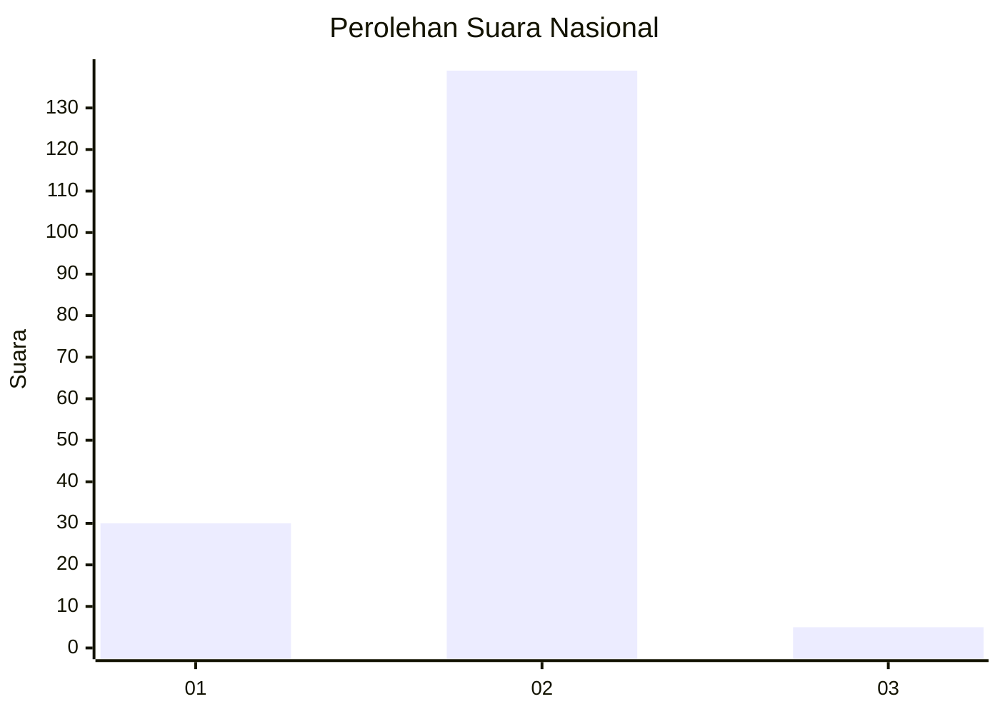
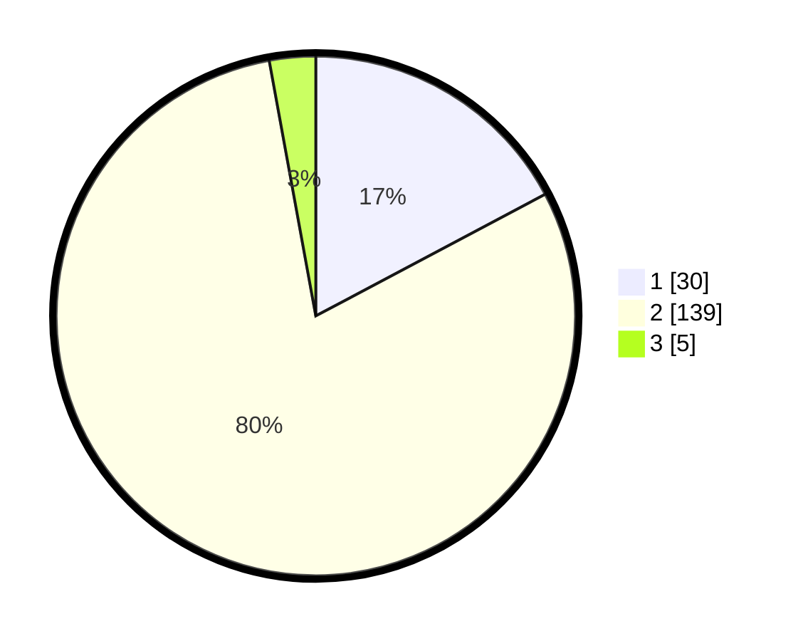

# Hasil

## Grafik

## Tabel

| No. | Nama Paslon    | Suara | Suara (raw) | Persentase |
|:--- |:-------------- | -----:| -----------:| ----------:|
| 1   | ANIES MUHAIMIN | 30    | [30][p-1]   | 17,24      |
| 2   | PRABOWO GIBRAN | 139   | [139][p-2]  | 79,89      |
| 3   | GANJAR MAHFUD  | 5     | [5][p-3]    | 2,87       |

[p-1]: https://github.com/gigit-pemilu/pemilu-2024/blob/main/pilpres/hitung-suara/sub/11-aceh/sub/08-aceh-utara/sub/04-lhoksukon/sub/2075-buket-hagu/sub/007-tps/sub/paslon-1.txt
[p-2]: https://github.com/gigit-pemilu/pemilu-2024/blob/main/pilpres/hitung-suara/sub/11-aceh/sub/08-aceh-utara/sub/04-lhoksukon/sub/2075-buket-hagu/sub/007-tps/sub/paslon-2.txt
[p-3]: https://github.com/gigit-pemilu/pemilu-2024/blob/main/pilpres/hitung-suara/sub/11-aceh/sub/08-aceh-utara/sub/04-lhoksukon/sub/2075-buket-hagu/sub/007-tps/sub/paslon-3.txt

## Foto C Plano

https://sirekap-obj-formc.kpu.go.id/fe51/pemilu/ppwp/11/08/04/20/75/1108042075007-20240215-093747--98108ea8-938c-48b8-bc35-b615b45b829f.jpg

https://sirekap-obj-formc.kpu.go.id/fe51/pemilu/ppwp/11/08/04/20/75/1108042075007-20240215-093936--25a843ad-20f5-43b5-a1ce-835c695b4cc2.jpg

https://sirekap-obj-formc.kpu.go.id/fe51/pemilu/ppwp/11/08/04/20/75/1108042075007-20240215-094053--28a0d325-f25d-4d2d-9ee8-46fa5c0434a2.jpg

## Metadata

| Key        | Value               |
| ---------- | ------------------- |
| Time Stamp | 2024-02-15 18:00:26 |

