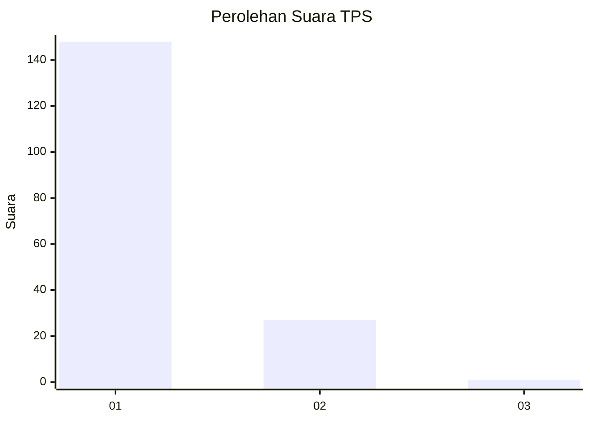
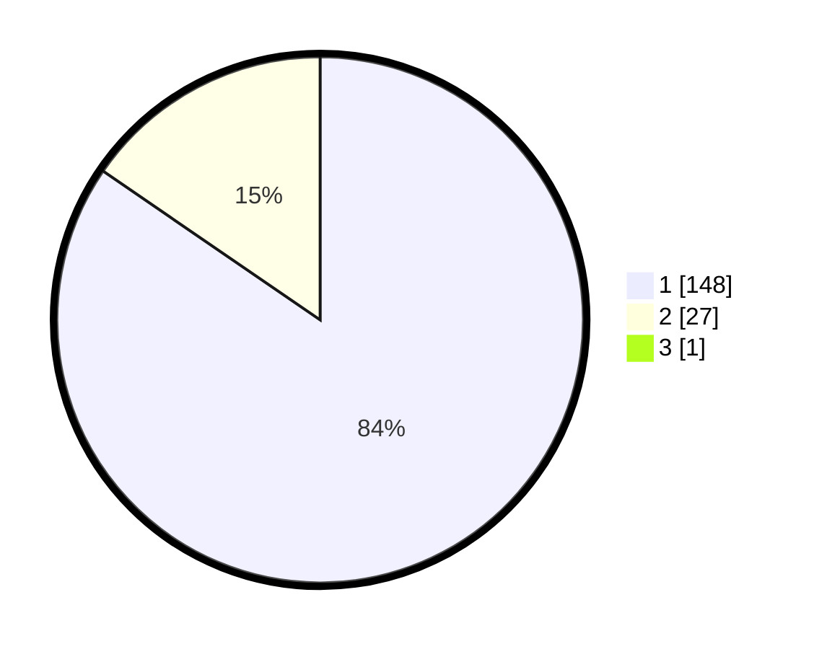

# Hasil

## Grafik

## Tabel

| No. | Nama Paslon    | Suara | Suara (raw) | Persentase |
|:--- |:-------------- | -----:| -----------:| ----------:|
| 1   | ANIES MUHAIMIN | 148   | [148][p-1]  | 84,09      |
| 2   | PRABOWO GIBRAN | 27    | [27][p-2]   | 15,34      |
| 3   | GANJAR MAHFUD  | 1     | [1][p-3]    | 0,57       |

[p-1]: https://github.com/gigit-pemilu/pemilu-2024-11-aceh/blob/main/pilpres/hitung-suara/sub/11-aceh/sub/08-aceh-utara/sub/05-matangkuli/sub/2002-ude/sub/002-tps/sub/paslon-1.txt
[p-2]: https://github.com/gigit-pemilu/pemilu-2024-11-aceh/blob/main/pilpres/hitung-suara/sub/11-aceh/sub/08-aceh-utara/sub/05-matangkuli/sub/2002-ude/sub/002-tps/sub/paslon-2.txt
[p-3]: https://github.com/gigit-pemilu/pemilu-2024-11-aceh/blob/main/pilpres/hitung-suara/sub/11-aceh/sub/08-aceh-utara/sub/05-matangkuli/sub/2002-ude/sub/002-tps/sub/paslon-3.txt

## Foto C Plano

https://sirekap-obj-formc.kpu.go.id/4940/pemilu/ppwp/11/08/05/20/02/1108052002002-20240214-203438--5c941c77-7b18-49db-9c1c-46c5bd61c51d.jpg

https://sirekap-obj-formc.kpu.go.id/4940/pemilu/ppwp/11/08/05/20/02/1108052002002-20240214-203445--43180a55-4f25-414e-9f7d-f77d5c776dfd.jpg

https://sirekap-obj-formc.kpu.go.id/4940/pemilu/ppwp/11/08/05/20/02/1108052002002-20240214-203450--c2d5cc27-014d-4406-aac4-2d6e0fb4680d.jpg

## Metadata

| Key        | Value               |
| ---------- | ------------------- |
| Time Stamp | 2024-02-15 00:41:44 |

## DATA PEMILIH TETAP

Jumlah pemilih dalam DPT: **199**.
 * L: **91**.
 * P: **108**.

## DATA PENGGUNA HAK PILIH

Jumlah pengguna hak pilih dalam DPT: **169**.
 * L: **72**.
 * P: **97**.

Jumlah pengguna hak pilih dalam DPTb: **0**.
 * L: **0**.
 * P: **0**.

Jumlah pengguna hak pilih dalam DPK: **7**.
 * L: **0**.
 * P: **7**.

Jumlah pengguna hak pilih: **176**.
 * L: **72**.
 * P: **104**.

## JUMLAH SUARA SAH DAN TIDAK SAH

JUMLAH SELURUH SUARA SAH: **176**.

JUMLAH SUARA TIDAK SAH: **0**.

JUMLAH SELURUH SUARA SAH DAN SUARA TIDAK SAH: **176**.

