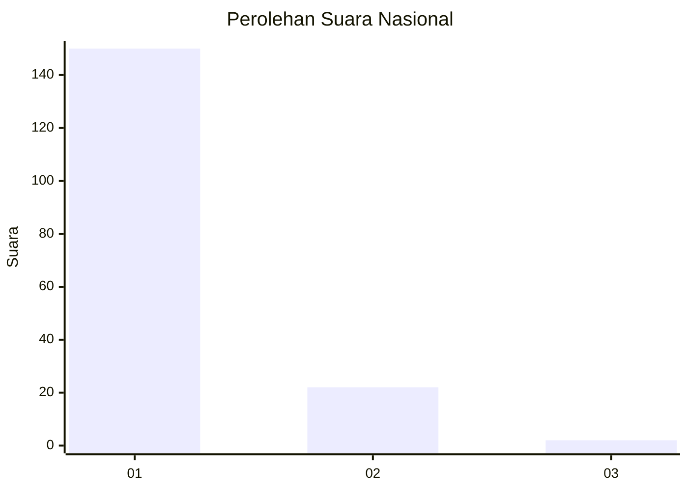
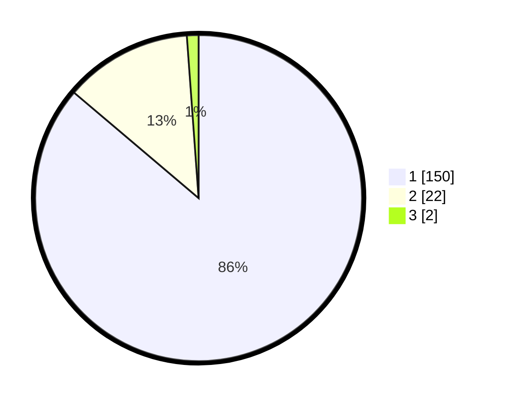

# Hasil

## Grafik

## Tabel

| No. | Nama Paslon    | Suara | Suara (raw) | Persentase |
|:--- |:-------------- | -----:| -----------:| ----------:|
| 1   | ANIES MUHAIMIN | 150   | [150][p-1]  | 86,21      |
| 2   | PRABOWO GIBRAN | 22    | [22][p-2]   | 12,64      |
| 3   | GANJAR MAHFUD  | 2     | [2][p-3]    | 1,15       |

[p-1]: https://github.com/gigit-pemilu/pemilu-2024/blob/main/pilpres/hitung-suara/sub/11-aceh/sub/08-aceh-utara/sub/05-matangkuli/sub/2003-blang-matangkuli/sub/001-tps/sub/paslon-1.txt
[p-2]: https://github.com/gigit-pemilu/pemilu-2024/blob/main/pilpres/hitung-suara/sub/11-aceh/sub/08-aceh-utara/sub/05-matangkuli/sub/2003-blang-matangkuli/sub/001-tps/sub/paslon-2.txt
[p-3]: https://github.com/gigit-pemilu/pemilu-2024/blob/main/pilpres/hitung-suara/sub/11-aceh/sub/08-aceh-utara/sub/05-matangkuli/sub/2003-blang-matangkuli/sub/001-tps/sub/paslon-3.txt

## Foto C Plano

https://sirekap-obj-formc.kpu.go.id/d69b/pemilu/ppwp/11/08/05/20/03/1108052003001-20240215-054320--90326242-2761-4df6-ac26-abfd2d3edda0.jpg

https://sirekap-obj-formc.kpu.go.id/d69b/pemilu/ppwp/11/08/05/20/03/1108052003001-20240215-054441--1b9d5b96-3a08-40df-85da-f47e45f48c18.jpg

https://sirekap-obj-formc.kpu.go.id/d69b/pemilu/ppwp/11/08/05/20/03/1108052003001-20240215-054542--d6bfc564-e433-46f0-be87-f151aa564407.jpg

## Metadata

| Key        | Value               |
| ---------- | ------------------- |
| Time Stamp | 2024-02-16 12:51:22 |

