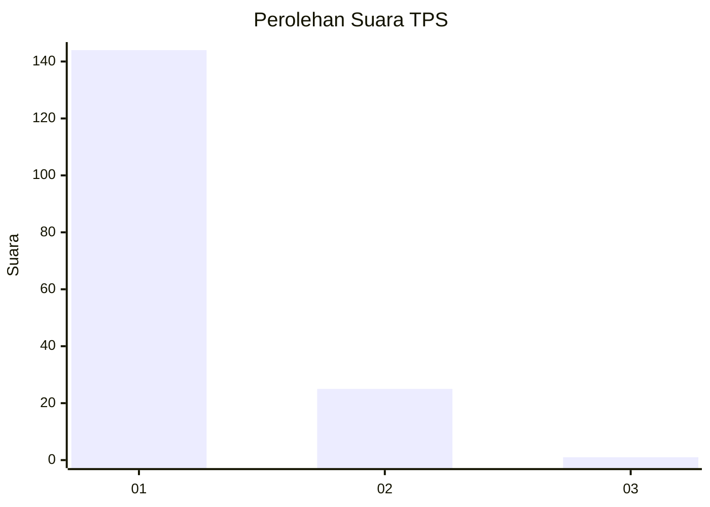
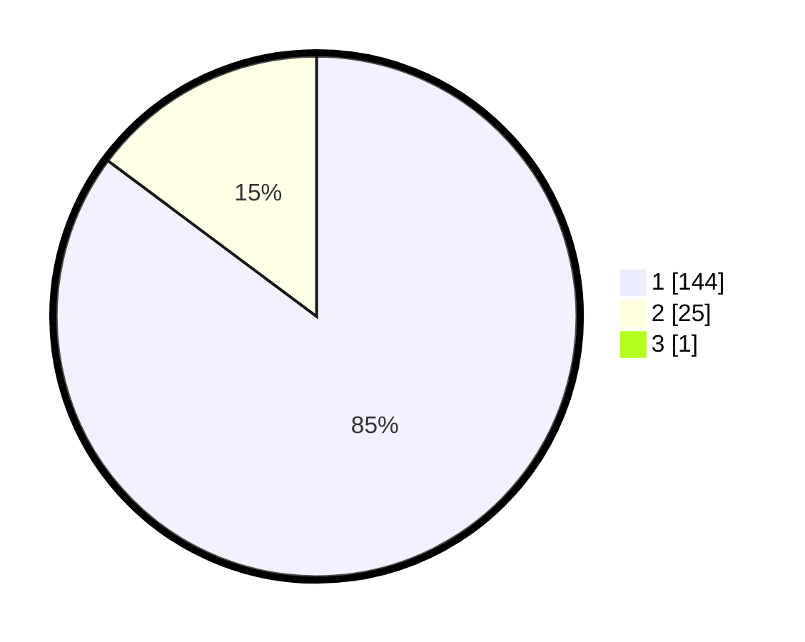

# Hasil

## Grafik

## Tabel

| No. | Nama Paslon    | Suara | Suara (raw) | Persentase |
|:--- |:-------------- | -----:| -----------:| ----------:|
| 1   | ANIES MUHAIMIN | 144   | [144][p-1]  | 84,71      |
| 2   | PRABOWO GIBRAN | 25    | [25][p-2]   | 14,71      |
| 3   | GANJAR MAHFUD  | 1     | [1][p-3]    | 0,59       |

[p-1]: https://github.com/gigit-pemilu/pemilu-2024-11-aceh/blob/main/pilpres/hitung-suara/sub/11-aceh/sub/08-aceh-utara/sub/05-matangkuli/sub/2003-blang-matangkuli/sub/002-tps/sub/paslon-1.txt
[p-2]: https://github.com/gigit-pemilu/pemilu-2024-11-aceh/blob/main/pilpres/hitung-suara/sub/11-aceh/sub/08-aceh-utara/sub/05-matangkuli/sub/2003-blang-matangkuli/sub/002-tps/sub/paslon-2.txt
[p-3]: https://github.com/gigit-pemilu/pemilu-2024-11-aceh/blob/main/pilpres/hitung-suara/sub/11-aceh/sub/08-aceh-utara/sub/05-matangkuli/sub/2003-blang-matangkuli/sub/002-tps/sub/paslon-3.txt

## Foto C Plano

https://sirekap-obj-formc.kpu.go.id/0907/pemilu/ppwp/11/08/05/20/03/1108052003002-20240215-054140--366bd631-b04a-4e12-884f-7e44cecdcb16.jpg

https://sirekap-obj-formc.kpu.go.id/0907/pemilu/ppwp/11/08/05/20/03/1108052003002-20240215-054337--c24f19d4-6c91-4a1a-96b0-1e8843d3eb27.jpg

https://sirekap-obj-formc.kpu.go.id/0907/pemilu/ppwp/11/08/05/20/03/1108052003002-20240215-054350--3acdbea0-0317-4c4e-ad1a-02e2dd708972.jpg

## Metadata

| Key        | Value               |
| ---------- | ------------------- |
| Time Stamp | 2024-02-17 00:28:35 |

