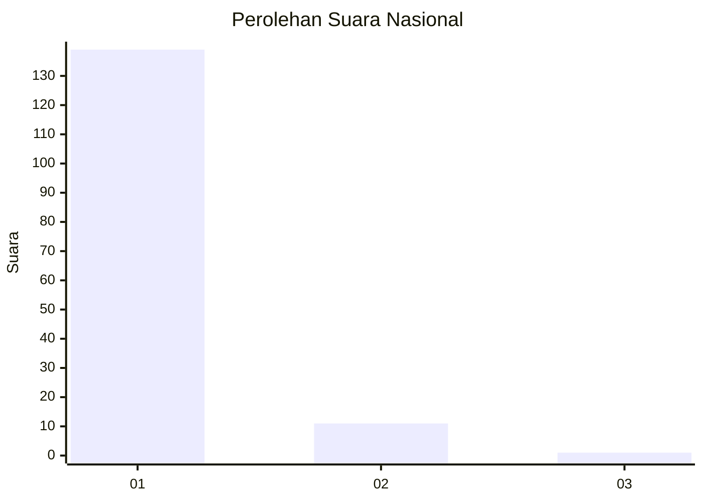
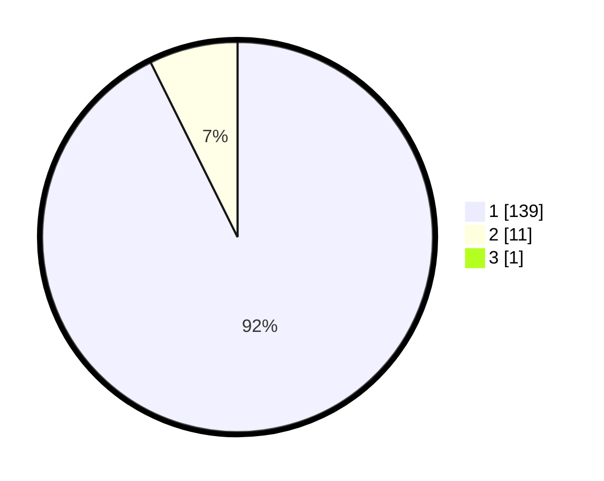

# Hasil

## Grafik

## Tabel

| No. | Nama Paslon    | Suara | Suara (raw) | Persentase |
|:--- |:-------------- | -----:| -----------:| ----------:|
| 1   | ANIES MUHAIMIN | 139   | [139][p-1]  | 92,05      |
| 2   | PRABOWO GIBRAN | 11    | [11][p-2]   | 7,28       |
| 3   | GANJAR MAHFUD  | 1     | [1][p-3]    | 0,66       |

[p-1]: https://github.com/gigit-pemilu/pemilu-2024/blob/main/pilpres/hitung-suara/sub/11-aceh/sub/08-aceh-utara/sub/05-matangkuli/sub/2009-punti-geulumpang-vii/sub/001-tps/sub/paslon-1.txt
[p-2]: https://github.com/gigit-pemilu/pemilu-2024/blob/main/pilpres/hitung-suara/sub/11-aceh/sub/08-aceh-utara/sub/05-matangkuli/sub/2009-punti-geulumpang-vii/sub/001-tps/sub/paslon-2.txt
[p-3]: https://github.com/gigit-pemilu/pemilu-2024/blob/main/pilpres/hitung-suara/sub/11-aceh/sub/08-aceh-utara/sub/05-matangkuli/sub/2009-punti-geulumpang-vii/sub/001-tps/sub/paslon-3.txt

## Foto C Plano

https://sirekap-obj-formc.kpu.go.id/1106/pemilu/ppwp/11/08/05/20/09/1108052009001-20240214-203114--fe93d671-7ec5-4d8d-a11e-4d5927fb4211.jpg

https://sirekap-obj-formc.kpu.go.id/1106/pemilu/ppwp/11/08/05/20/09/1108052009001-20240214-203441--23f89327-dc09-4cc0-95d7-e41ff4b7d440.jpg

https://sirekap-obj-formc.kpu.go.id/1106/pemilu/ppwp/11/08/05/20/09/1108052009001-20240214-203619--aa1da703-e9a6-41b8-bd72-7cd0f46841c8.jpg

## Metadata

| Key        | Value               |
| ---------- | ------------------- |
| Time Stamp | 2024-02-14 21:46:01 |

