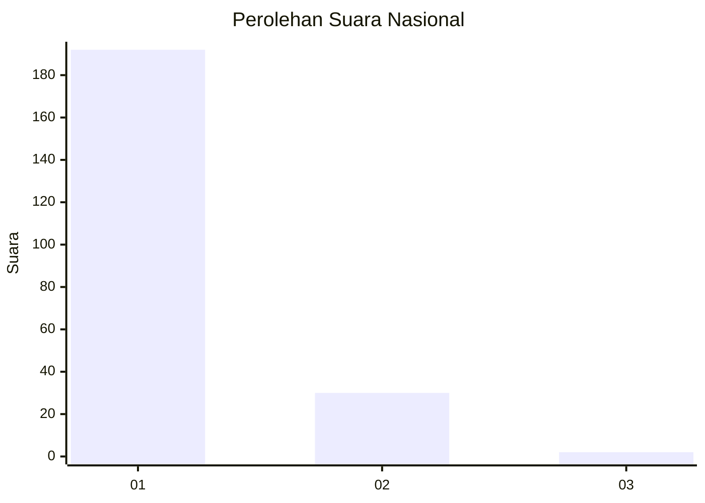
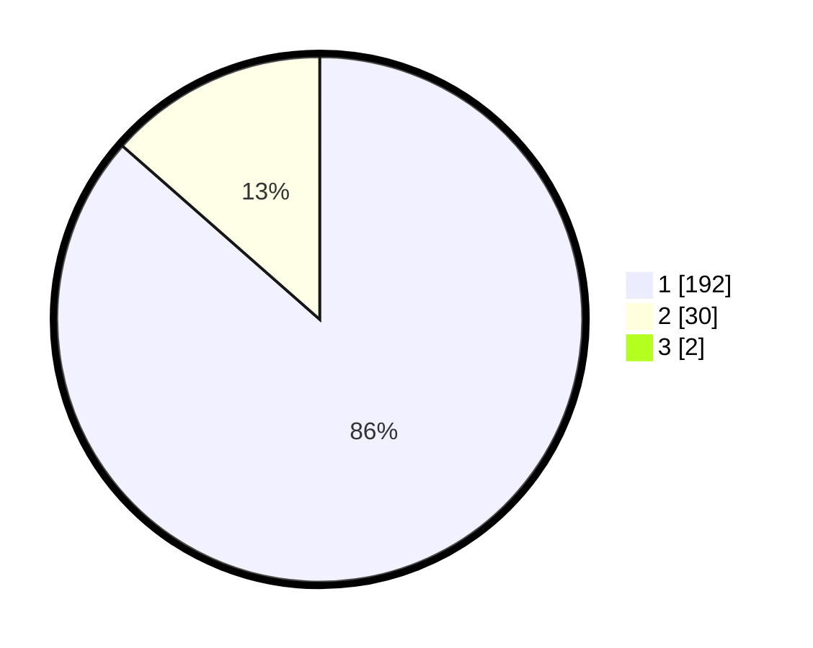

# Hasil

## Grafik

## Tabel

| No. | Nama Paslon    | Suara | Suara (raw) | Persentase |
|:--- |:-------------- | -----:| -----------:| ----------:|
| 1   | ANIES MUHAIMIN | 192   | [192][p-1]  | 85,71      |
| 2   | PRABOWO GIBRAN | 30    | [30][p-2]   | 13,39      |
| 3   | GANJAR MAHFUD  | 2     | [2][p-3]    | 0,89       |

[p-1]: https://github.com/gigit-pemilu/pemilu-2024/blob/main/pilpres/hitung-suara/sub/11-aceh/sub/08-aceh-utara/sub/05-matangkuli/sub/2014-parang-sikureung/sub/001-tps/sub/paslon-1.txt
[p-2]: https://github.com/gigit-pemilu/pemilu-2024/blob/main/pilpres/hitung-suara/sub/11-aceh/sub/08-aceh-utara/sub/05-matangkuli/sub/2014-parang-sikureung/sub/001-tps/sub/paslon-2.txt
[p-3]: https://github.com/gigit-pemilu/pemilu-2024/blob/main/pilpres/hitung-suara/sub/11-aceh/sub/08-aceh-utara/sub/05-matangkuli/sub/2014-parang-sikureung/sub/001-tps/sub/paslon-3.txt

## Foto C Plano

https://sirekap-obj-formc.kpu.go.id/ab05/pemilu/ppwp/11/08/05/20/14/1108052014001-20240215-023058--f6ca1555-0398-481d-bce5-dda98527f48e.jpg

https://sirekap-obj-formc.kpu.go.id/ab05/pemilu/ppwp/11/08/05/20/14/1108052014001-20240215-023202--2a16076a-5e2e-4af4-988a-8f25ba9d67cb.jpg

https://sirekap-obj-formc.kpu.go.id/ab05/pemilu/ppwp/11/08/05/20/14/1108052014001-20240215-024536--5aaf3af0-962c-4b74-96a3-3d58c310d92e.jpg

## Metadata

| Key        | Value               |
| ---------- | ------------------- |
| Time Stamp | 2024-02-15 15:30:25 |

