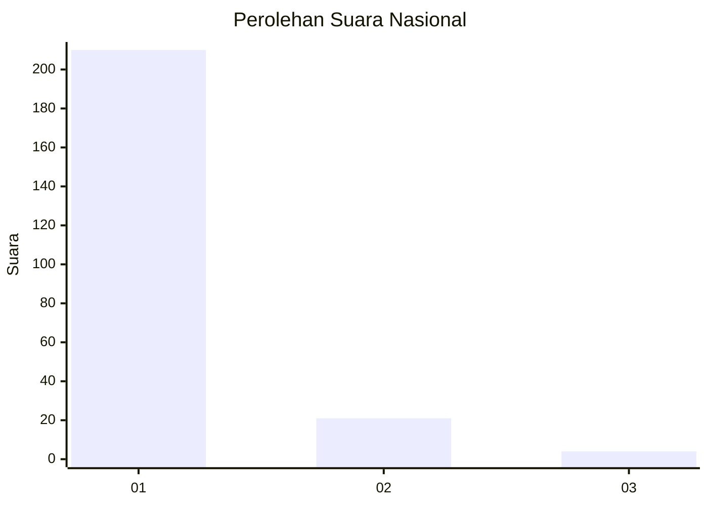
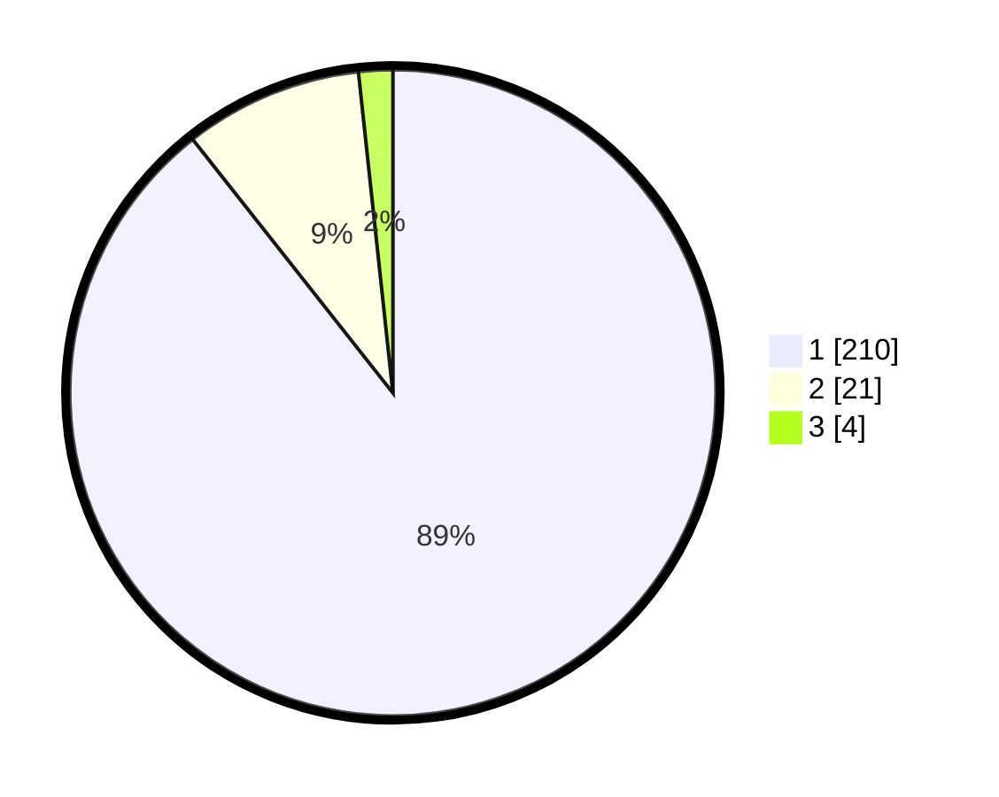

# Hasil

## Grafik

## Tabel

| No. | Nama Paslon    | Suara | Suara (raw) | Persentase |
|:--- |:-------------- | -----:| -----------:| ----------:|
| 1   | ANIES MUHAIMIN | 210   | [210][p-1]  | 89,36      |
| 2   | PRABOWO GIBRAN | 21    | [21][p-2]   | 8,94       |
| 3   | GANJAR MAHFUD  | 4     | [4][p-3]    | 1,70       |

[p-1]: https://github.com/gigit-pemilu/pemilu-2024/blob/main/pilpres/hitung-suara/sub/11-aceh/sub/08-aceh-utara/sub/05-matangkuli/sub/2016-mee/sub/001-tps/sub/paslon-1.txt
[p-2]: https://github.com/gigit-pemilu/pemilu-2024/blob/main/pilpres/hitung-suara/sub/11-aceh/sub/08-aceh-utara/sub/05-matangkuli/sub/2016-mee/sub/001-tps/sub/paslon-2.txt
[p-3]: https://github.com/gigit-pemilu/pemilu-2024/blob/main/pilpres/hitung-suara/sub/11-aceh/sub/08-aceh-utara/sub/05-matangkuli/sub/2016-mee/sub/001-tps/sub/paslon-3.txt

## Foto C Plano

https://sirekap-obj-formc.kpu.go.id/eb2a/pemilu/ppwp/11/08/05/20/16/1108052016001-20240215-091402--9d6c7fca-8965-42a8-a4fa-6d0cc702b05f.jpg

https://sirekap-obj-formc.kpu.go.id/eb2a/pemilu/ppwp/11/08/05/20/16/1108052016001-20240215-091644--119cc0cd-7ebf-4a08-a8df-a4fc3751a3fd.jpg

https://sirekap-obj-formc.kpu.go.id/eb2a/pemilu/ppwp/11/08/05/20/16/1108052016001-20240215-091833--8ad540be-0b87-4b31-ab1f-c73c9dc6550d.jpg

## Metadata

| Key        | Value               |
| ---------- | ------------------- |
| Time Stamp | 2024-02-15 18:30:25 |

