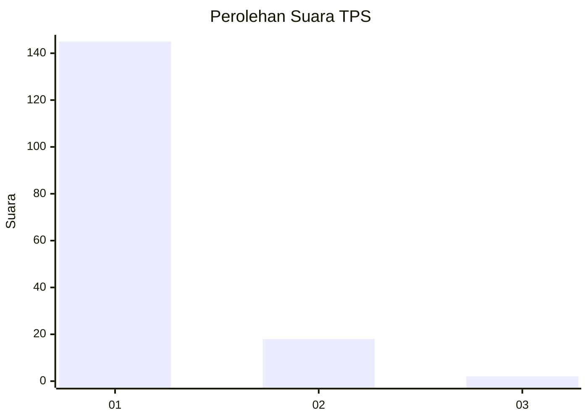
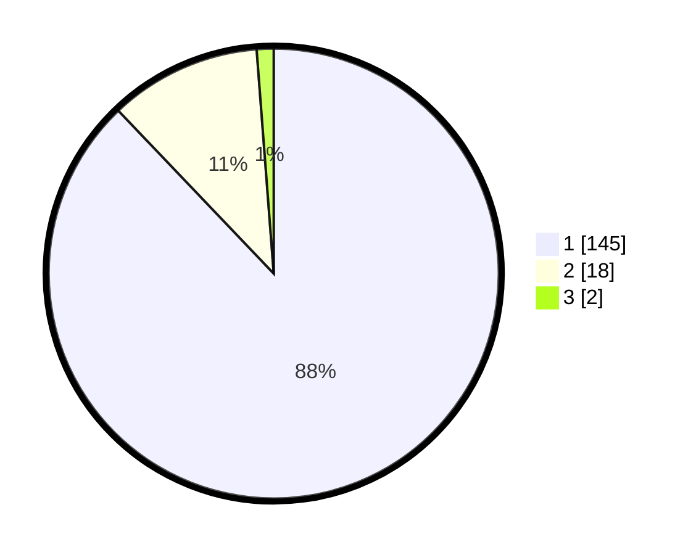

# Hasil

## Grafik

## Tabel

| No. | Nama Paslon    | Suara | Suara (raw) | Persentase |
|:--- |:-------------- | -----:| -----------:| ----------:|
| 1   | ANIES MUHAIMIN | 145   | [145][p-1]  | 87,88      |
| 2   | PRABOWO GIBRAN | 18    | [18][p-2]   | 10,91      |
| 3   | GANJAR MAHFUD  | 2     | [2][p-3]    | 1,21       |

[p-1]: https://github.com/gigit-pemilu/pemilu-2024-11-aceh/blob/main/pilpres/hitung-suara/sub/11-aceh/sub/08-aceh-utara/sub/05-matangkuli/sub/2019-teupin-keubeu/sub/001-tps/sub/paslon-1.txt
[p-2]: https://github.com/gigit-pemilu/pemilu-2024-11-aceh/blob/main/pilpres/hitung-suara/sub/11-aceh/sub/08-aceh-utara/sub/05-matangkuli/sub/2019-teupin-keubeu/sub/001-tps/sub/paslon-2.txt
[p-3]: https://github.com/gigit-pemilu/pemilu-2024-11-aceh/blob/main/pilpres/hitung-suara/sub/11-aceh/sub/08-aceh-utara/sub/05-matangkuli/sub/2019-teupin-keubeu/sub/001-tps/sub/paslon-3.txt

## Foto C Plano

https://sirekap-obj-formc.kpu.go.id/89de/pemilu/ppwp/11/08/05/20/19/1108052019001-20240214-215149--796ee627-3a05-47e1-bae8-d8a7b0482761.jpg

https://sirekap-obj-formc.kpu.go.id/89de/pemilu/ppwp/11/08/05/20/19/1108052019001-20240214-224749--10a6cec8-e013-4e67-b3bd-57574f947173.jpg

https://sirekap-obj-formc.kpu.go.id/89de/pemilu/ppwp/11/08/05/20/19/1108052019001-20240214-224837--32581dab-6ee4-4c9f-b33b-94d281ece441.jpg

## Metadata

| Key        | Value               |
| ---------- | ------------------- |
| Time Stamp | 2024-02-15 15:30:25 |

