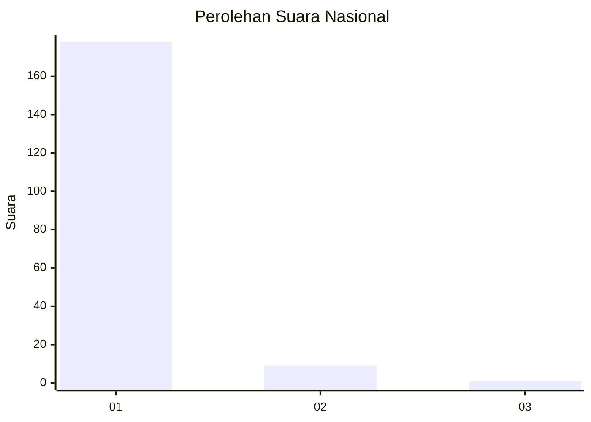
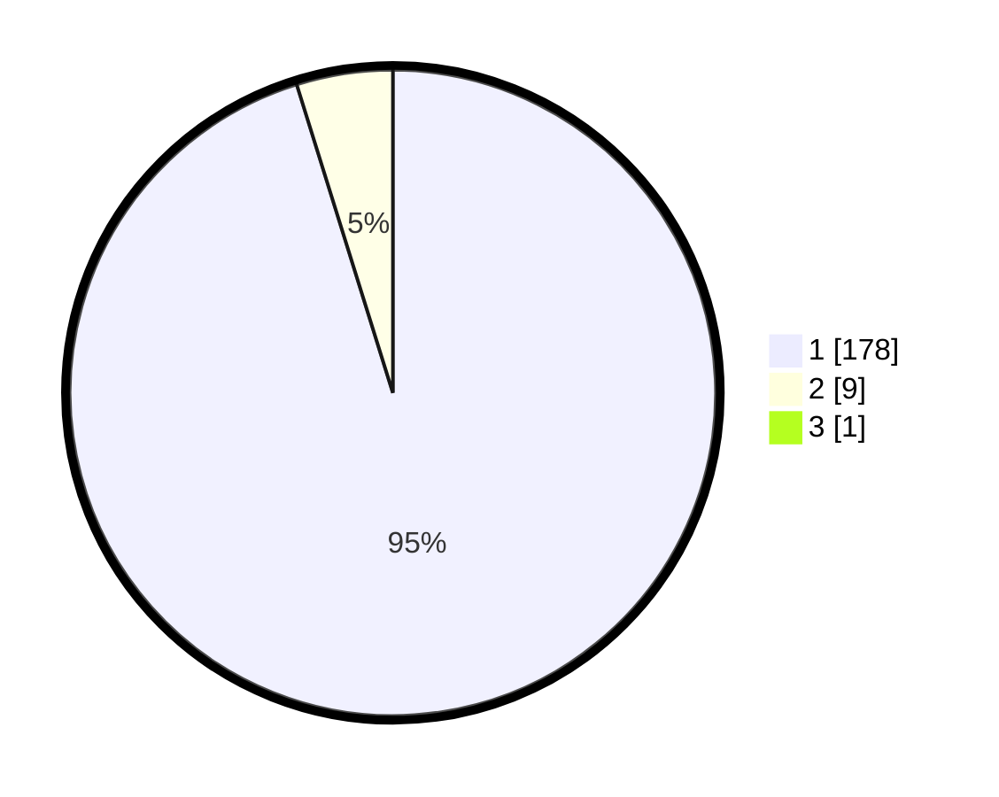

# Hasil

## Grafik

## Tabel

| No. | Nama Paslon    | Suara | Suara (raw) | Persentase |
|:--- |:-------------- | -----:| -----------:| ----------:|
| 1   | ANIES MUHAIMIN | 178   | [178][p-1]  | 94,68      |
| 2   | PRABOWO GIBRAN | 9     | [9][p-2]    | 4,79       |
| 3   | GANJAR MAHFUD  | 1     | [1][p-3]    | 0,53       |

[p-1]: https://github.com/gigit-pemilu/pemilu-2024/blob/main/pilpres/hitung-suara/sub/11-aceh/sub/08-aceh-utara/sub/05-matangkuli/sub/2022-jeumpa-geulumpang-vii/sub/001-tps/sub/paslon-1.txt
[p-2]: https://github.com/gigit-pemilu/pemilu-2024/blob/main/pilpres/hitung-suara/sub/11-aceh/sub/08-aceh-utara/sub/05-matangkuli/sub/2022-jeumpa-geulumpang-vii/sub/001-tps/sub/paslon-2.txt
[p-3]: https://github.com/gigit-pemilu/pemilu-2024/blob/main/pilpres/hitung-suara/sub/11-aceh/sub/08-aceh-utara/sub/05-matangkuli/sub/2022-jeumpa-geulumpang-vii/sub/001-tps/sub/paslon-3.txt

## Foto C Plano

https://sirekap-obj-formc.kpu.go.id/bca4/pemilu/ppwp/11/08/05/20/22/1108052022001-20240215-083756--1928d1bf-9551-4c47-8564-9d753a0420bb.jpg

https://sirekap-obj-formc.kpu.go.id/bca4/pemilu/ppwp/11/08/05/20/22/1108052022001-20240215-083351--ee0b8220-e4b6-43cc-991f-4744b6a22f4d.jpg

https://sirekap-obj-formc.kpu.go.id/bca4/pemilu/ppwp/11/08/05/20/22/1108052022001-20240215-083505--765cf5e1-fdc9-4c84-b098-9467b7ccf275.jpg

## Metadata

| Key        | Value               |
| ---------- | ------------------- |
| Time Stamp | 2024-02-15 15:30:25 |

