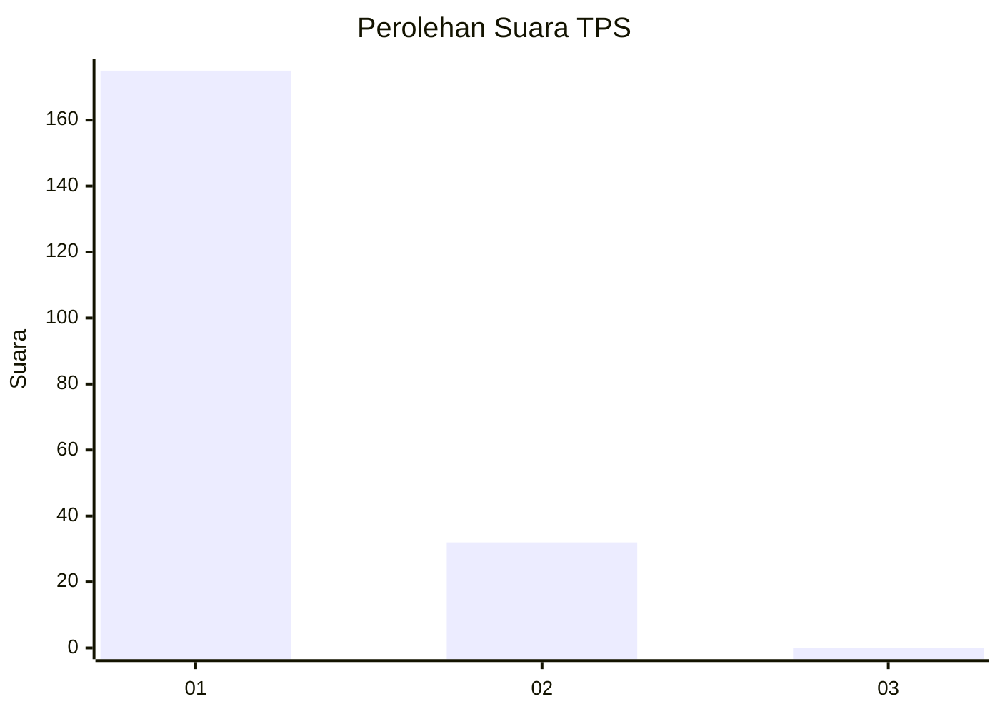
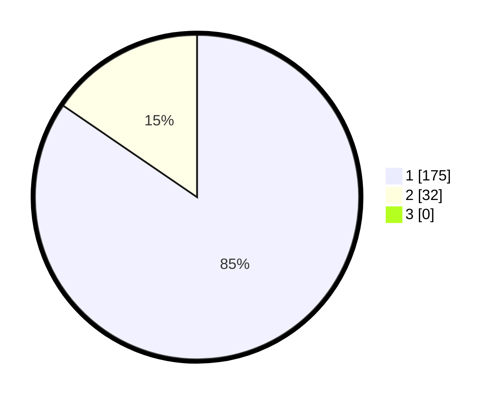

# Hasil

## Grafik

## Tabel

| No. | Nama Paslon    | Suara | Suara (raw) | Persentase |
|:--- |:-------------- | -----:| -----------:| ----------:|
| 1   | ANIES MUHAIMIN | 175   | [175][p-1]  | 84,54      |
| 2   | PRABOWO GIBRAN | 32    | [32][p-2]   | 15,46      |
| 3   | GANJAR MAHFUD  | 0     | [0][p-3]    | 0,00       |

[p-1]: https://github.com/gigit-pemilu/pemilu-2024-11-aceh/blob/main/pilpres/hitung-suara/sub/11-aceh/sub/08-aceh-utara/sub/05-matangkuli/sub/2036-hagu/sub/001-tps/sub/paslon-1.txt
[p-2]: https://github.com/gigit-pemilu/pemilu-2024-11-aceh/blob/main/pilpres/hitung-suara/sub/11-aceh/sub/08-aceh-utara/sub/05-matangkuli/sub/2036-hagu/sub/001-tps/sub/paslon-2.txt
[p-3]: https://github.com/gigit-pemilu/pemilu-2024-11-aceh/blob/main/pilpres/hitung-suara/sub/11-aceh/sub/08-aceh-utara/sub/05-matangkuli/sub/2036-hagu/sub/001-tps/sub/paslon-3.txt

## Foto C Plano

https://sirekap-obj-formc.kpu.go.id/c798/pemilu/ppwp/11/08/05/20/36/1108052036001-20240214-220721--08417145-2d2e-48a9-8c40-2a4a47e5f218.jpg

https://sirekap-obj-formc.kpu.go.id/c798/pemilu/ppwp/11/08/05/20/36/1108052036001-20240214-203138--716ed759-3011-4fd7-8df8-cb3ce52b0edf.jpg

https://sirekap-obj-formc.kpu.go.id/c798/pemilu/ppwp/11/08/05/20/36/1108052036001-20240214-203253--473dfd47-73d8-4cd1-ab53-b683f280e80a.jpg

## Metadata

| Key        | Value               |
| ---------- | ------------------- |
| Time Stamp | 2024-02-15 15:00:29 |

