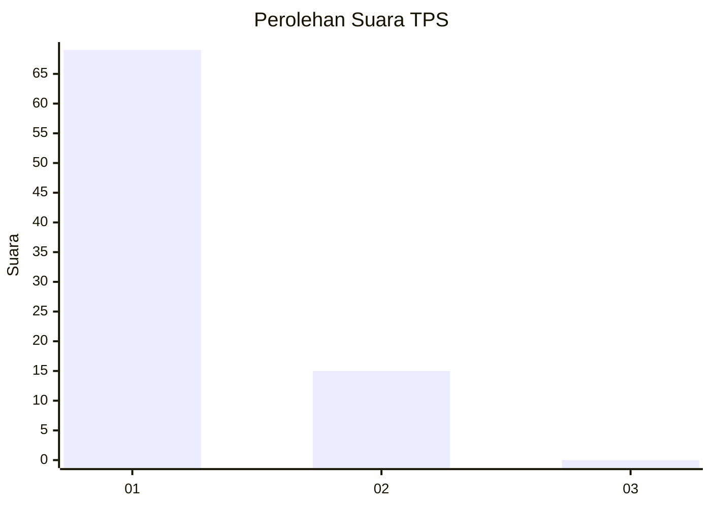
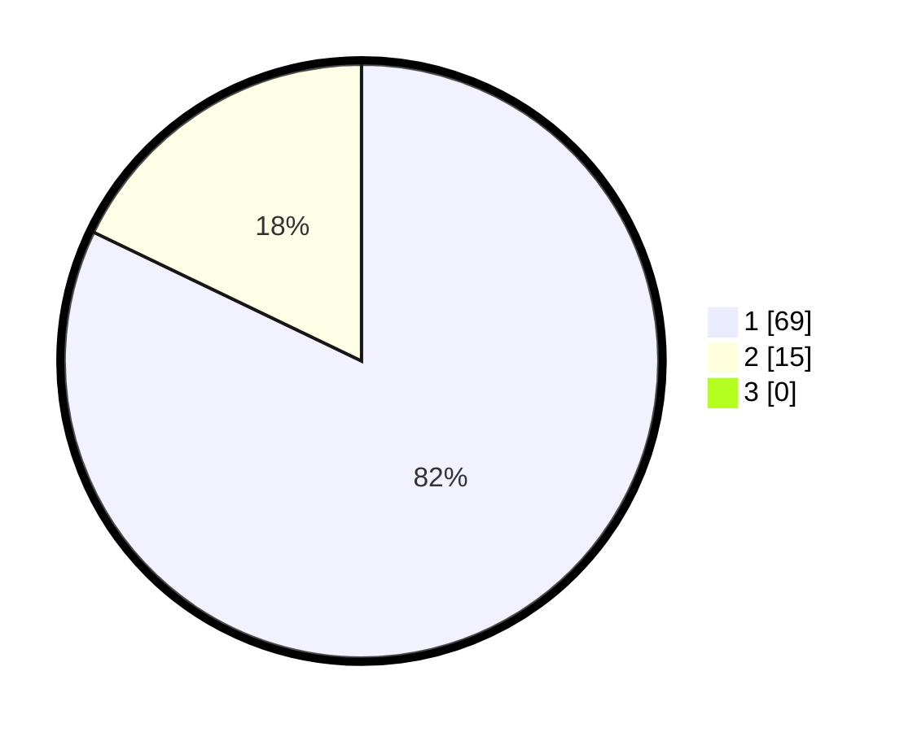

# Hasil

## Grafik

## Tabel

| No. | Nama Paslon    | Suara | Suara (raw) | Persentase |
|:--- |:-------------- | -----:| -----------:| ----------:|
| 1   | ANIES MUHAIMIN | 69    | [69][p-1]   | 82,14      |
| 2   | PRABOWO GIBRAN | 15    | [15][p-2]   | 17,86      |
| 3   | GANJAR MAHFUD  | 0     | [0][p-3]    | 0,00       |

[p-1]: https://github.com/gigit-pemilu/pemilu-2024-11-aceh/blob/main/pilpres/hitung-suara/sub/11-aceh/sub/08-aceh-utara/sub/05-matangkuli/sub/2043-tanjong-haji-muda/sub/001-tps/sub/paslon-1.txt
[p-2]: https://github.com/gigit-pemilu/pemilu-2024-11-aceh/blob/main/pilpres/hitung-suara/sub/11-aceh/sub/08-aceh-utara/sub/05-matangkuli/sub/2043-tanjong-haji-muda/sub/001-tps/sub/paslon-2.txt
[p-3]: https://github.com/gigit-pemilu/pemilu-2024-11-aceh/blob/main/pilpres/hitung-suara/sub/11-aceh/sub/08-aceh-utara/sub/05-matangkuli/sub/2043-tanjong-haji-muda/sub/001-tps/sub/paslon-3.txt

## Foto C Plano

https://sirekap-obj-formc.kpu.go.id/2200/pemilu/ppwp/11/08/05/20/43/1108052043001-20240214-194409--a8892ffc-443d-4512-8e3e-665529d40cac.jpg

https://sirekap-obj-formc.kpu.go.id/2200/pemilu/ppwp/11/08/05/20/43/1108052043001-20240214-194418--68f1b047-dff9-44c2-b66b-f851ae7d686a.jpg

https://sirekap-obj-formc.kpu.go.id/2200/pemilu/ppwp/11/08/05/20/43/1108052043001-20240214-194421--ee2fa738-3da8-407f-91d7-95d2acb8785b.jpg

## Metadata

| Key        | Value               |
| ---------- | ------------------- |
| Time Stamp | 2024-02-14 21:46:01 |

## DATA PEMILIH TETAP

Jumlah pemilih dalam DPT: **94**.
 * L: **48**.
 * P: **46**.

## DATA PENGGUNA HAK PILIH

Jumlah pengguna hak pilih dalam DPT: **83**.
 * L: **37**.
 * P: **46**.

Jumlah pengguna hak pilih dalam DPTb: **1**.
 * L: **0**.
 * P: **1**.

Jumlah pengguna hak pilih dalam DPK: **0**.
 * L: **0**.
 * P: **0**.

Jumlah pengguna hak pilih: **84**.
 * L: **37**.
 * P: **47**.

## JUMLAH SUARA SAH DAN TIDAK SAH

JUMLAH SELURUH SUARA SAH: **84**.

JUMLAH SUARA TIDAK SAH: **0**.

JUMLAH SELURUH SUARA SAH DAN SUARA TIDAK SAH: **84**.

