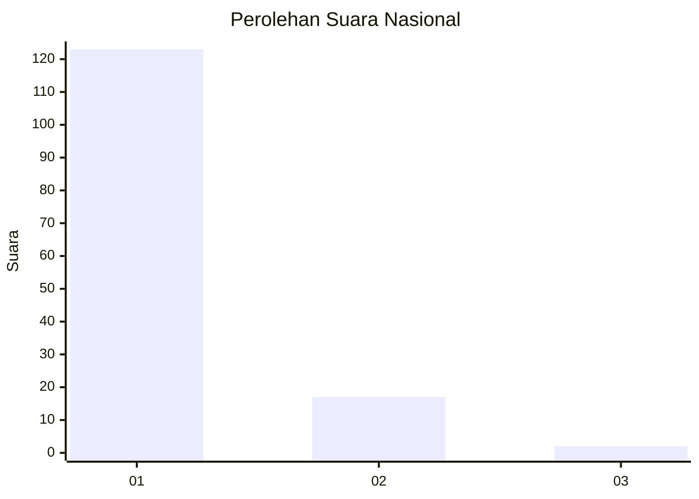
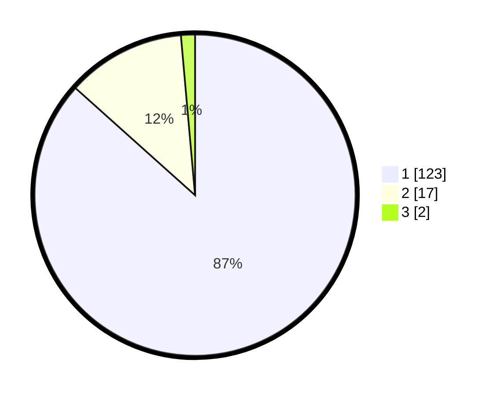

# Hasil

## Grafik

## Tabel

| No. | Nama Paslon    | Suara | Suara (raw) | Persentase |
|:--- |:-------------- | -----:| -----------:| ----------:|
| 1   | ANIES MUHAIMIN | 123   | [123][p-1]  | 86,62      |
| 2   | PRABOWO GIBRAN | 17    | [17][p-2]   | 11,97      |
| 3   | GANJAR MAHFUD  | 2     | [2][p-3]    | 1,41       |

[p-1]: https://github.com/gigit-pemilu/pemilu-2024/blob/main/pilpres/hitung-suara/sub/11-aceh/sub/08-aceh-utara/sub/05-matangkuli/sub/2044-siren/sub/001-tps/sub/paslon-1.txt
[p-2]: https://github.com/gigit-pemilu/pemilu-2024/blob/main/pilpres/hitung-suara/sub/11-aceh/sub/08-aceh-utara/sub/05-matangkuli/sub/2044-siren/sub/001-tps/sub/paslon-2.txt
[p-3]: https://github.com/gigit-pemilu/pemilu-2024/blob/main/pilpres/hitung-suara/sub/11-aceh/sub/08-aceh-utara/sub/05-matangkuli/sub/2044-siren/sub/001-tps/sub/paslon-3.txt

## Foto C Plano

https://sirekap-obj-formc.kpu.go.id/b470/pemilu/ppwp/11/08/05/20/44/1108052044001-20240215-000145--760229ee-2918-479b-b0f6-1bba318ade93.jpg

https://sirekap-obj-formc.kpu.go.id/b470/pemilu/ppwp/11/08/05/20/44/1108052044001-20240214-211807--dfe269fb-cf76-4e95-9c9b-d0b92767c336.jpg

https://sirekap-obj-formc.kpu.go.id/b470/pemilu/ppwp/11/08/05/20/44/1108052044001-20240214-211907--0e083975-4f12-4bd9-8fdd-ed81fad3b196.jpg

## Metadata

| Key        | Value               |
| ---------- | ------------------- |
| Time Stamp | 2024-02-15 15:00:29 |

