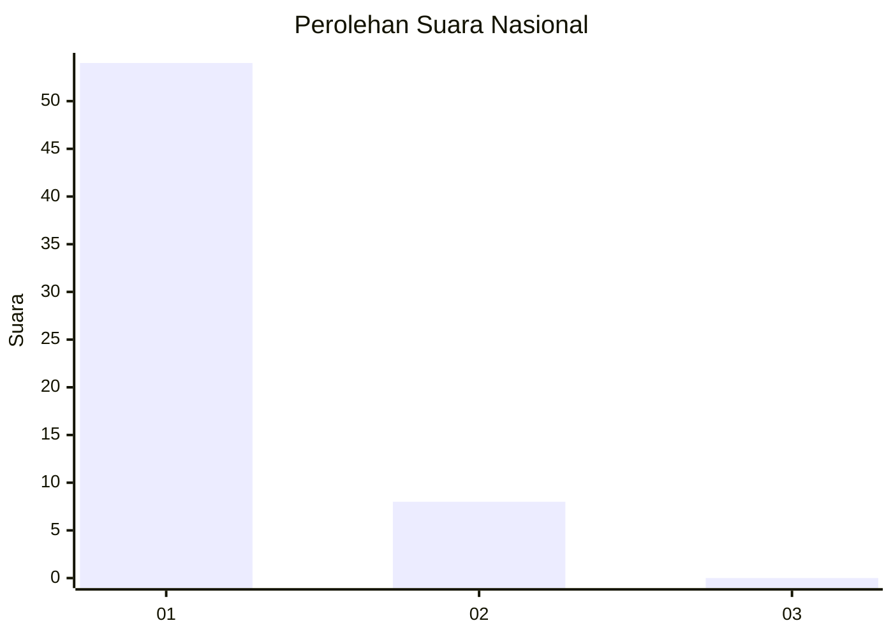
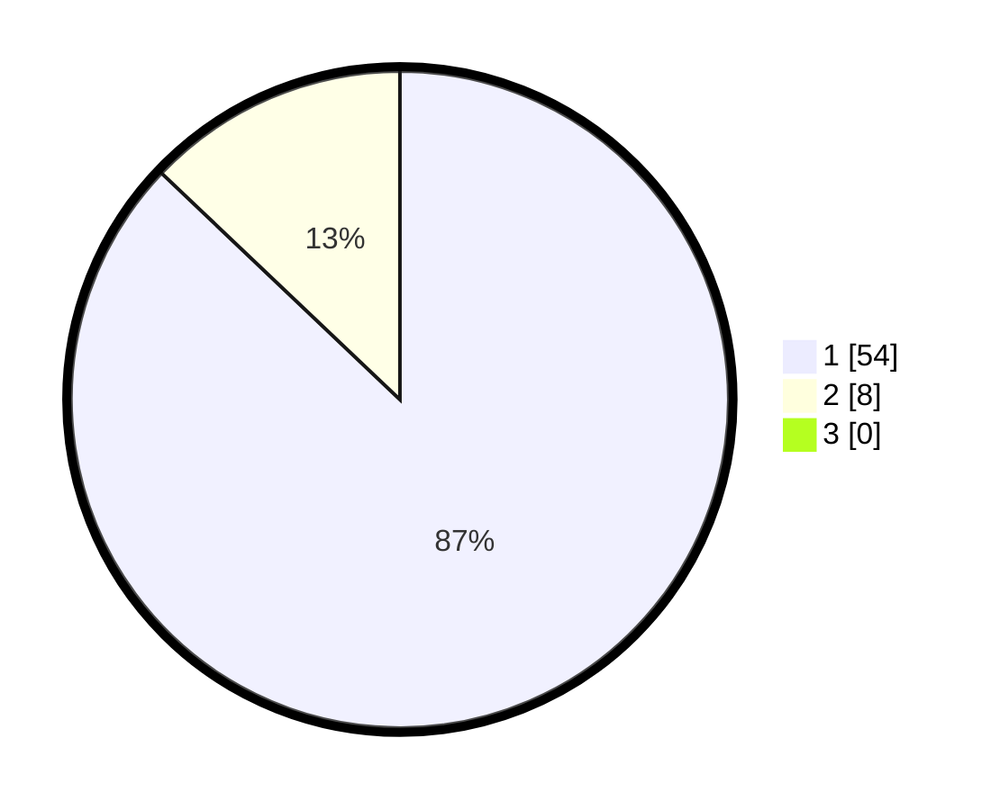

# Hasil

## Grafik

## Tabel

| No. | Nama Paslon    | Suara | Suara (raw) | Persentase |
|:--- |:-------------- | -----:| -----------:| ----------:|
| 1   | ANIES MUHAIMIN | 54    | [54][p-1]   | 87,10      |
| 2   | PRABOWO GIBRAN | 8     | [8][p-2]    | 12,90      |
| 3   | GANJAR MAHFUD  | 0     | [0][p-3]    | 0,00       |

[p-1]: https://github.com/gigit-pemilu/pemilu-2024/blob/main/pilpres/hitung-suara/sub/11-aceh/sub/08-aceh-utara/sub/05-matangkuli/sub/2045-meunye-pirak/sub/001-tps/sub/paslon-1.txt
[p-2]: https://github.com/gigit-pemilu/pemilu-2024/blob/main/pilpres/hitung-suara/sub/11-aceh/sub/08-aceh-utara/sub/05-matangkuli/sub/2045-meunye-pirak/sub/001-tps/sub/paslon-2.txt
[p-3]: https://github.com/gigit-pemilu/pemilu-2024/blob/main/pilpres/hitung-suara/sub/11-aceh/sub/08-aceh-utara/sub/05-matangkuli/sub/2045-meunye-pirak/sub/001-tps/sub/paslon-3.txt

## Foto C Plano

https://sirekap-obj-formc.kpu.go.id/fe90/pemilu/ppwp/11/08/05/20/45/1108052045001-20240214-195957--6c2400c1-b984-4b14-a40c-9bb2a0c548a2.jpg

https://sirekap-obj-formc.kpu.go.id/fe90/pemilu/ppwp/11/08/05/20/45/1108052045001-20240214-201332--477b418c-09f4-4cc8-ad44-f95a4f2395b9.jpg

https://sirekap-obj-formc.kpu.go.id/fe90/pemilu/ppwp/11/08/05/20/45/1108052045001-20240214-201444--647a2fc1-8804-4f9e-a744-b5766c8c705c.jpg

## Metadata

| Key        | Value               |
| ---------- | ------------------- |
| Time Stamp | 2024-02-16 12:51:22 |

## DATA PEMILIH TETAP

Jumlah pemilih dalam DPT: **79**.
 * L: **38**.
 * P: **41**.

## DATA PENGGUNA HAK PILIH

Jumlah pengguna hak pilih dalam DPT: **66**.
 * L: **30**.
 * P: **36**.

Jumlah pengguna hak pilih dalam DPTb: **0**.
 * L: **0**.
 * P: **0**.

Jumlah pengguna hak pilih dalam DPK: **0**.
 * L: **0**.
 * P: **0**.

Jumlah pengguna hak pilih: **66**.
 * L: **30**.
 * P: **36**.

## JUMLAH SUARA SAH DAN TIDAK SAH

JUMLAH SELURUH SUARA SAH: **66**.

JUMLAH SUARA TIDAK SAH: **0**.

JUMLAH SELURUH SUARA SAH DAN SUARA TIDAK SAH: **66**.

