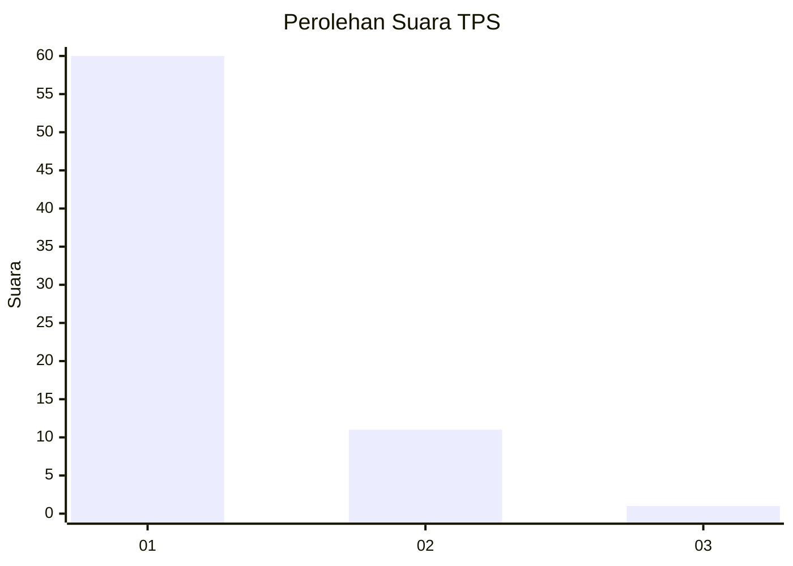
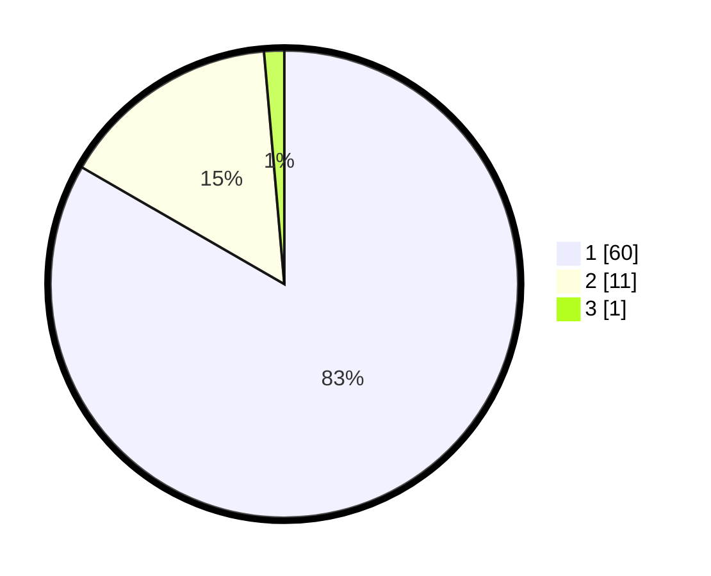

# Hasil

## Grafik

## Tabel

| No. | Nama Paslon    | Suara | Suara (raw) | Persentase |
|:--- |:-------------- | -----:| -----------:| ----------:|
| 1   | ANIES MUHAIMIN | 60    | [60][p-1]   | 83,33      |
| 2   | PRABOWO GIBRAN | 11    | [11][p-2]   | 15,28      |
| 3   | GANJAR MAHFUD  | 1     | [1][p-3]    | 1,39       |

[p-1]: https://github.com/gigit-pemilu/pemilu-2024-11-aceh/blob/main/pilpres/hitung-suara/sub/11-aceh/sub/08-aceh-utara/sub/05-matangkuli/sub/2050-pante-pirak/sub/001-tps/sub/paslon-1.txt
[p-2]: https://github.com/gigit-pemilu/pemilu-2024-11-aceh/blob/main/pilpres/hitung-suara/sub/11-aceh/sub/08-aceh-utara/sub/05-matangkuli/sub/2050-pante-pirak/sub/001-tps/sub/paslon-2.txt
[p-3]: https://github.com/gigit-pemilu/pemilu-2024-11-aceh/blob/main/pilpres/hitung-suara/sub/11-aceh/sub/08-aceh-utara/sub/05-matangkuli/sub/2050-pante-pirak/sub/001-tps/sub/paslon-3.txt

## Foto C Plano

https://sirekap-obj-formc.kpu.go.id/407b/pemilu/ppwp/11/08/05/20/50/1108052050001-20240216-154936--90ce414b-bff1-48a8-bc5e-8d86c671dd1e.jpg

https://sirekap-obj-formc.kpu.go.id/407b/pemilu/ppwp/11/08/05/20/50/1108052050001-20240216-154937--5e60b025-6cac-4c12-a619-e042a3e40ef7.jpg

https://sirekap-obj-formc.kpu.go.id/407b/pemilu/ppwp/11/08/05/20/50/1108052050001-20240216-154936--d0cba69e-1880-474a-9aff-1419bc02a406.jpg

## Metadata

| Key        | Value               |
| ---------- | ------------------- |
| Time Stamp | 2024-02-16 23:30:00 |

## DATA PEMILIH TETAP

Jumlah pemilih dalam DPT: **94**.
 * L: **43**.
 * P: **51**.

## DATA PENGGUNA HAK PILIH

Jumlah pengguna hak pilih dalam DPT: **72**.
 * L: **29**.
 * P: **43**.

Jumlah pengguna hak pilih dalam DPTb: **0**.
 * L: **0**.
 * P: **0**.

Jumlah pengguna hak pilih dalam DPK: **0**.
 * L: **0**.
 * P: **0**.

Jumlah pengguna hak pilih: **72**.
 * L: **29**.
 * P: **43**.

## JUMLAH SUARA SAH DAN TIDAK SAH

JUMLAH SELURUH SUARA SAH: **72**.

JUMLAH SUARA TIDAK SAH: **0**.

JUMLAH SELURUH SUARA SAH DAN SUARA TIDAK SAH: **72**.

