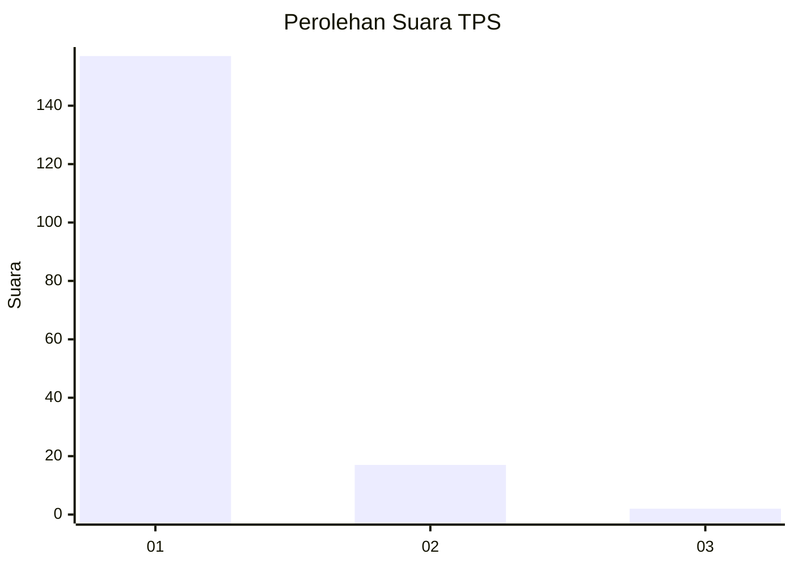
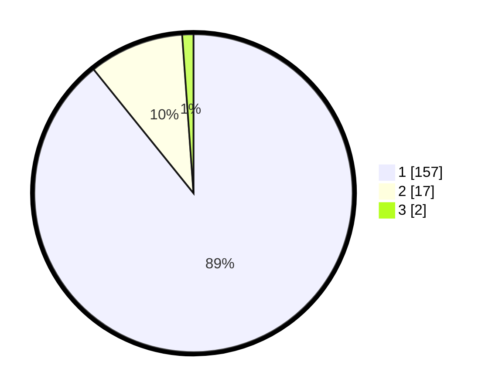

# Hasil

## Grafik

## Tabel

| No. | Nama Paslon    | Suara | Suara (raw) | Persentase |
|:--- |:-------------- | -----:| -----------:| ----------:|
| 1   | ANIES MUHAIMIN | 157   | [157][p-1]  | 89,20      |
| 2   | PRABOWO GIBRAN | 17    | [17][p-2]   | 9,66       |
| 3   | GANJAR MAHFUD  | 2     | [2][p-3]    | 1,14       |

[p-1]: https://github.com/gigit-pemilu/pemilu-2024-11-aceh/blob/main/pilpres/hitung-suara/sub/11-aceh/sub/08-aceh-utara/sub/05-matangkuli/sub/2053-blang-kuta/sub/001-tps/sub/paslon-1.txt
[p-2]: https://github.com/gigit-pemilu/pemilu-2024-11-aceh/blob/main/pilpres/hitung-suara/sub/11-aceh/sub/08-aceh-utara/sub/05-matangkuli/sub/2053-blang-kuta/sub/001-tps/sub/paslon-2.txt
[p-3]: https://github.com/gigit-pemilu/pemilu-2024-11-aceh/blob/main/pilpres/hitung-suara/sub/11-aceh/sub/08-aceh-utara/sub/05-matangkuli/sub/2053-blang-kuta/sub/001-tps/sub/paslon-3.txt

## Foto C Plano

https://sirekap-obj-formc.kpu.go.id/2ec6/pemilu/ppwp/11/08/05/20/53/1108052053001-20240215-092228--9c6829c4-ff15-490f-8466-b18b6d1d11ec.jpg

https://sirekap-obj-formc.kpu.go.id/2ec6/pemilu/ppwp/11/08/05/20/53/1108052053001-20240215-001634--d75d9f76-6285-45b4-867c-a1a672760475.jpg

https://sirekap-obj-formc.kpu.go.id/2ec6/pemilu/ppwp/11/08/05/20/53/1108052053001-20240215-001749--655ed06c-df84-4ac0-937e-91516f364b2f.jpg

## Metadata

| Key        | Value               |
| ---------- | ------------------- |
| Time Stamp | 2024-02-15 16:00:26 |

