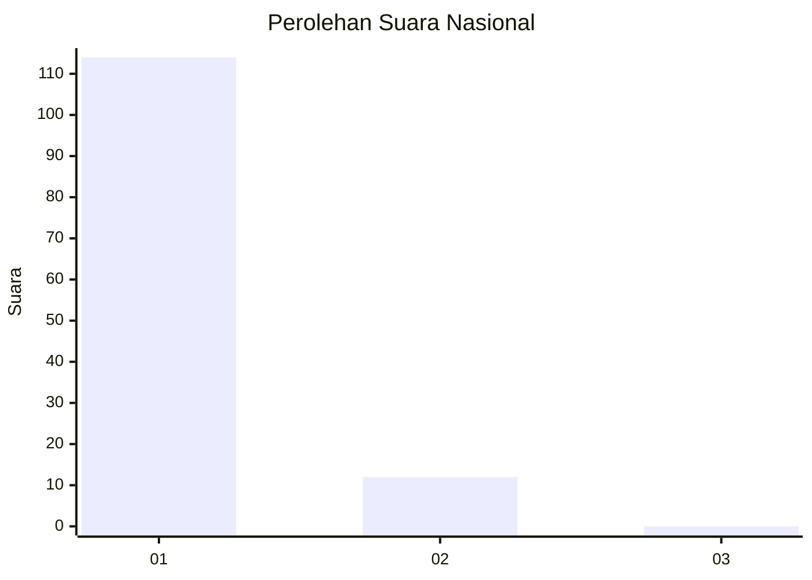
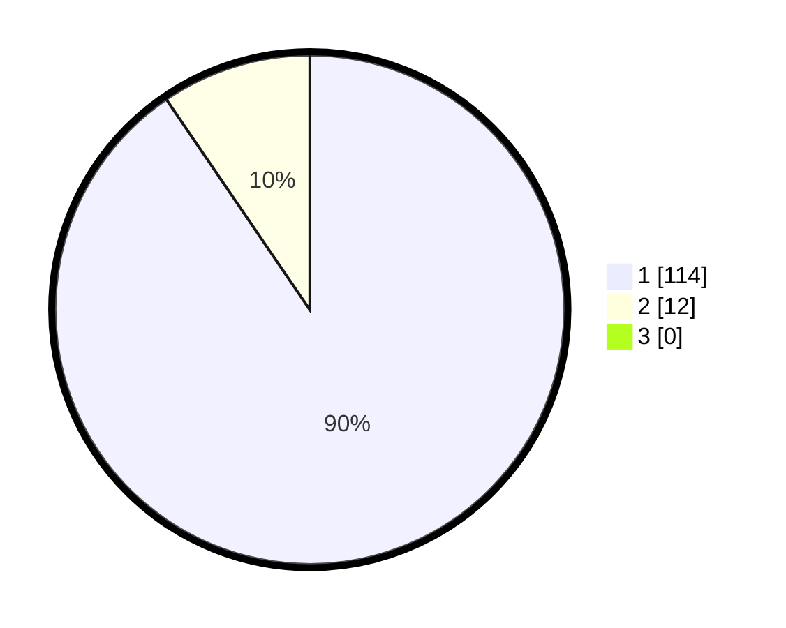

# Hasil

## Grafik

## Tabel

| No. | Nama Paslon    | Suara | Suara (raw) | Persentase |
|:--- |:-------------- | -----:| -----------:| ----------:|
| 1   | ANIES MUHAIMIN | 114   | [114][p-1]  | 90,48      |
| 2   | PRABOWO GIBRAN | 12    | [12][p-2]   | 9,52       |
| 3   | GANJAR MAHFUD  | 0     | [0][p-3]    | 0,00       |

[p-1]: https://github.com/gigit-pemilu/pemilu-2024/blob/main/pilpres/hitung-suara/sub/11-aceh/sub/08-aceh-utara/sub/05-matangkuli/sub/2054-blang-supeng/sub/001-tps/sub/paslon-1.txt
[p-2]: https://github.com/gigit-pemilu/pemilu-2024/blob/main/pilpres/hitung-suara/sub/11-aceh/sub/08-aceh-utara/sub/05-matangkuli/sub/2054-blang-supeng/sub/001-tps/sub/paslon-2.txt
[p-3]: https://github.com/gigit-pemilu/pemilu-2024/blob/main/pilpres/hitung-suara/sub/11-aceh/sub/08-aceh-utara/sub/05-matangkuli/sub/2054-blang-supeng/sub/001-tps/sub/paslon-3.txt

## Foto C Plano

https://sirekap-obj-formc.kpu.go.id/5ef8/pemilu/ppwp/11/08/05/20/54/1108052054001-20240214-222252--42fb8ef5-9d90-4681-a653-1c9c3ba0553f.jpg

https://sirekap-obj-formc.kpu.go.id/5ef8/pemilu/ppwp/11/08/05/20/54/1108052054001-20240214-195350--48bcc878-4806-4a11-a0da-687a7fca138d.jpg

https://sirekap-obj-formc.kpu.go.id/5ef8/pemilu/ppwp/11/08/05/20/54/1108052054001-20240214-195354--7f1d0b58-9a75-4ff7-8b3f-ec6b5425eadf.jpg

## Metadata

| Key        | Value               |
| ---------- | ------------------- |
| Time Stamp | 2024-02-15 12:00:28 |

