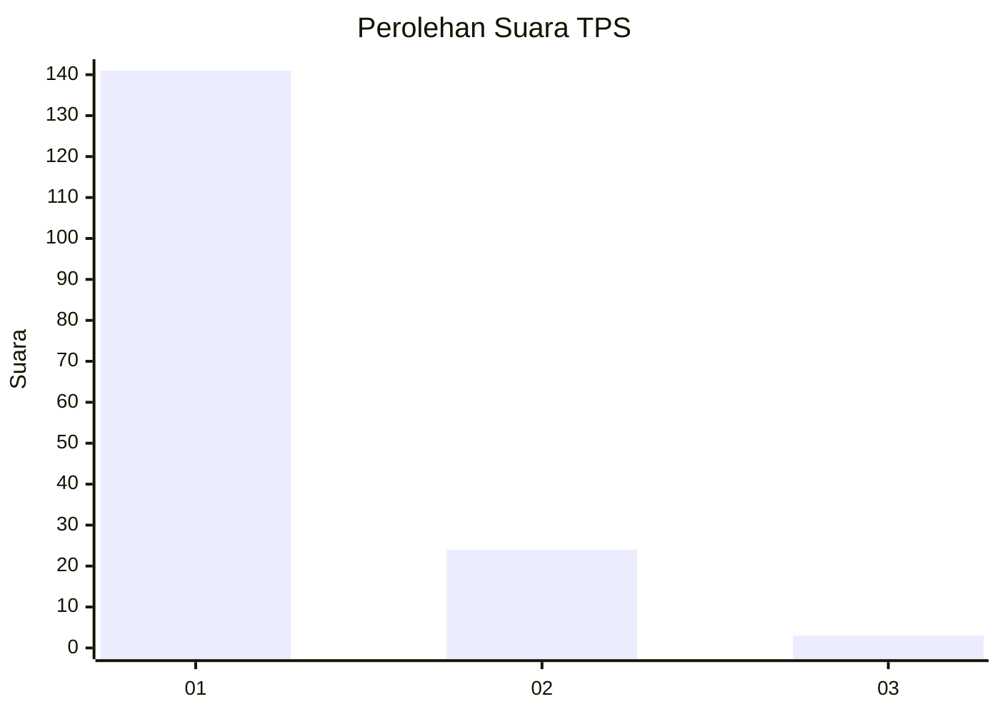
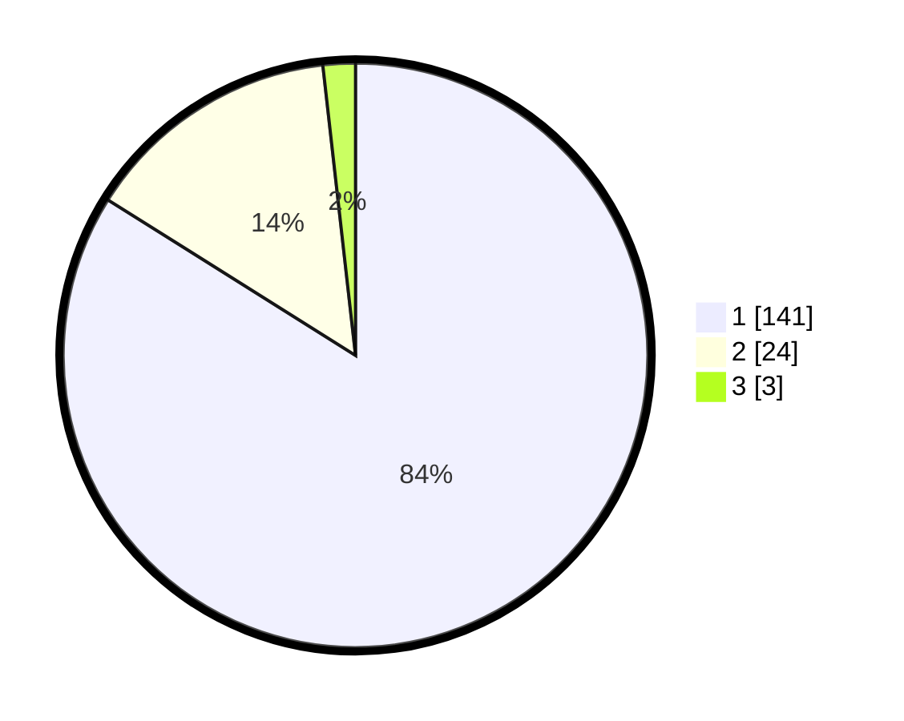

# Hasil

## Grafik

## Tabel

| No. | Nama Paslon    | Suara | Suara (raw) | Persentase |
|:--- |:-------------- | -----:| -----------:| ----------:|
| 1   | ANIES MUHAIMIN | 141   | [141][p-1]  | 83,93      |
| 2   | PRABOWO GIBRAN | 24    | [24][p-2]   | 14,29      |
| 3   | GANJAR MAHFUD  | 3     | [3][p-3]    | 1,79       |

[p-1]: https://github.com/gigit-pemilu/pemilu-2024-11-aceh/blob/main/pilpres/hitung-suara/sub/11-aceh/sub/08-aceh-utara/sub/05-matangkuli/sub/2066-alue-entok/sub/001-tps/sub/paslon-1.txt
[p-2]: https://github.com/gigit-pemilu/pemilu-2024-11-aceh/blob/main/pilpres/hitung-suara/sub/11-aceh/sub/08-aceh-utara/sub/05-matangkuli/sub/2066-alue-entok/sub/001-tps/sub/paslon-2.txt
[p-3]: https://github.com/gigit-pemilu/pemilu-2024-11-aceh/blob/main/pilpres/hitung-suara/sub/11-aceh/sub/08-aceh-utara/sub/05-matangkuli/sub/2066-alue-entok/sub/001-tps/sub/paslon-3.txt

## Foto C Plano

https://sirekap-obj-formc.kpu.go.id/a34e/pemilu/ppwp/11/08/05/20/66/1108052066001-20240215-091358--47ff2171-239e-401b-8317-6b011fcbdadb.jpg

https://sirekap-obj-formc.kpu.go.id/a34e/pemilu/ppwp/11/08/05/20/66/1108052066001-20240215-091506--8638de13-28ef-48ba-846c-4cc2d73556ed.jpg

https://sirekap-obj-formc.kpu.go.id/a34e/pemilu/ppwp/11/08/05/20/66/1108052066001-20240215-091600--e26adab5-c7a9-416e-b508-344397922b96.jpg

## Metadata

| Key        | Value               |
| ---------- | ------------------- |
| Time Stamp | 2024-02-17 00:28:35 |

