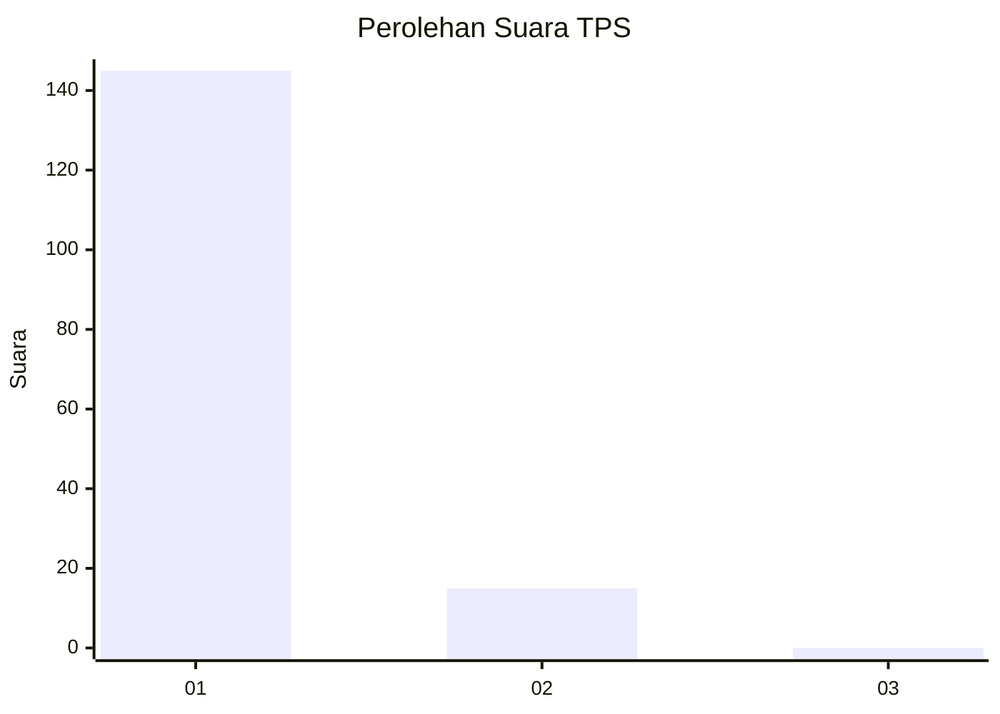
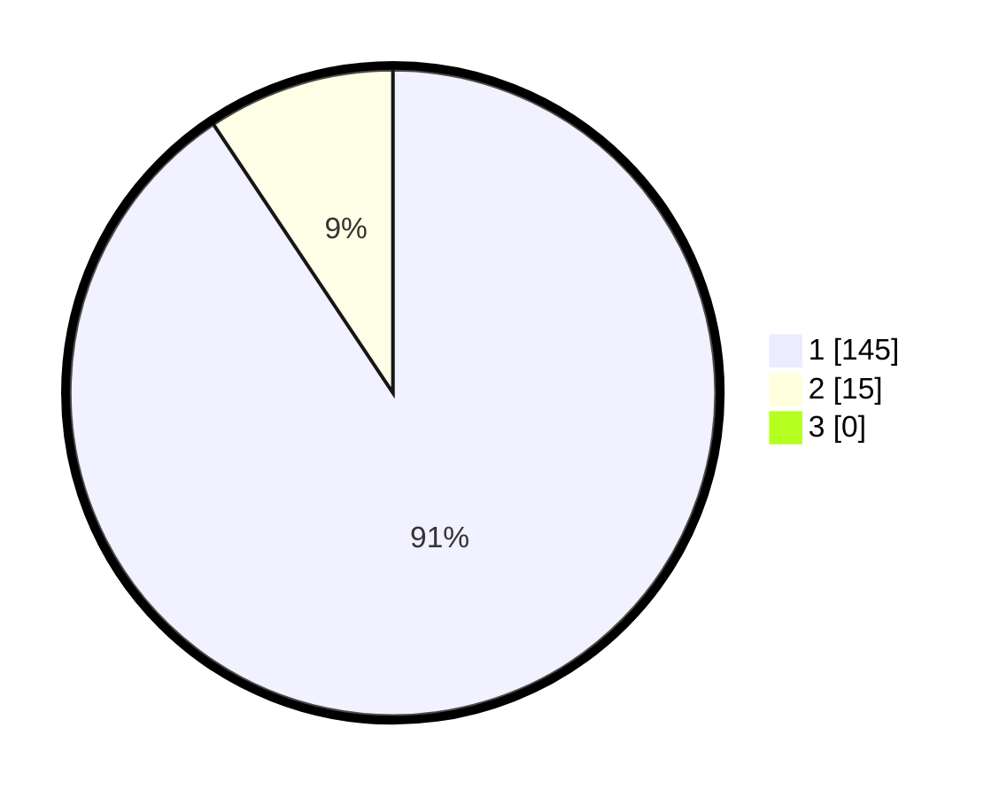

# Hasil

## Grafik

## Tabel

| No. | Nama Paslon    | Suara | Suara (raw) | Persentase |
|:--- |:-------------- | -----:| -----------:| ----------:|
| 1   | ANIES MUHAIMIN | 145   | [145][p-1]  | 90,63      |
| 2   | PRABOWO GIBRAN | 15    | [15][p-2]   | 9,38       |
| 3   | GANJAR MAHFUD  | 0     | [0][p-3]    | 0,00       |

[p-1]: https://github.com/gigit-pemilu/pemilu-2024-11-aceh/blob/main/pilpres/hitung-suara/sub/11-aceh/sub/08-aceh-utara/sub/05-matangkuli/sub/2067-tanjong-teungku-kari/sub/001-tps/sub/paslon-1.txt
[p-2]: https://github.com/gigit-pemilu/pemilu-2024-11-aceh/blob/main/pilpres/hitung-suara/sub/11-aceh/sub/08-aceh-utara/sub/05-matangkuli/sub/2067-tanjong-teungku-kari/sub/001-tps/sub/paslon-2.txt
[p-3]: https://github.com/gigit-pemilu/pemilu-2024-11-aceh/blob/main/pilpres/hitung-suara/sub/11-aceh/sub/08-aceh-utara/sub/05-matangkuli/sub/2067-tanjong-teungku-kari/sub/001-tps/sub/paslon-3.txt

## Foto C Plano

https://sirekap-obj-formc.kpu.go.id/9d27/pemilu/ppwp/11/08/05/20/67/1108052067001-20240215-030641--f94ff44f-f542-4dc5-8638-95522b840d8e.jpg

https://sirekap-obj-formc.kpu.go.id/9d27/pemilu/ppwp/11/08/05/20/67/1108052067001-20240215-030757--dd1e1698-d1e7-49bc-b62f-afa33d66a838.jpg

https://sirekap-obj-formc.kpu.go.id/9d27/pemilu/ppwp/11/08/05/20/67/1108052067001-20240215-030904--268f9a92-f6ec-4080-84d6-b3ba5a7ec4c7.jpg

## Metadata

| Key        | Value               |
| ---------- | ------------------- |
| Time Stamp | 2024-02-15 16:00:26 |

