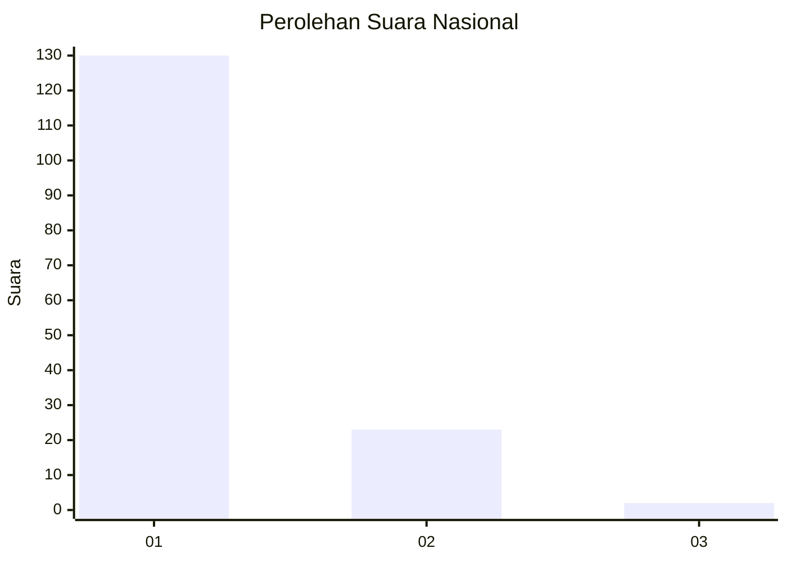
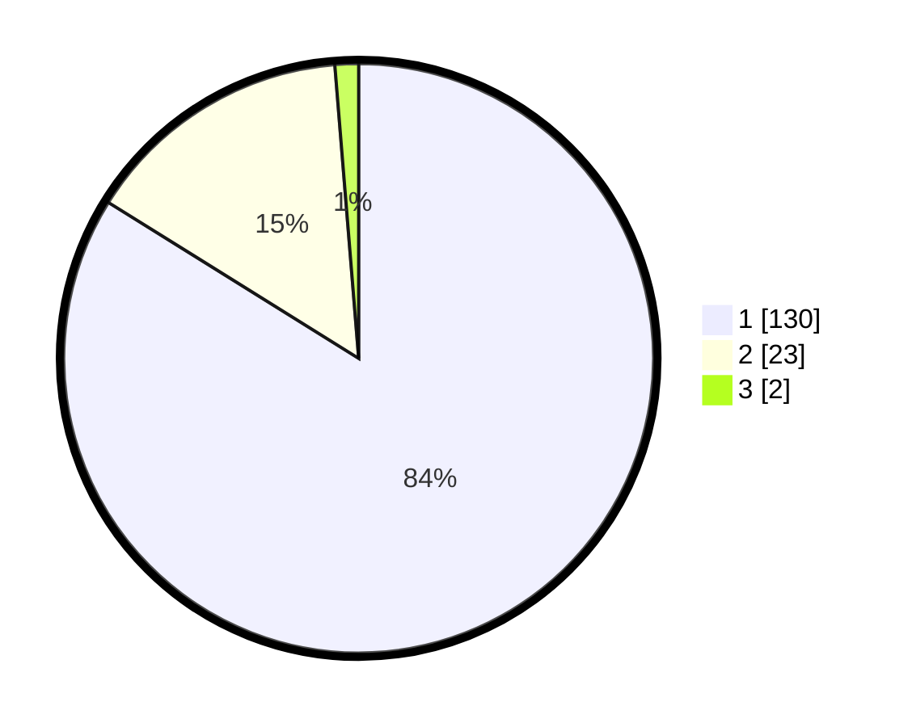

# Hasil

## Grafik

## Tabel

| No. | Nama Paslon    | Suara | Suara (raw) | Persentase |
|:--- |:-------------- | -----:| -----------:| ----------:|
| 1   | ANIES MUHAIMIN | 130   | [130][p-1]  | 83,87      |
| 2   | PRABOWO GIBRAN | 23    | [23][p-2]   | 14,84      |
| 3   | GANJAR MAHFUD  | 2     | [2][p-3]    | 1,29       |

[p-1]: https://github.com/gigit-pemilu/pemilu-2024/blob/main/pilpres/hitung-suara/sub/11-aceh/sub/08-aceh-utara/sub/05-matangkuli/sub/2069-seuriweuk/sub/001-tps/sub/paslon-1.txt
[p-2]: https://github.com/gigit-pemilu/pemilu-2024/blob/main/pilpres/hitung-suara/sub/11-aceh/sub/08-aceh-utara/sub/05-matangkuli/sub/2069-seuriweuk/sub/001-tps/sub/paslon-2.txt
[p-3]: https://github.com/gigit-pemilu/pemilu-2024/blob/main/pilpres/hitung-suara/sub/11-aceh/sub/08-aceh-utara/sub/05-matangkuli/sub/2069-seuriweuk/sub/001-tps/sub/paslon-3.txt

## Foto C Plano

https://sirekap-obj-formc.kpu.go.id/98fd/pemilu/ppwp/11/08/05/20/69/1108052069001-20240215-072445--d8230877-5d26-4020-8674-3cc6eb61274c.jpg

https://sirekap-obj-formc.kpu.go.id/98fd/pemilu/ppwp/11/08/05/20/69/1108052069001-20240215-072732--162cb5a8-eb11-4e4b-84cc-39a4fef6e25f.jpg

https://sirekap-obj-formc.kpu.go.id/98fd/pemilu/ppwp/11/08/05/20/69/1108052069001-20240215-072235--1530f2ac-4aa5-4713-81b4-dca8b56c4efd.jpg

## Metadata

| Key        | Value               |
| ---------- | ------------------- |
| Time Stamp | 2024-02-16 12:51:22 |

