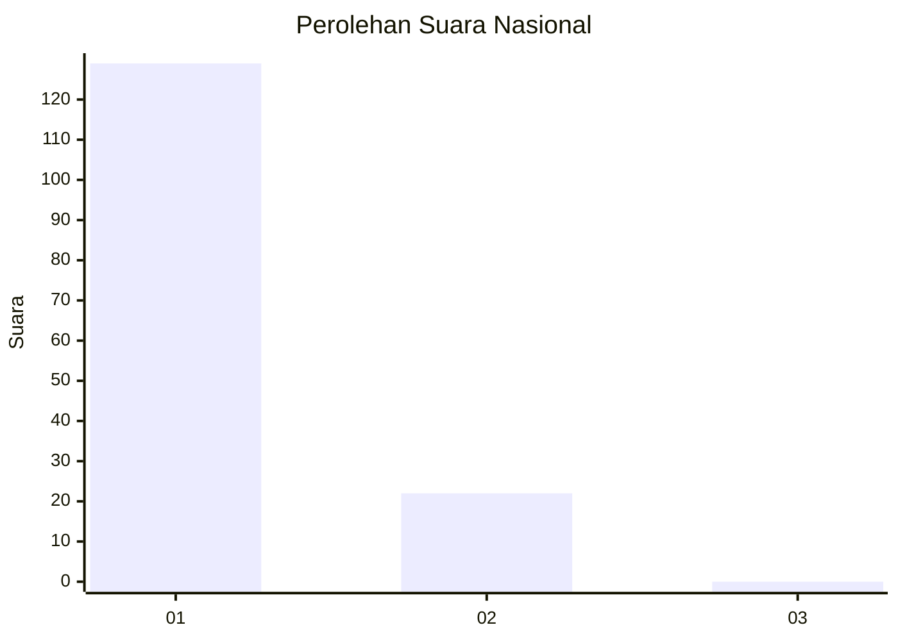
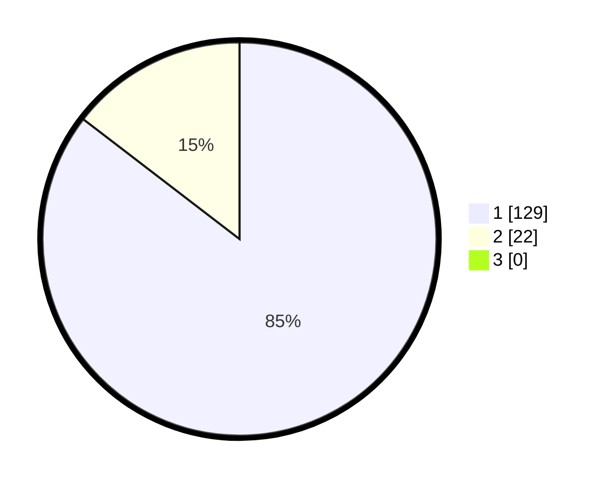

# Hasil

## Grafik

## Tabel

| No. | Nama Paslon    | Suara | Suara (raw) | Persentase |
|:--- |:-------------- | -----:| -----------:| ----------:|
| 1   | ANIES MUHAIMIN | 129   | [129][p-1]  | 85,43      |
| 2   | PRABOWO GIBRAN | 22    | [22][p-2]   | 14,57      |
| 3   | GANJAR MAHFUD  | 0     | [0][p-3]    | 0,00       |

[p-1]: https://github.com/gigit-pemilu/pemilu-2024/blob/main/pilpres/hitung-suara/sub/11-aceh/sub/08-aceh-utara/sub/05-matangkuli/sub/2069-seuriweuk/sub/002-tps/sub/paslon-1.txt
[p-2]: https://github.com/gigit-pemilu/pemilu-2024/blob/main/pilpres/hitung-suara/sub/11-aceh/sub/08-aceh-utara/sub/05-matangkuli/sub/2069-seuriweuk/sub/002-tps/sub/paslon-2.txt
[p-3]: https://github.com/gigit-pemilu/pemilu-2024/blob/main/pilpres/hitung-suara/sub/11-aceh/sub/08-aceh-utara/sub/05-matangkuli/sub/2069-seuriweuk/sub/002-tps/sub/paslon-3.txt

## Foto C Plano

https://sirekap-obj-formc.kpu.go.id/965b/pemilu/ppwp/11/08/05/20/69/1108052069002-20240215-071440--ca3761e6-fe72-4a40-ad59-766ba57d118e.jpg

https://sirekap-obj-formc.kpu.go.id/965b/pemilu/ppwp/11/08/05/20/69/1108052069002-20240215-071528--61819335-1156-4621-b628-a32473a3b7fc.jpg

https://sirekap-obj-formc.kpu.go.id/965b/pemilu/ppwp/11/08/05/20/69/1108052069002-20240215-071613--e9e59763-2a38-4514-9869-4d4a0a6b17ac.jpg

## Metadata

| Key        | Value               |
| ---------- | ------------------- |
| Time Stamp | 2024-02-16 12:51:22 |

