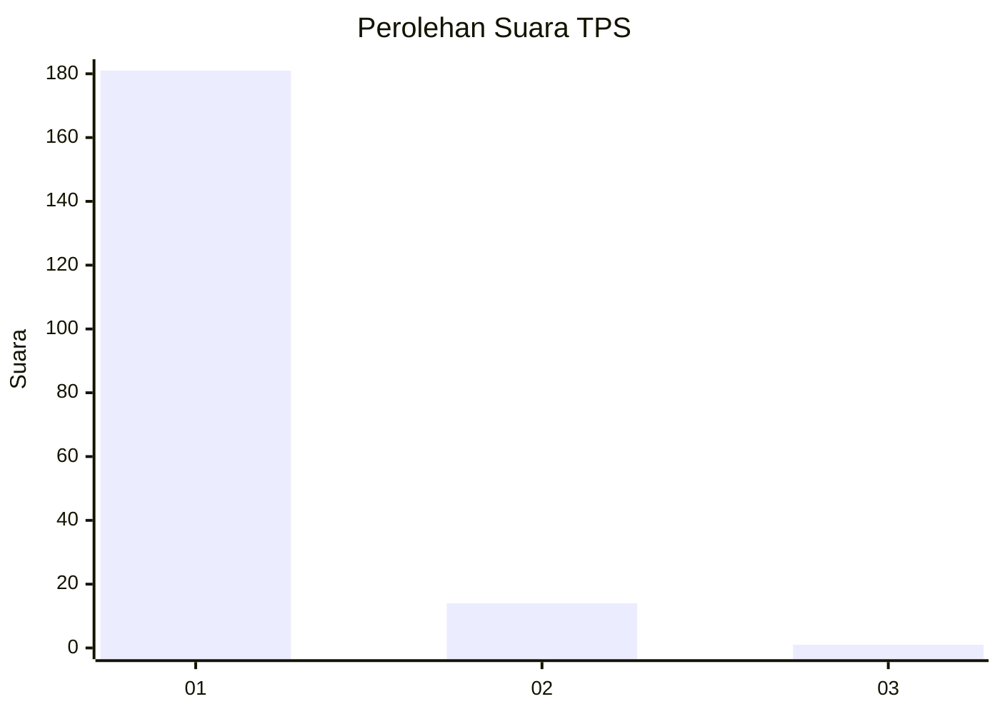
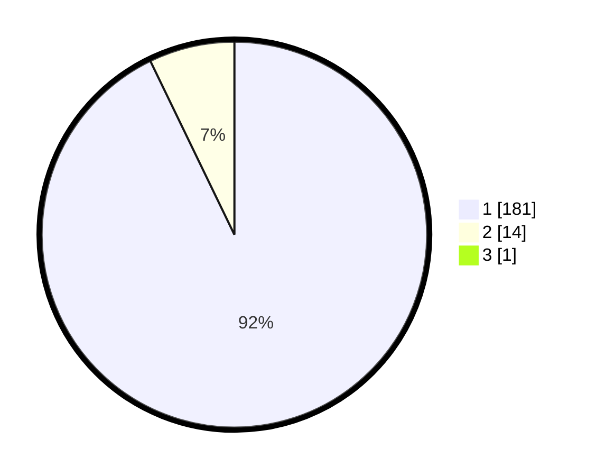

# Hasil

## Grafik

## Tabel

| No. | Nama Paslon    | Suara | Suara (raw) | Persentase |
|:--- |:-------------- | -----:| -----------:| ----------:|
| 1   | ANIES MUHAIMIN | 181   | [181][p-1]  | 92,35      |
| 2   | PRABOWO GIBRAN | 14    | [14][p-2]   | 7,14       |
| 3   | GANJAR MAHFUD  | 1     | [1][p-3]    | 0,51       |

[p-1]: https://github.com/gigit-pemilu/pemilu-2024-11-aceh/blob/main/pilpres/hitung-suara/sub/11-aceh/sub/08-aceh-utara/sub/06-muara-batu/sub/2001-keude-mane/sub/001-tps/sub/paslon-1.txt
[p-2]: https://github.com/gigit-pemilu/pemilu-2024-11-aceh/blob/main/pilpres/hitung-suara/sub/11-aceh/sub/08-aceh-utara/sub/06-muara-batu/sub/2001-keude-mane/sub/001-tps/sub/paslon-2.txt
[p-3]: https://github.com/gigit-pemilu/pemilu-2024-11-aceh/blob/main/pilpres/hitung-suara/sub/11-aceh/sub/08-aceh-utara/sub/06-muara-batu/sub/2001-keude-mane/sub/001-tps/sub/paslon-3.txt

## Foto C Plano

https://sirekap-obj-formc.kpu.go.id/7cba/pemilu/ppwp/11/08/06/20/01/1108062001001-20240215-123849--e031da28-986e-416c-aa4c-f96121bb21f1.jpg

https://sirekap-obj-formc.kpu.go.id/7cba/pemilu/ppwp/11/08/06/20/01/1108062001001-20240215-123032--a93668fb-7f7b-46fa-8fb2-93414ee735db.jpg

https://sirekap-obj-formc.kpu.go.id/7cba/pemilu/ppwp/11/08/06/20/01/1108062001001-20240215-123211--0a28efa3-8828-4bb5-9075-ba1fcae2d17a.jpg

## Metadata

| Key        | Value               |
| ---------- | ------------------- |
| Time Stamp | 2024-02-15 16:00:26 |

