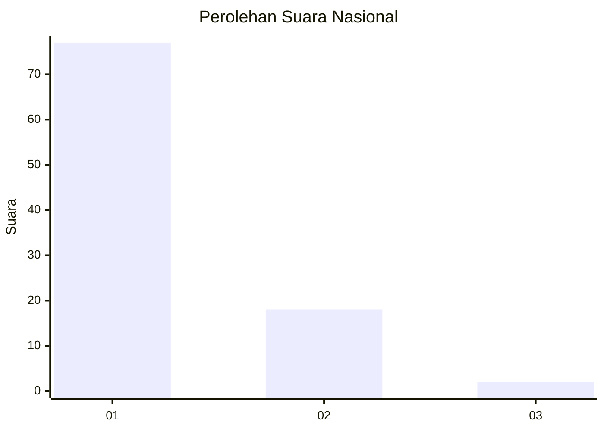
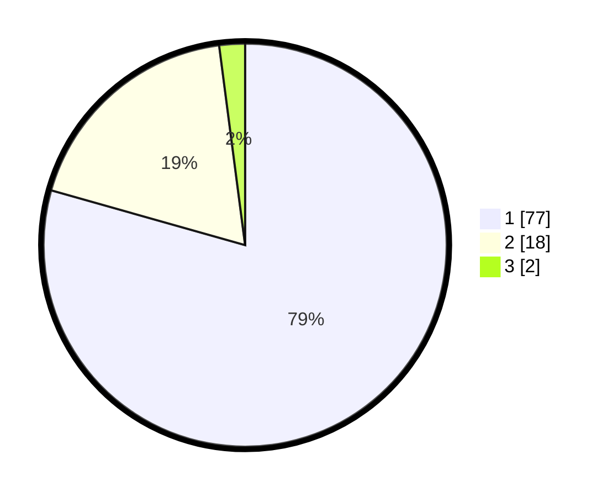

# Hasil

## Grafik

## Tabel

| No. | Nama Paslon    | Suara | Suara (raw) | Persentase |
|:--- |:-------------- | -----:| -----------:| ----------:|
| 1   | ANIES MUHAIMIN | 77    | [77][p-1]   | 79,38      |
| 2   | PRABOWO GIBRAN | 18    | [18][p-2]   | 18,56      |
| 3   | GANJAR MAHFUD  | 2     | [2][p-3]    | 2,06       |

[p-1]: https://github.com/gigit-pemilu/pemilu-2024/blob/main/pilpres/hitung-suara/sub/11-aceh/sub/08-aceh-utara/sub/06-muara-batu/sub/2001-keude-mane/sub/002-tps/sub/paslon-1.txt
[p-2]: https://github.com/gigit-pemilu/pemilu-2024/blob/main/pilpres/hitung-suara/sub/11-aceh/sub/08-aceh-utara/sub/06-muara-batu/sub/2001-keude-mane/sub/002-tps/sub/paslon-2.txt
[p-3]: https://github.com/gigit-pemilu/pemilu-2024/blob/main/pilpres/hitung-suara/sub/11-aceh/sub/08-aceh-utara/sub/06-muara-batu/sub/2001-keude-mane/sub/002-tps/sub/paslon-3.txt

## Foto C Plano

https://sirekap-obj-formc.kpu.go.id/e983/pemilu/ppwp/11/08/06/20/01/1108062001002-20240215-121140--fdf2f125-2417-4f31-b15a-69dde926e65d.jpg

https://sirekap-obj-formc.kpu.go.id/e983/pemilu/ppwp/11/08/06/20/01/1108062001002-20240215-121236--f4df91d7-38c0-45d8-bf95-232982d37b7c.jpg

https://sirekap-obj-formc.kpu.go.id/e983/pemilu/ppwp/11/08/06/20/01/1108062001002-20240215-121457--fce23e6e-ceb5-4796-8ca2-e8d00c534c89.jpg

## Metadata

| Key        | Value               |
| ---------- | ------------------- |
| Time Stamp | 2024-02-15 18:00:26 |

