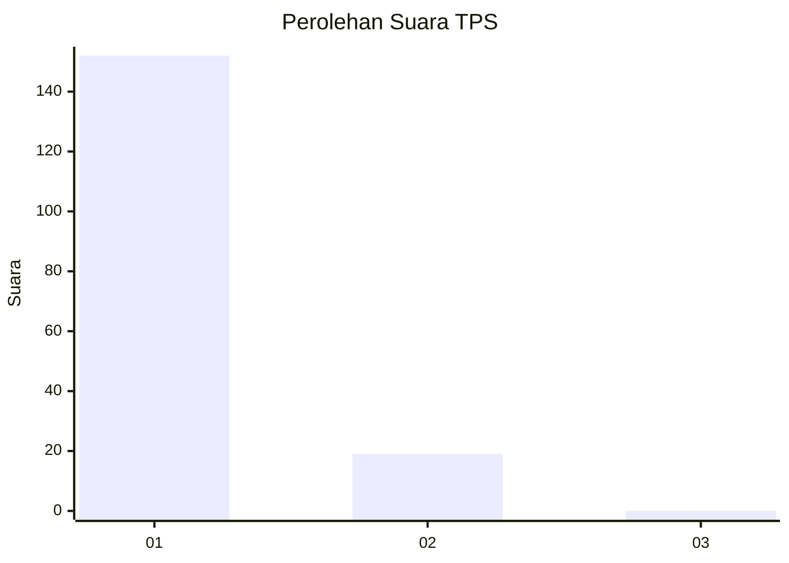
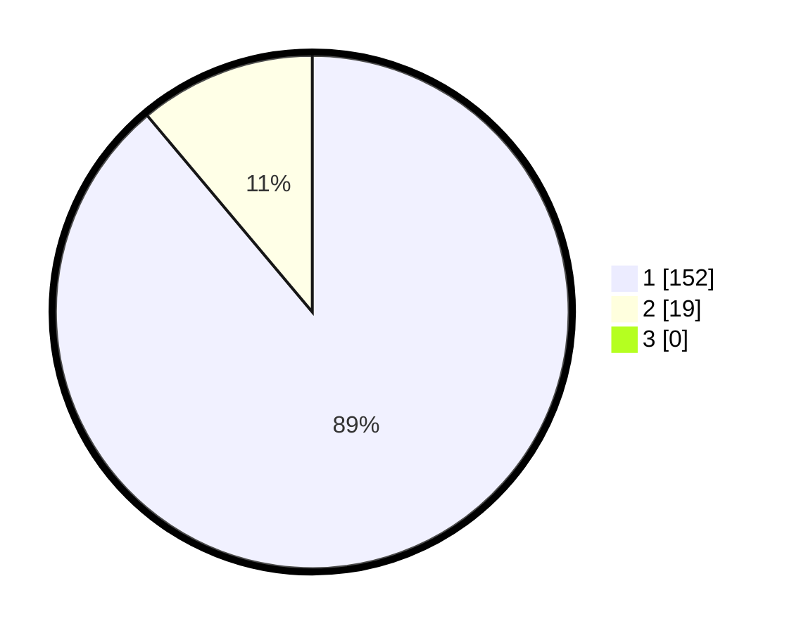

# Hasil

## Grafik

## Tabel

| No. | Nama Paslon    | Suara | Suara (raw) | Persentase |
|:--- |:-------------- | -----:| -----------:| ----------:|
| 1   | ANIES MUHAIMIN | 152   | [152][p-1]  | 88,89      |
| 2   | PRABOWO GIBRAN | 19    | [19][p-2]   | 11,11      |
| 3   | GANJAR MAHFUD  | 0     | [0][p-3]    | 0,00       |

[p-1]: https://github.com/gigit-pemilu/pemilu-2024-11-aceh/blob/main/pilpres/hitung-suara/sub/11-aceh/sub/08-aceh-utara/sub/06-muara-batu/sub/2001-keude-mane/sub/003-tps/sub/paslon-1.txt
[p-2]: https://github.com/gigit-pemilu/pemilu-2024-11-aceh/blob/main/pilpres/hitung-suara/sub/11-aceh/sub/08-aceh-utara/sub/06-muara-batu/sub/2001-keude-mane/sub/003-tps/sub/paslon-2.txt
[p-3]: https://github.com/gigit-pemilu/pemilu-2024-11-aceh/blob/main/pilpres/hitung-suara/sub/11-aceh/sub/08-aceh-utara/sub/06-muara-batu/sub/2001-keude-mane/sub/003-tps/sub/paslon-3.txt

## Foto C Plano

https://sirekap-obj-formc.kpu.go.id/ecaa/pemilu/ppwp/11/08/06/20/01/1108062001003-20240215-121947--e51da7bd-c031-49f5-9c70-6b32d33e516a.jpg

https://sirekap-obj-formc.kpu.go.id/ecaa/pemilu/ppwp/11/08/06/20/01/1108062001003-20240215-122256--76fb2f36-c4ef-4252-94d6-e0368230e62e.jpg

https://sirekap-obj-formc.kpu.go.id/ecaa/pemilu/ppwp/11/08/06/20/01/1108062001003-20240215-122442--1cb36c5f-8666-4c23-bd39-63d8f456fdf3.jpg

## Metadata

| Key        | Value               |
| ---------- | ------------------- |
| Time Stamp | 2024-02-15 16:30:25 |

