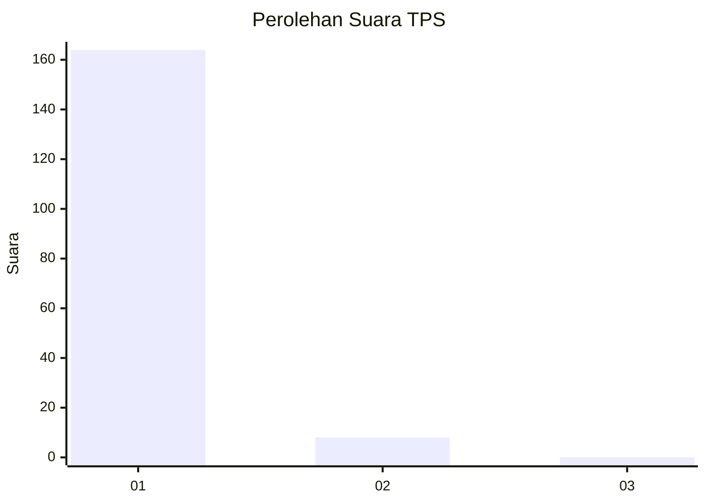
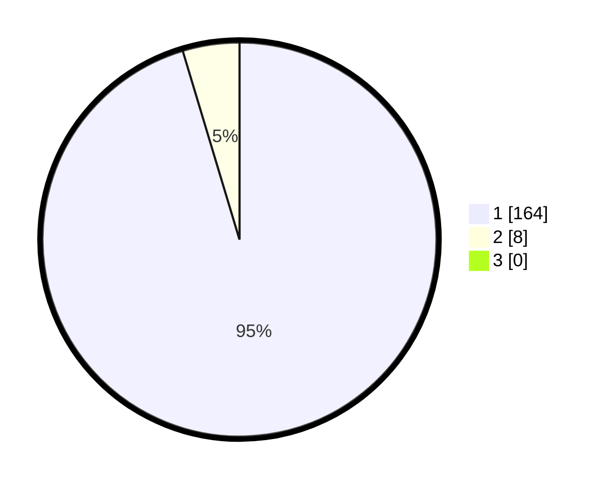

# Hasil

## Grafik

## Tabel

| No. | Nama Paslon    | Suara | Suara (raw) | Persentase |
|:--- |:-------------- | -----:| -----------:| ----------:|
| 1   | ANIES MUHAIMIN | 164   | [164][p-1]  | 95,35      |
| 2   | PRABOWO GIBRAN | 8     | [8][p-2]    | 4,65       |
| 3   | GANJAR MAHFUD  | 0     | [0][p-3]    | 0,00       |

[p-1]: https://github.com/gigit-pemilu/pemilu-2024-11-aceh/blob/main/pilpres/hitung-suara/sub/11-aceh/sub/08-aceh-utara/sub/06-muara-batu/sub/2002-meunasah-drang/sub/001-tps/sub/paslon-1.txt
[p-2]: https://github.com/gigit-pemilu/pemilu-2024-11-aceh/blob/main/pilpres/hitung-suara/sub/11-aceh/sub/08-aceh-utara/sub/06-muara-batu/sub/2002-meunasah-drang/sub/001-tps/sub/paslon-2.txt
[p-3]: https://github.com/gigit-pemilu/pemilu-2024-11-aceh/blob/main/pilpres/hitung-suara/sub/11-aceh/sub/08-aceh-utara/sub/06-muara-batu/sub/2002-meunasah-drang/sub/001-tps/sub/paslon-3.txt

## Foto C Plano

https://sirekap-obj-formc.kpu.go.id/afa6/pemilu/ppwp/11/08/06/20/02/1108062002001-20240215-091355--01f61f89-3a43-4b17-9fbe-7037cffc2a02.jpg

https://sirekap-obj-formc.kpu.go.id/afa6/pemilu/ppwp/11/08/06/20/02/1108062002001-20240215-091618--c08a7601-b5ff-4e99-97b2-a436522e2215.jpg

https://sirekap-obj-formc.kpu.go.id/afa6/pemilu/ppwp/11/08/06/20/02/1108062002001-20240215-091919--e84b075b-0262-49e1-941c-2ae8e4268750.jpg

## Metadata

| Key        | Value               |
| ---------- | ------------------- |
| Time Stamp | 2024-02-16 10:30:29 |

