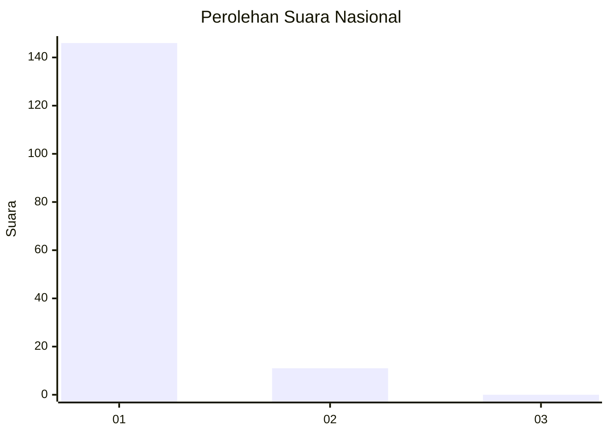
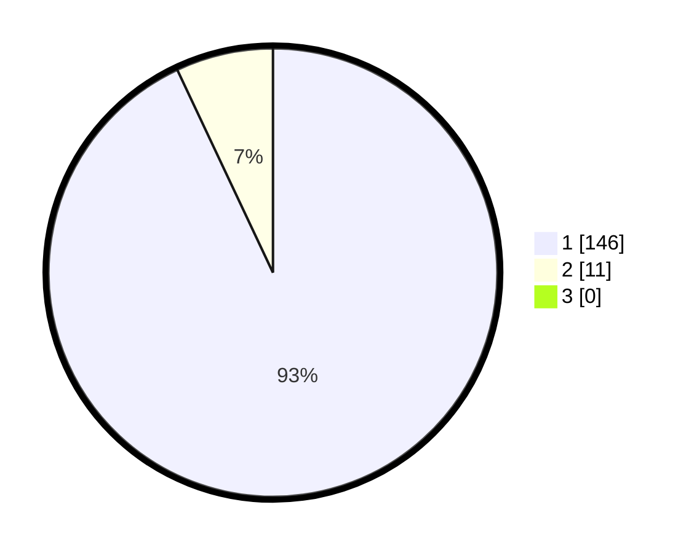

# Hasil

## Grafik

## Tabel

| No. | Nama Paslon    | Suara | Suara (raw) | Persentase |
|:--- |:-------------- | -----:| -----------:| ----------:|
| 1   | ANIES MUHAIMIN | 146   | [146][p-1]  | 92,99      |
| 2   | PRABOWO GIBRAN | 11    | [11][p-2]   | 7,01       |
| 3   | GANJAR MAHFUD  | 0     | [0][p-3]    | 0,00       |

[p-1]: https://github.com/gigit-pemilu/pemilu-2024/blob/main/pilpres/hitung-suara/sub/11-aceh/sub/08-aceh-utara/sub/06-muara-batu/sub/2002-meunasah-drang/sub/004-tps/sub/paslon-1.txt
[p-2]: https://github.com/gigit-pemilu/pemilu-2024/blob/main/pilpres/hitung-suara/sub/11-aceh/sub/08-aceh-utara/sub/06-muara-batu/sub/2002-meunasah-drang/sub/004-tps/sub/paslon-2.txt
[p-3]: https://github.com/gigit-pemilu/pemilu-2024/blob/main/pilpres/hitung-suara/sub/11-aceh/sub/08-aceh-utara/sub/06-muara-batu/sub/2002-meunasah-drang/sub/004-tps/sub/paslon-3.txt

## Foto C Plano

https://sirekap-obj-formc.kpu.go.id/1911/pemilu/ppwp/11/08/06/20/02/1108062002004-20240215-092040--b567bfa7-cc05-47bf-852f-573d8d1a2ddd.jpg

https://sirekap-obj-formc.kpu.go.id/1911/pemilu/ppwp/11/08/06/20/02/1108062002004-20240215-082456--73b27eed-ccfb-4cd5-b114-2be462336be3.jpg

https://sirekap-obj-formc.kpu.go.id/1911/pemilu/ppwp/11/08/06/20/02/1108062002004-20240215-082558--d30d0efd-bb8a-4be7-b9b6-4b32bba448b2.jpg

## Metadata

| Key        | Value               |
| ---------- | ------------------- |
| Time Stamp | 2024-02-15 18:00:26 |

