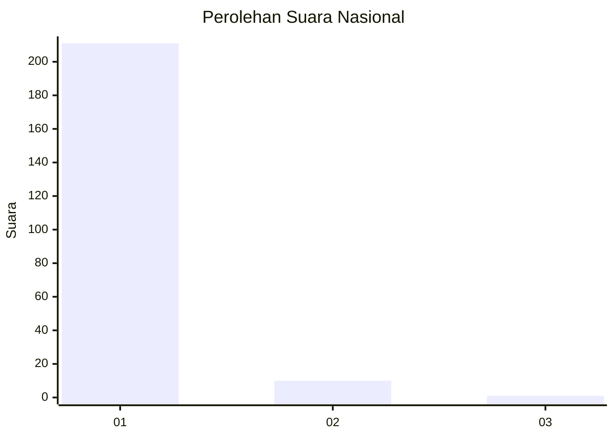
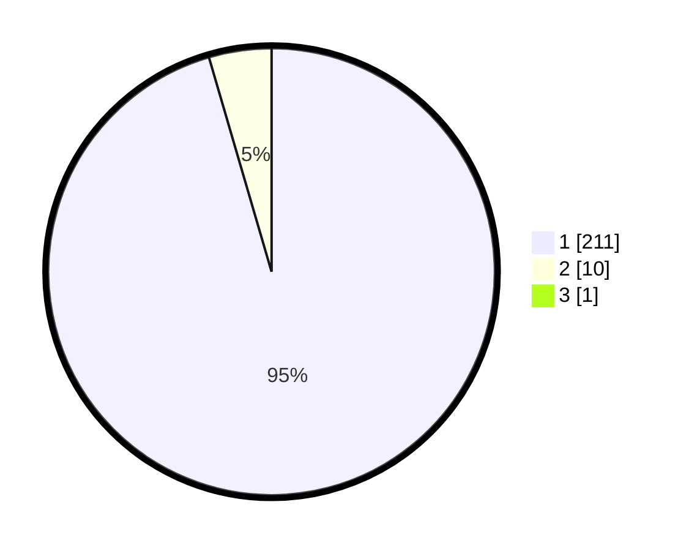

# Hasil

## Grafik

## Tabel

| No. | Nama Paslon    | Suara | Suara (raw) | Persentase |
|:--- |:-------------- | -----:| -----------:| ----------:|
| 1   | ANIES MUHAIMIN | 211   | [211][p-1]  | 95,05      |
| 2   | PRABOWO GIBRAN | 10    | [10][p-2]   | 4,50       |
| 3   | GANJAR MAHFUD  | 1     | [1][p-3]    | 0,45       |

[p-1]: https://github.com/gigit-pemilu/pemilu-2024/blob/main/pilpres/hitung-suara/sub/11-aceh/sub/08-aceh-utara/sub/06-muara-batu/sub/2003-meunasah-baro/sub/001-tps/sub/paslon-1.txt
[p-2]: https://github.com/gigit-pemilu/pemilu-2024/blob/main/pilpres/hitung-suara/sub/11-aceh/sub/08-aceh-utara/sub/06-muara-batu/sub/2003-meunasah-baro/sub/001-tps/sub/paslon-2.txt
[p-3]: https://github.com/gigit-pemilu/pemilu-2024/blob/main/pilpres/hitung-suara/sub/11-aceh/sub/08-aceh-utara/sub/06-muara-batu/sub/2003-meunasah-baro/sub/001-tps/sub/paslon-3.txt

## Foto C Plano

https://sirekap-obj-formc.kpu.go.id/9401/pemilu/ppwp/11/08/06/20/03/1108062003001-20240215-123322--bc078599-4d8a-482f-aac3-45a36b6106ed.jpg

https://sirekap-obj-formc.kpu.go.id/9401/pemilu/ppwp/11/08/06/20/03/1108062003001-20240215-123534--b954f698-118d-46fd-80af-f89db9771862.jpg

https://sirekap-obj-formc.kpu.go.id/9401/pemilu/ppwp/11/08/06/20/03/1108062003001-20240215-124209--e7d14ecc-357d-4c00-92a5-a0edc497350e.jpg

## Metadata

| Key        | Value               |
| ---------- | ------------------- |
| Time Stamp | 2024-02-15 15:30:25 |

