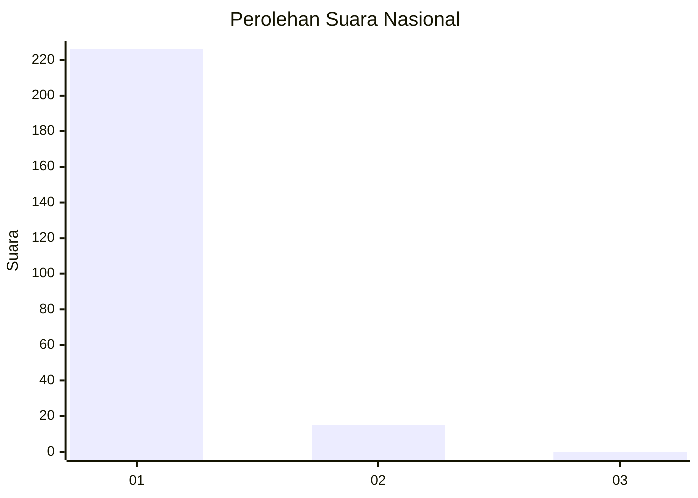
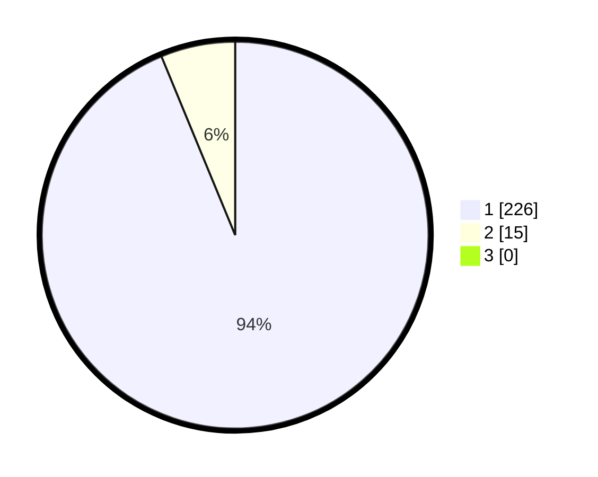

# Hasil

## Grafik

## Tabel

| No. | Nama Paslon    | Suara | Suara (raw) | Persentase |
|:--- |:-------------- | -----:| -----------:| ----------:|
| 1   | ANIES MUHAIMIN | 226   | [226][p-1]  | 93,78      |
| 2   | PRABOWO GIBRAN | 15    | [15][p-2]   | 6,22       |
| 3   | GANJAR MAHFUD  | 0     | [0][p-3]    | 0,00       |

[p-1]: https://github.com/gigit-pemilu/pemilu-2024/blob/main/pilpres/hitung-suara/sub/11-aceh/sub/08-aceh-utara/sub/06-muara-batu/sub/2003-meunasah-baro/sub/004-tps/sub/paslon-1.txt
[p-2]: https://github.com/gigit-pemilu/pemilu-2024/blob/main/pilpres/hitung-suara/sub/11-aceh/sub/08-aceh-utara/sub/06-muara-batu/sub/2003-meunasah-baro/sub/004-tps/sub/paslon-2.txt
[p-3]: https://github.com/gigit-pemilu/pemilu-2024/blob/main/pilpres/hitung-suara/sub/11-aceh/sub/08-aceh-utara/sub/06-muara-batu/sub/2003-meunasah-baro/sub/004-tps/sub/paslon-3.txt

## Foto C Plano

https://sirekap-obj-formc.kpu.go.id/3505/pemilu/ppwp/11/08/06/20/03/1108062003004-20240215-115444--37ae6cae-1601-4e8f-98d0-e1c8476cf031.jpg

https://sirekap-obj-formc.kpu.go.id/3505/pemilu/ppwp/11/08/06/20/03/1108062003004-20240215-120056--84e2db86-c224-4ead-a8e4-992434379495.jpg

https://sirekap-obj-formc.kpu.go.id/3505/pemilu/ppwp/11/08/06/20/03/1108062003004-20240215-115949--a6016786-c488-4eac-b7cb-b31f52ee1652.jpg

## Metadata

| Key        | Value               |
| ---------- | ------------------- |
| Time Stamp | 2024-02-15 15:30:25 |

