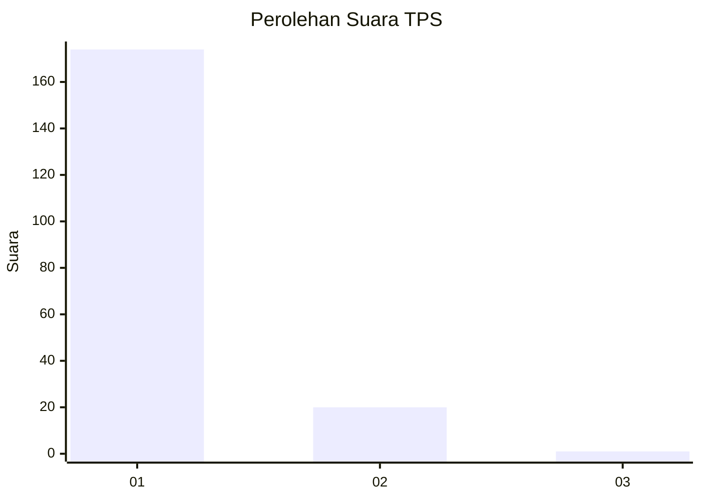
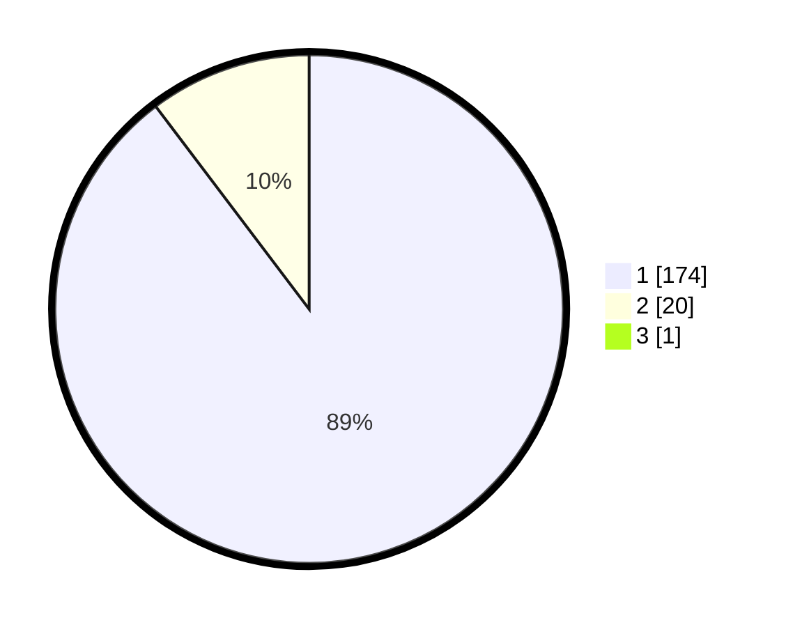

# Hasil

## Grafik

## Tabel

| No. | Nama Paslon    | Suara | Suara (raw) | Persentase |
|:--- |:-------------- | -----:| -----------:| ----------:|
| 1   | ANIES MUHAIMIN | 174   | [174][p-1]  | 89,23      |
| 2   | PRABOWO GIBRAN | 20    | [20][p-2]   | 10,26      |
| 3   | GANJAR MAHFUD  | 1     | [1][p-3]    | 0,51       |

[p-1]: https://github.com/gigit-pemilu/pemilu-2024-11-aceh/blob/main/pilpres/hitung-suara/sub/11-aceh/sub/08-aceh-utara/sub/06-muara-batu/sub/2004-meunasah-lhok/sub/001-tps/sub/paslon-1.txt
[p-2]: https://github.com/gigit-pemilu/pemilu-2024-11-aceh/blob/main/pilpres/hitung-suara/sub/11-aceh/sub/08-aceh-utara/sub/06-muara-batu/sub/2004-meunasah-lhok/sub/001-tps/sub/paslon-2.txt
[p-3]: https://github.com/gigit-pemilu/pemilu-2024-11-aceh/blob/main/pilpres/hitung-suara/sub/11-aceh/sub/08-aceh-utara/sub/06-muara-batu/sub/2004-meunasah-lhok/sub/001-tps/sub/paslon-3.txt

## Foto C Plano

https://sirekap-obj-formc.kpu.go.id/75c0/pemilu/ppwp/11/08/06/20/04/1108062004001-20240215-033249--fd69bdff-f677-48aa-920b-8e5033716396.jpg

https://sirekap-obj-formc.kpu.go.id/75c0/pemilu/ppwp/11/08/06/20/04/1108062004001-20240215-033710--7cd2e99b-0fd5-49b0-a8a9-df160a7be78f.jpg

https://sirekap-obj-formc.kpu.go.id/75c0/pemilu/ppwp/11/08/06/20/04/1108062004001-20240215-034046--689d3a9a-11f9-462d-aa70-4dffb8357922.jpg

## Metadata

| Key        | Value               |
| ---------- | ------------------- |
| Time Stamp | 2024-02-15 15:30:25 |

