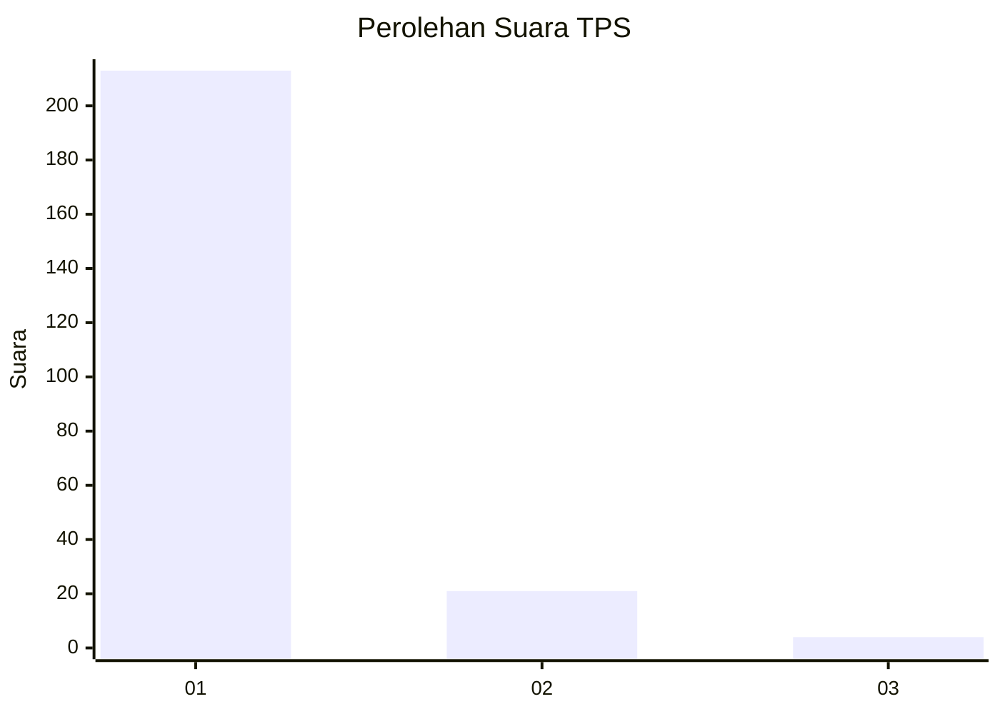
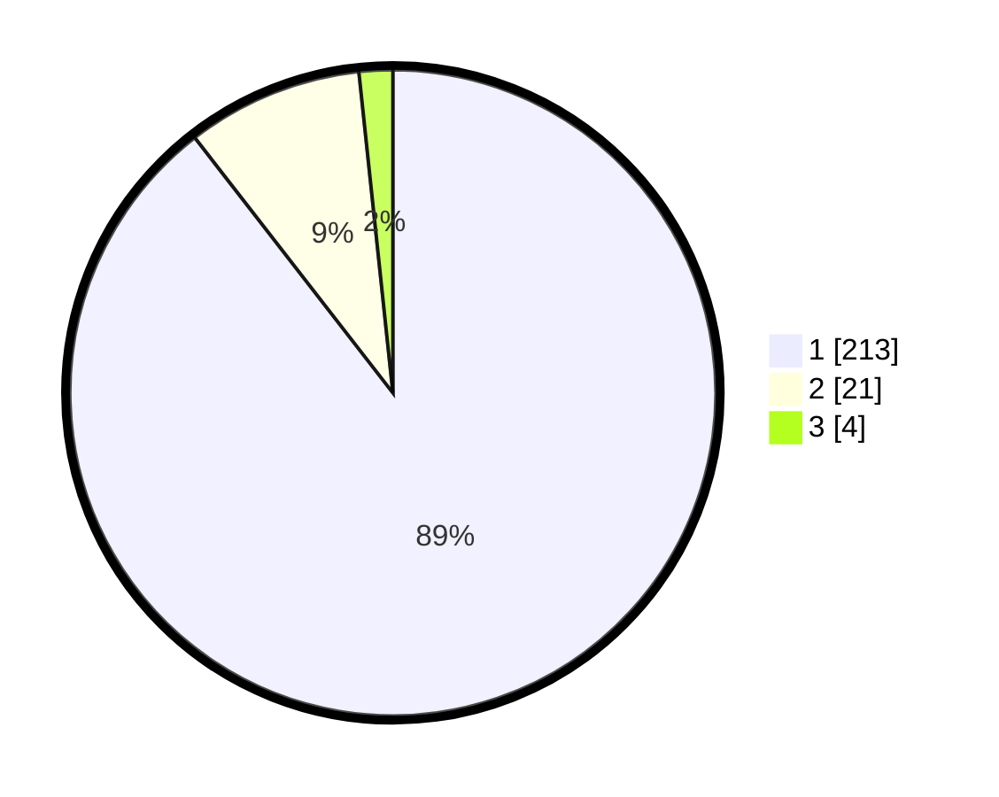

# Hasil

## Grafik

## Tabel

| No. | Nama Paslon    | Suara | Suara (raw) | Persentase |
|:--- |:-------------- | -----:| -----------:| ----------:|
| 1   | ANIES MUHAIMIN | 213   | [213][p-1]  | 89,50      |
| 2   | PRABOWO GIBRAN | 21    | [21][p-2]   | 8,82       |
| 3   | GANJAR MAHFUD  | 4     | [4][p-3]    | 1,68       |

[p-1]: https://github.com/gigit-pemilu/pemilu-2024-11-aceh/blob/main/pilpres/hitung-suara/sub/11-aceh/sub/08-aceh-utara/sub/06-muara-batu/sub/2005-cot-seurani/sub/001-tps/sub/paslon-1.txt
[p-2]: https://github.com/gigit-pemilu/pemilu-2024-11-aceh/blob/main/pilpres/hitung-suara/sub/11-aceh/sub/08-aceh-utara/sub/06-muara-batu/sub/2005-cot-seurani/sub/001-tps/sub/paslon-2.txt
[p-3]: https://github.com/gigit-pemilu/pemilu-2024-11-aceh/blob/main/pilpres/hitung-suara/sub/11-aceh/sub/08-aceh-utara/sub/06-muara-batu/sub/2005-cot-seurani/sub/001-tps/sub/paslon-3.txt

## Foto C Plano

https://sirekap-obj-formc.kpu.go.id/7b02/pemilu/ppwp/11/08/06/20/05/1108062005001-20240215-054537--125a22bc-9512-4079-a1f7-f438354a8db6.jpg

https://sirekap-obj-formc.kpu.go.id/7b02/pemilu/ppwp/11/08/06/20/05/1108062005001-20240215-054150--6989441d-22a1-47e4-aea1-e66f92d4eb2c.jpg

https://sirekap-obj-formc.kpu.go.id/7b02/pemilu/ppwp/11/08/06/20/05/1108062005001-20240215-054244--c2f1dd8f-7519-4dea-b637-a1d07219fa27.jpg

## Metadata

| Key        | Value               |
| ---------- | ------------------- |
| Time Stamp | 2024-02-17 01:00:00 |

