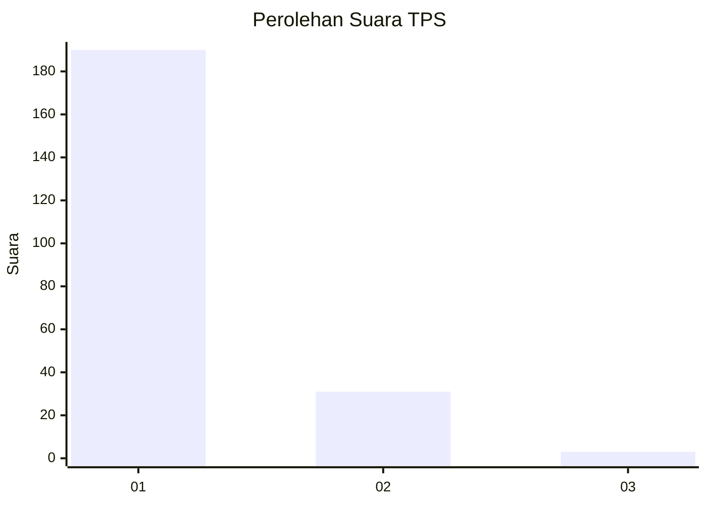
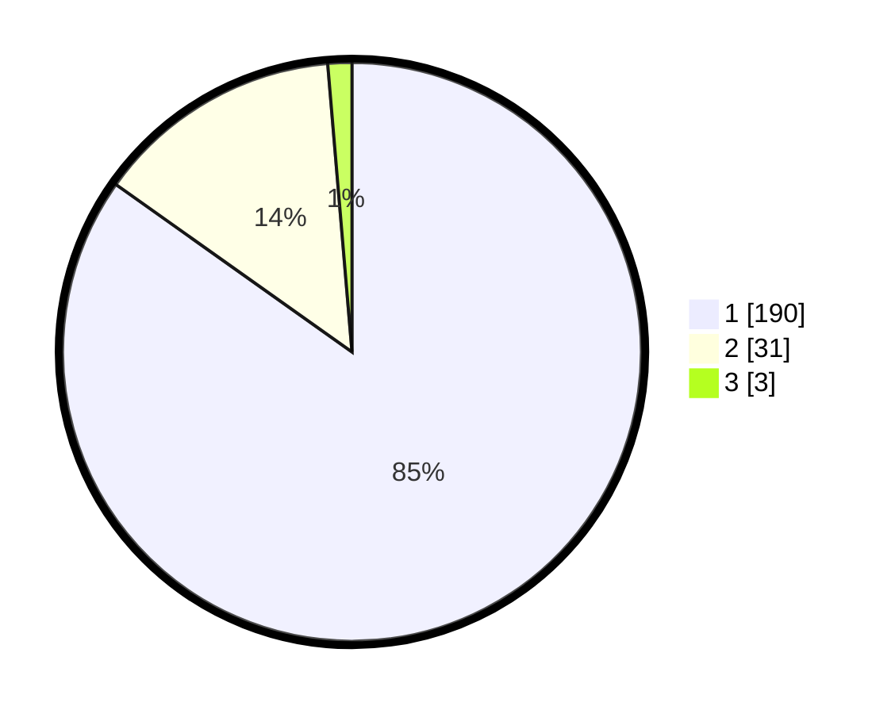

# Hasil

## Grafik

## Tabel

| No. | Nama Paslon    | Suara | Suara (raw) | Persentase |
|:--- |:-------------- | -----:| -----------:| ----------:|
| 1   | ANIES MUHAIMIN | 190   | [190][p-1]  | 84,82      |
| 2   | PRABOWO GIBRAN | 31    | [31][p-2]   | 13,84      |
| 3   | GANJAR MAHFUD  | 3     | [3][p-3]    | 1,34       |

[p-1]: https://github.com/gigit-pemilu/pemilu-2024-11-aceh/blob/main/pilpres/hitung-suara/sub/11-aceh/sub/08-aceh-utara/sub/06-muara-batu/sub/2005-cot-seurani/sub/002-tps/sub/paslon-1.txt
[p-2]: https://github.com/gigit-pemilu/pemilu-2024-11-aceh/blob/main/pilpres/hitung-suara/sub/11-aceh/sub/08-aceh-utara/sub/06-muara-batu/sub/2005-cot-seurani/sub/002-tps/sub/paslon-2.txt
[p-3]: https://github.com/gigit-pemilu/pemilu-2024-11-aceh/blob/main/pilpres/hitung-suara/sub/11-aceh/sub/08-aceh-utara/sub/06-muara-batu/sub/2005-cot-seurani/sub/002-tps/sub/paslon-3.txt

## Foto C Plano

https://sirekap-obj-formc.kpu.go.id/9e26/pemilu/ppwp/11/08/06/20/05/1108062005002-20240215-060637--81880347-0ad1-4a37-b838-22992a7831d5.jpg

https://sirekap-obj-formc.kpu.go.id/9e26/pemilu/ppwp/11/08/06/20/05/1108062005002-20240215-060727--66d0b67e-e800-41d9-bf88-84e159fad9c9.jpg

https://sirekap-obj-formc.kpu.go.id/9e26/pemilu/ppwp/11/08/06/20/05/1108062005002-20240215-060805--4782b8b3-a638-4616-a7d0-a903e85027a5.jpg

## Metadata

| Key        | Value               |
| ---------- | ------------------- |
| Time Stamp | 2024-02-15 15:30:25 |

