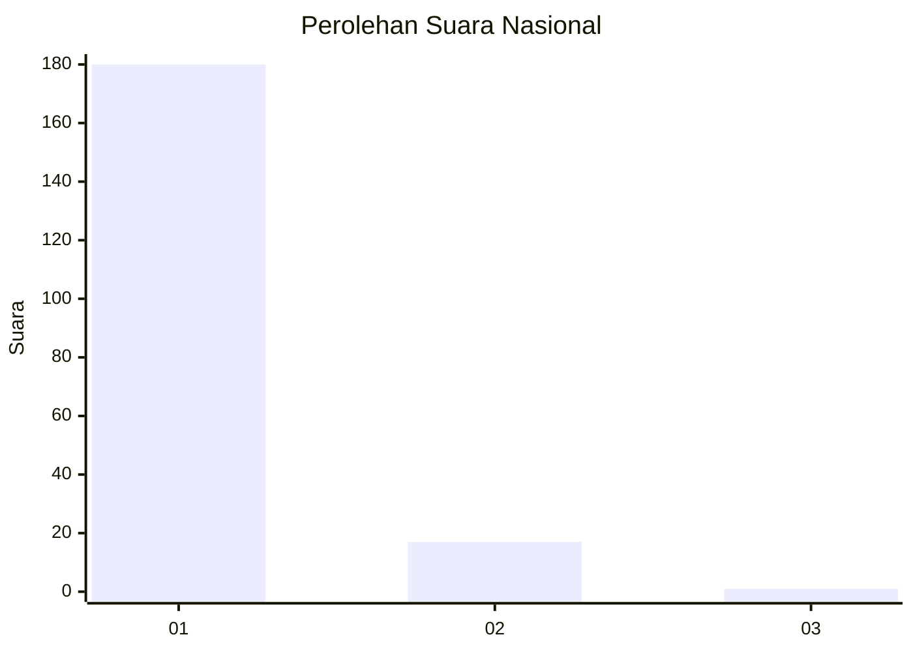
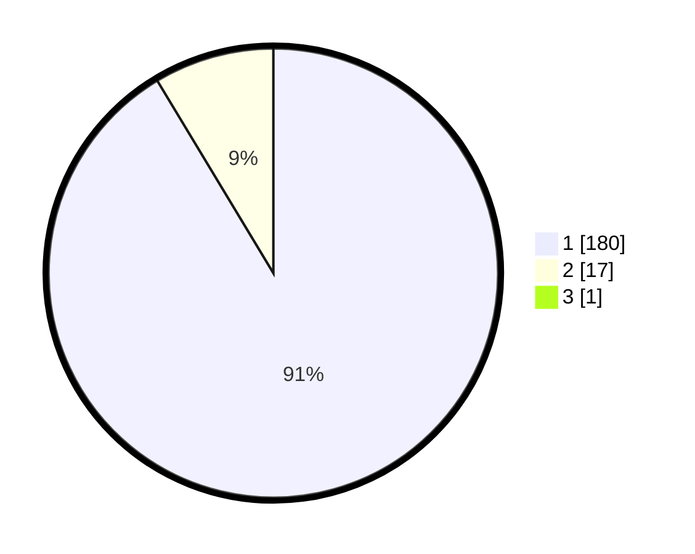

# Hasil

## Grafik

## Tabel

| No. | Nama Paslon    | Suara | Suara (raw) | Persentase |
|:--- |:-------------- | -----:| -----------:| ----------:|
| 1   | ANIES MUHAIMIN | 180   | [180][p-1]  | 90,91      |
| 2   | PRABOWO GIBRAN | 17    | [17][p-2]   | 8,59       |
| 3   | GANJAR MAHFUD  | 1     | [1][p-3]    | 0,51       |

[p-1]: https://github.com/gigit-pemilu/pemilu-2024/blob/main/pilpres/hitung-suara/sub/11-aceh/sub/08-aceh-utara/sub/06-muara-batu/sub/2005-cot-seurani/sub/003-tps/sub/paslon-1.txt
[p-2]: https://github.com/gigit-pemilu/pemilu-2024/blob/main/pilpres/hitung-suara/sub/11-aceh/sub/08-aceh-utara/sub/06-muara-batu/sub/2005-cot-seurani/sub/003-tps/sub/paslon-2.txt
[p-3]: https://github.com/gigit-pemilu/pemilu-2024/blob/main/pilpres/hitung-suara/sub/11-aceh/sub/08-aceh-utara/sub/06-muara-batu/sub/2005-cot-seurani/sub/003-tps/sub/paslon-3.txt

## Foto C Plano

https://sirekap-obj-formc.kpu.go.id/88a5/pemilu/ppwp/11/08/06/20/05/1108062005003-20240215-070842--0ecb41e1-e4ed-440b-96a7-534bf845887f.jpg

https://sirekap-obj-formc.kpu.go.id/88a5/pemilu/ppwp/11/08/06/20/05/1108062005003-20240215-071031--b520b337-539b-40ec-b620-e0c7f1553baa.jpg

https://sirekap-obj-formc.kpu.go.id/88a5/pemilu/ppwp/11/08/06/20/05/1108062005003-20240215-071243--d89e62a6-c845-44bc-855e-0844b5ba99cb.jpg

## Metadata

| Key        | Value               |
| ---------- | ------------------- |
| Time Stamp | 2024-02-17 01:00:00 |

