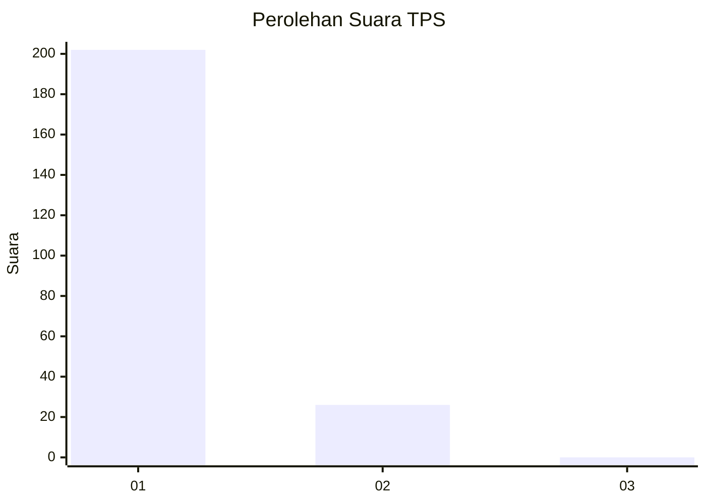
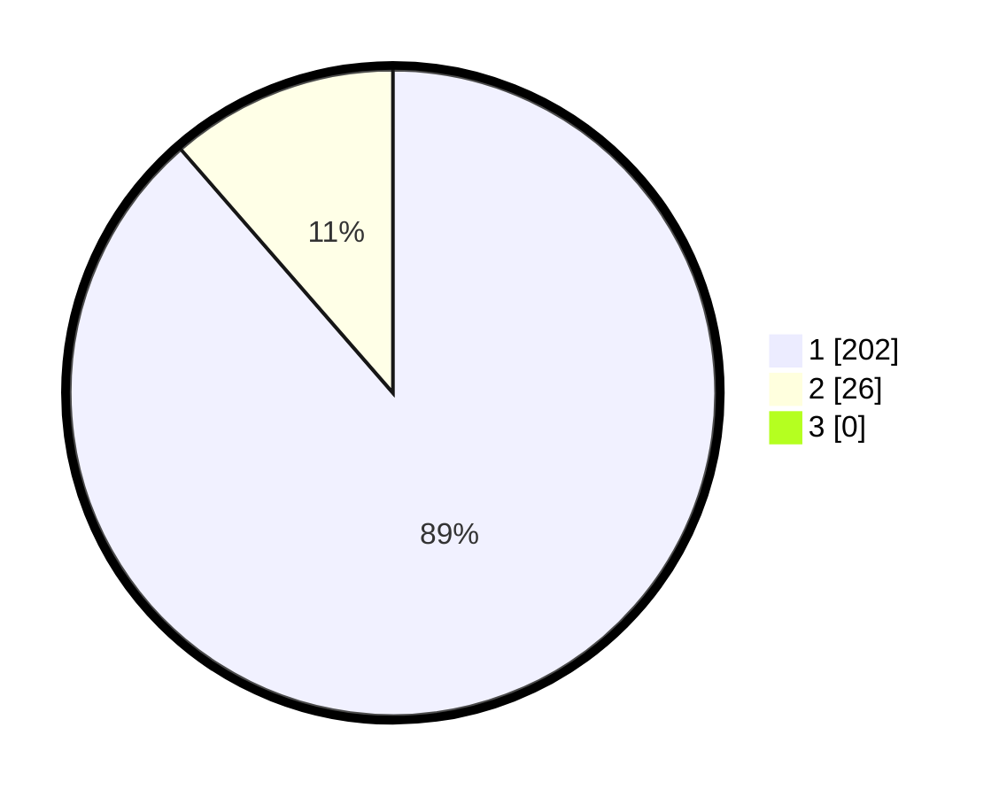

# Hasil

## Grafik

## Tabel

| No. | Nama Paslon    | Suara | Suara (raw) | Persentase |
|:--- |:-------------- | -----:| -----------:| ----------:|
| 1   | ANIES MUHAIMIN | 202   | [202][p-1]  | 88,60      |
| 2   | PRABOWO GIBRAN | 26    | [26][p-2]   | 11,40      |
| 3   | GANJAR MAHFUD  | 0     | [0][p-3]    | 0,00       |

[p-1]: https://github.com/gigit-pemilu/pemilu-2024-11-aceh/blob/main/pilpres/hitung-suara/sub/11-aceh/sub/08-aceh-utara/sub/06-muara-batu/sub/2005-cot-seurani/sub/004-tps/sub/paslon-1.txt
[p-2]: https://github.com/gigit-pemilu/pemilu-2024-11-aceh/blob/main/pilpres/hitung-suara/sub/11-aceh/sub/08-aceh-utara/sub/06-muara-batu/sub/2005-cot-seurani/sub/004-tps/sub/paslon-2.txt
[p-3]: https://github.com/gigit-pemilu/pemilu-2024-11-aceh/blob/main/pilpres/hitung-suara/sub/11-aceh/sub/08-aceh-utara/sub/06-muara-batu/sub/2005-cot-seurani/sub/004-tps/sub/paslon-3.txt

## Foto C Plano

https://sirekap-obj-formc.kpu.go.id/ee37/pemilu/ppwp/11/08/06/20/05/1108062005004-20240215-043139--2b46004a-f53c-424b-96a2-56953bff3c47.jpg

https://sirekap-obj-formc.kpu.go.id/ee37/pemilu/ppwp/11/08/06/20/05/1108062005004-20240215-043243--03b01ece-ba02-4060-a90e-c9ece65c93eb.jpg

https://sirekap-obj-formc.kpu.go.id/ee37/pemilu/ppwp/11/08/06/20/05/1108062005004-20240215-043342--3708791e-7e27-4b77-ab8e-d4d46362e8a7.jpg

## Metadata

| Key        | Value               |
| ---------- | ------------------- |
| Time Stamp | 2024-02-16 12:51:22 |

