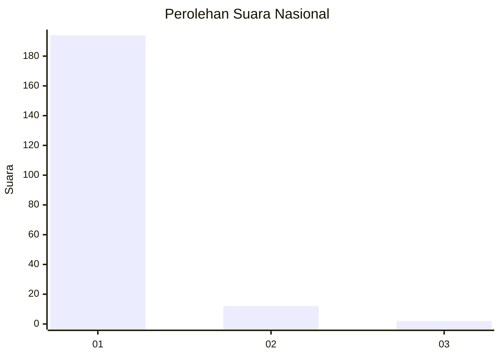
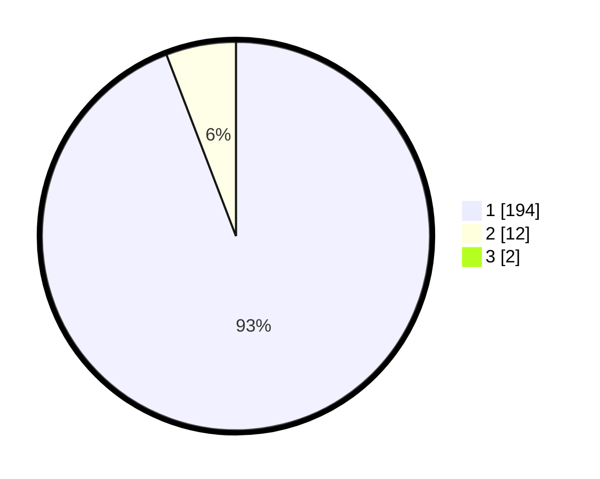

# Hasil

## Grafik

## Tabel

| No. | Nama Paslon    | Suara | Suara (raw) | Persentase |
|:--- |:-------------- | -----:| -----------:| ----------:|
| 1   | ANIES MUHAIMIN | 194   | [194][p-1]  | 93,27      |
| 2   | PRABOWO GIBRAN | 12    | [12][p-2]   | 5,77       |
| 3   | GANJAR MAHFUD  | 2     | [2][p-3]    | 0,96       |

[p-1]: https://github.com/gigit-pemilu/pemilu-2024/blob/main/pilpres/hitung-suara/sub/11-aceh/sub/08-aceh-utara/sub/06-muara-batu/sub/2005-cot-seurani/sub/006-tps/sub/paslon-1.txt
[p-2]: https://github.com/gigit-pemilu/pemilu-2024/blob/main/pilpres/hitung-suara/sub/11-aceh/sub/08-aceh-utara/sub/06-muara-batu/sub/2005-cot-seurani/sub/006-tps/sub/paslon-2.txt
[p-3]: https://github.com/gigit-pemilu/pemilu-2024/blob/main/pilpres/hitung-suara/sub/11-aceh/sub/08-aceh-utara/sub/06-muara-batu/sub/2005-cot-seurani/sub/006-tps/sub/paslon-3.txt

## Foto C Plano

https://sirekap-obj-formc.kpu.go.id/8e57/pemilu/ppwp/11/08/06/20/05/1108062005006-20240215-015517--0153f000-711f-44bb-92de-028d5fa1ddde.jpg

https://sirekap-obj-formc.kpu.go.id/8e57/pemilu/ppwp/11/08/06/20/05/1108062005006-20240215-015653--08ee0a35-3c70-479f-bd42-09a0970b1149.jpg

https://sirekap-obj-formc.kpu.go.id/8e57/pemilu/ppwp/11/08/06/20/05/1108062005006-20240215-015803--356ab108-7422-445c-b2b1-1de8479e1706.jpg

## Metadata

| Key        | Value               |
| ---------- | ------------------- |
| Time Stamp | 2024-02-17 01:00:00 |

