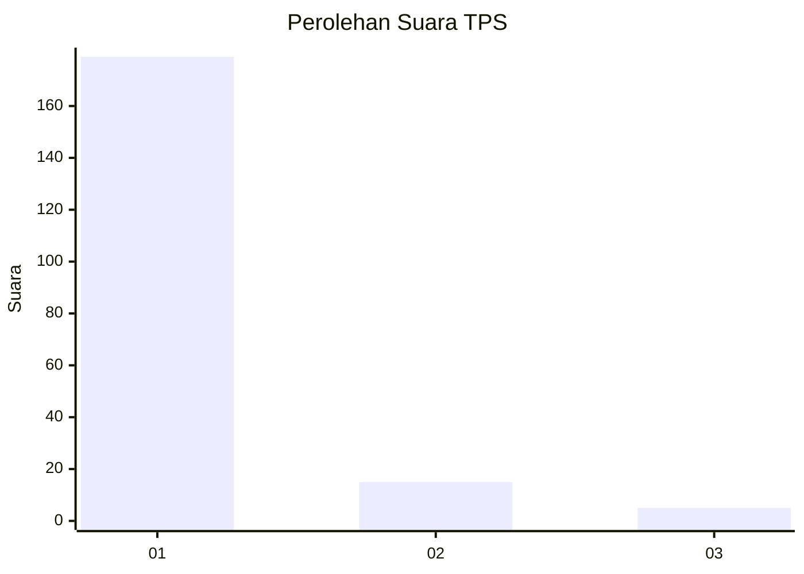
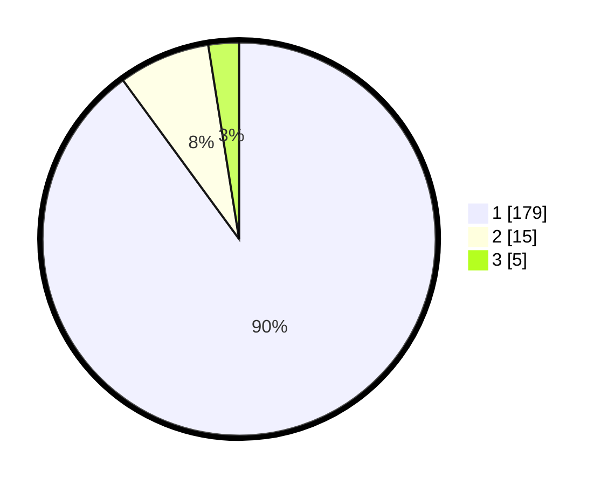

# Hasil

## Grafik

## Tabel

| No. | Nama Paslon    | Suara | Suara (raw) | Persentase |
|:--- |:-------------- | -----:| -----------:| ----------:|
| 1   | ANIES MUHAIMIN | 179   | [179][p-1]  | 89,95      |
| 2   | PRABOWO GIBRAN | 15    | [15][p-2]   | 7,54       |
| 3   | GANJAR MAHFUD  | 5     | [5][p-3]    | 2,51       |

[p-1]: https://github.com/gigit-pemilu/pemilu-2024-11-aceh/blob/main/pilpres/hitung-suara/sub/11-aceh/sub/08-aceh-utara/sub/06-muara-batu/sub/2006-mane-tunong/sub/001-tps/sub/paslon-1.txt
[p-2]: https://github.com/gigit-pemilu/pemilu-2024-11-aceh/blob/main/pilpres/hitung-suara/sub/11-aceh/sub/08-aceh-utara/sub/06-muara-batu/sub/2006-mane-tunong/sub/001-tps/sub/paslon-2.txt
[p-3]: https://github.com/gigit-pemilu/pemilu-2024-11-aceh/blob/main/pilpres/hitung-suara/sub/11-aceh/sub/08-aceh-utara/sub/06-muara-batu/sub/2006-mane-tunong/sub/001-tps/sub/paslon-3.txt

## Foto C Plano

https://sirekap-obj-formc.kpu.go.id/9bfb/pemilu/ppwp/11/08/06/20/06/1108062006001-20240215-112258--6e9d4c9b-71fc-4a2a-a23a-3813936d165c.jpg

https://sirekap-obj-formc.kpu.go.id/9bfb/pemilu/ppwp/11/08/06/20/06/1108062006001-20240215-112430--8d86afc9-cb41-4e00-b2c7-261ca18cb3b5.jpg

https://sirekap-obj-formc.kpu.go.id/9bfb/pemilu/ppwp/11/08/06/20/06/1108062006001-20240215-112726--db42f587-28da-47bd-a7a2-ab1466f576c5.jpg

## Metadata

| Key        | Value               |
| ---------- | ------------------- |
| Time Stamp | 2024-02-17 14:56:33 |

