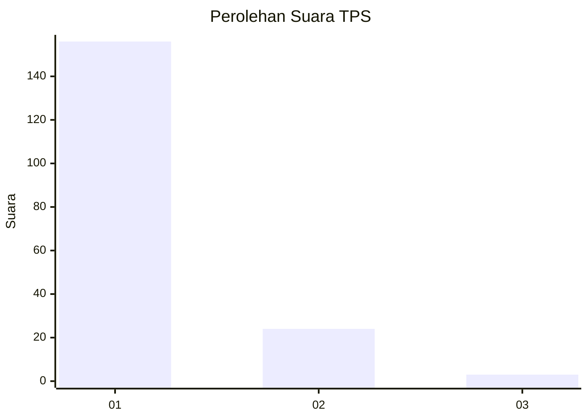
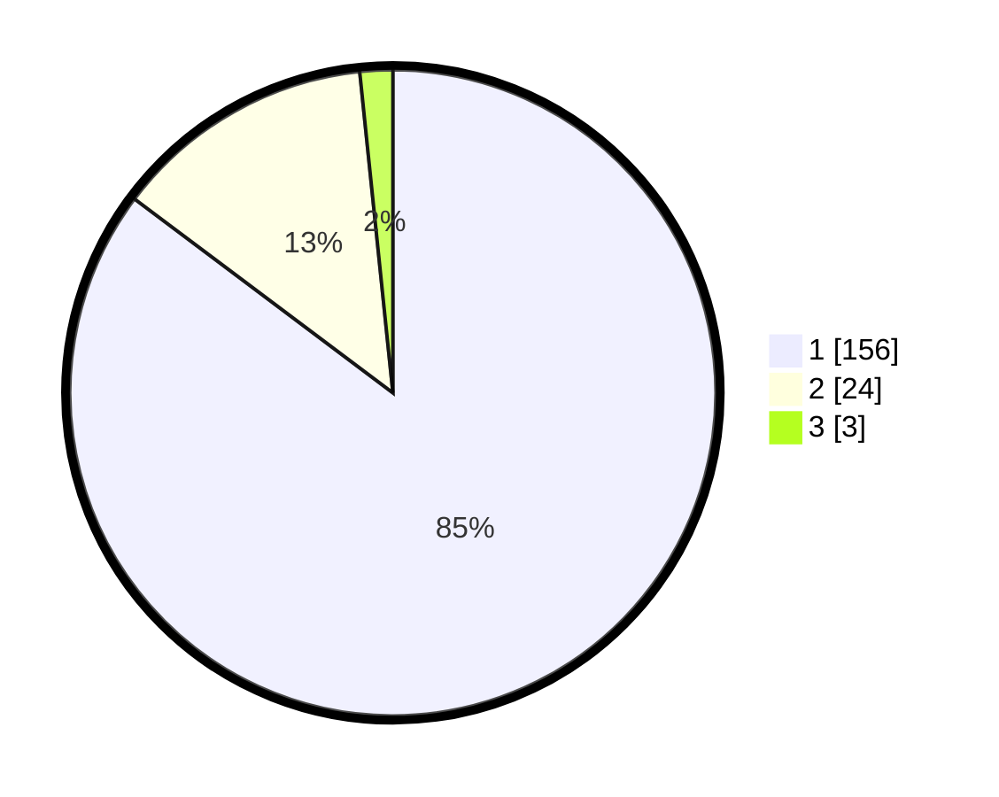

# Hasil

## Grafik

## Tabel

| No. | Nama Paslon    | Suara | Suara (raw) | Persentase |
|:--- |:-------------- | -----:| -----------:| ----------:|
| 1   | ANIES MUHAIMIN | 156   | [156][p-1]  | 85,25      |
| 2   | PRABOWO GIBRAN | 24    | [24][p-2]   | 13,11      |
| 3   | GANJAR MAHFUD  | 3     | [3][p-3]    | 1,64       |

[p-1]: https://github.com/gigit-pemilu/pemilu-2024-11-aceh/blob/main/pilpres/hitung-suara/sub/11-aceh/sub/08-aceh-utara/sub/06-muara-batu/sub/2006-mane-tunong/sub/005-tps/sub/paslon-1.txt
[p-2]: https://github.com/gigit-pemilu/pemilu-2024-11-aceh/blob/main/pilpres/hitung-suara/sub/11-aceh/sub/08-aceh-utara/sub/06-muara-batu/sub/2006-mane-tunong/sub/005-tps/sub/paslon-2.txt
[p-3]: https://github.com/gigit-pemilu/pemilu-2024-11-aceh/blob/main/pilpres/hitung-suara/sub/11-aceh/sub/08-aceh-utara/sub/06-muara-batu/sub/2006-mane-tunong/sub/005-tps/sub/paslon-3.txt

## Foto C Plano

https://sirekap-obj-formc.kpu.go.id/61ab/pemilu/ppwp/11/08/06/20/06/1108062006005-20240215-113415--a432a965-e011-47d5-83f1-958cb89c32d4.jpg

https://sirekap-obj-formc.kpu.go.id/61ab/pemilu/ppwp/11/08/06/20/06/1108062006005-20240215-114021--f9737c05-672e-43a0-9ca7-f48a3386f1c1.jpg

https://sirekap-obj-formc.kpu.go.id/61ab/pemilu/ppwp/11/08/06/20/06/1108062006005-20240215-114513--7c5219ed-9853-4c7b-8a7d-27d9c7b02dc0.jpg

## Metadata

| Key        | Value               |
| ---------- | ------------------- |
| Time Stamp | 2024-02-17 14:56:33 |

