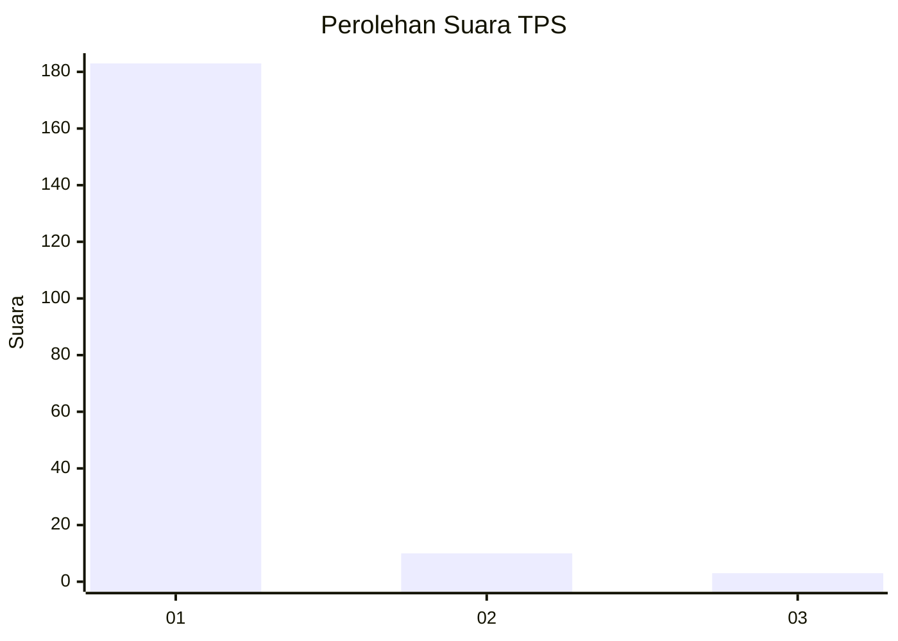
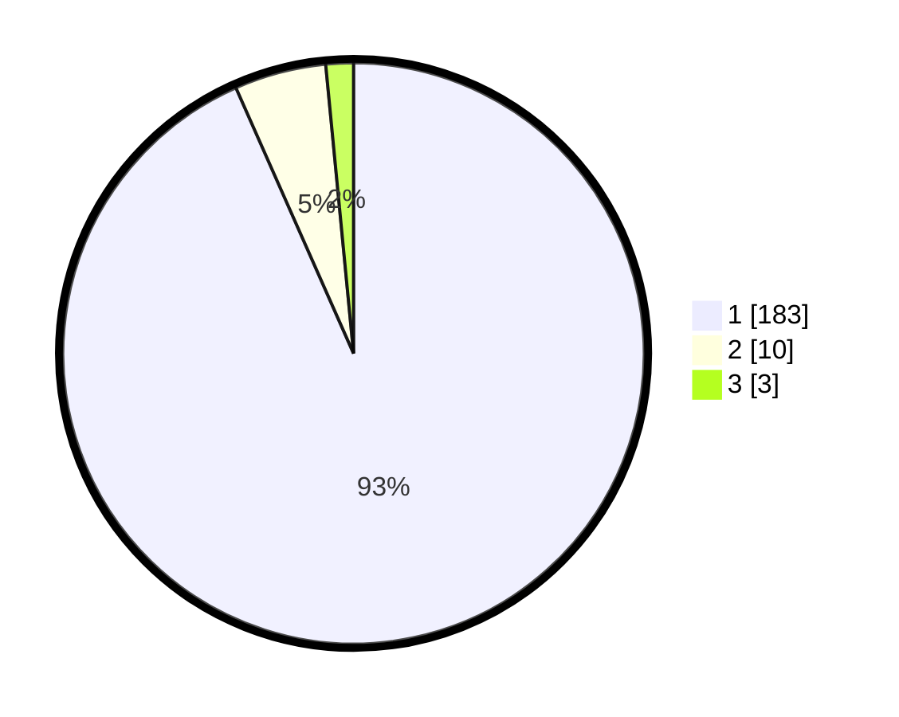

# Hasil

## Grafik

## Tabel

| No. | Nama Paslon    | Suara | Suara (raw) | Persentase |
|:--- |:-------------- | -----:| -----------:| ----------:|
| 1   | ANIES MUHAIMIN | 183   | [183][p-1]  | 93,37      |
| 2   | PRABOWO GIBRAN | 10    | [10][p-2]   | 5,10       |
| 3   | GANJAR MAHFUD  | 3     | [3][p-3]    | 1,53       |

[p-1]: https://github.com/gigit-pemilu/pemilu-2024-11-aceh/blob/main/pilpres/hitung-suara/sub/11-aceh/sub/08-aceh-utara/sub/06-muara-batu/sub/2006-mane-tunong/sub/006-tps/sub/paslon-1.txt
[p-2]: https://github.com/gigit-pemilu/pemilu-2024-11-aceh/blob/main/pilpres/hitung-suara/sub/11-aceh/sub/08-aceh-utara/sub/06-muara-batu/sub/2006-mane-tunong/sub/006-tps/sub/paslon-2.txt
[p-3]: https://github.com/gigit-pemilu/pemilu-2024-11-aceh/blob/main/pilpres/hitung-suara/sub/11-aceh/sub/08-aceh-utara/sub/06-muara-batu/sub/2006-mane-tunong/sub/006-tps/sub/paslon-3.txt

## Foto C Plano

https://sirekap-obj-formc.kpu.go.id/f7e8/pemilu/ppwp/11/08/06/20/06/1108062006006-20240215-021250--2f89bdff-c43f-47b8-af4d-1cf2959c80cf.jpg

https://sirekap-obj-formc.kpu.go.id/f7e8/pemilu/ppwp/11/08/06/20/06/1108062006006-20240215-021437--f7de60e7-5a6f-4671-aef2-fd49dda130cf.jpg

https://sirekap-obj-formc.kpu.go.id/f7e8/pemilu/ppwp/11/08/06/20/06/1108062006006-20240215-021528--45339d98-6d1c-4ebd-844d-2c1d6ceaee62.jpg

## Metadata

| Key        | Value               |
| ---------- | ------------------- |
| Time Stamp | 2024-02-17 14:56:33 |

