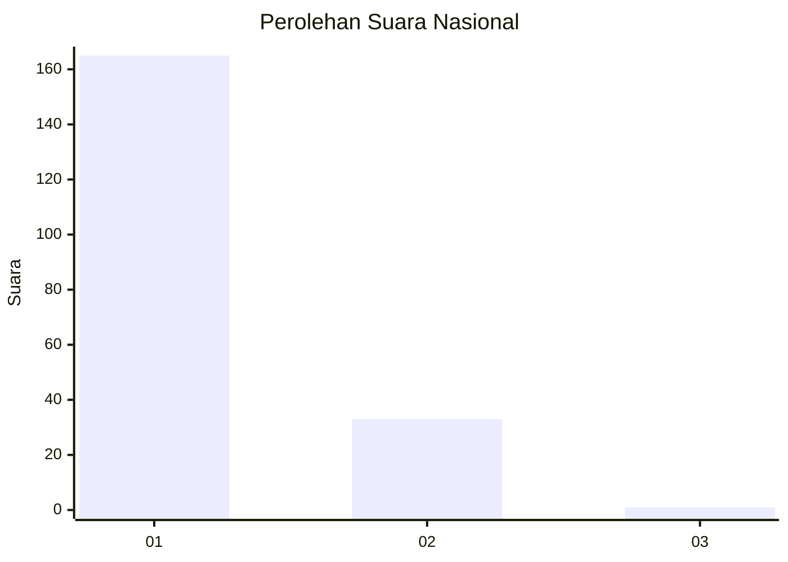
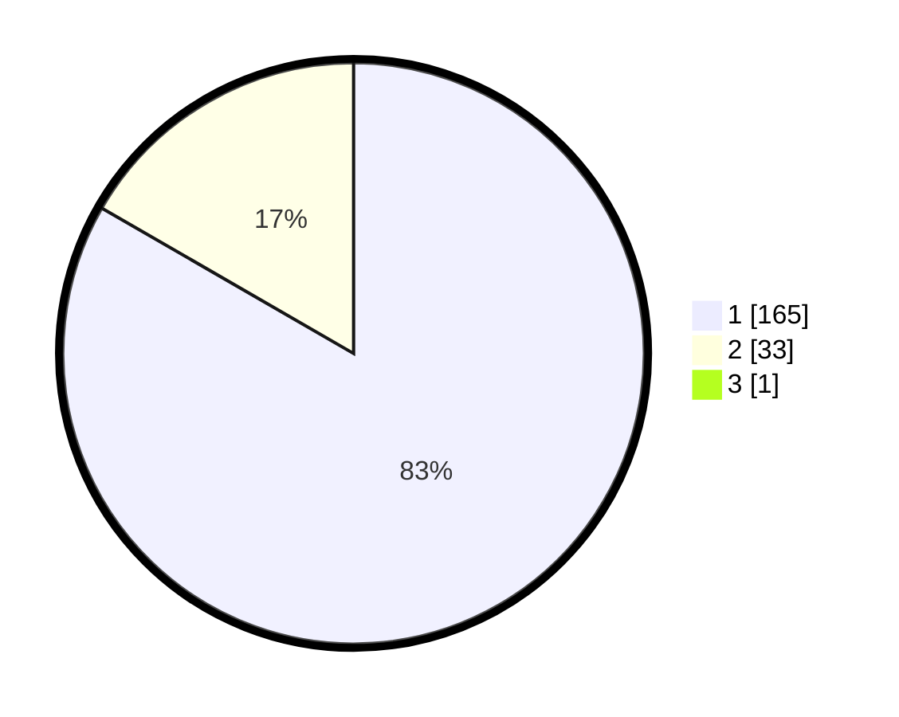

# Hasil

## Grafik

## Tabel

| No. | Nama Paslon    | Suara | Suara (raw) | Persentase |
|:--- |:-------------- | -----:| -----------:| ----------:|
| 1   | ANIES MUHAIMIN | 165   | [165][p-1]  | 82,91      |
| 2   | PRABOWO GIBRAN | 33    | [33][p-2]   | 16,58      |
| 3   | GANJAR MAHFUD  | 1     | [1][p-3]    | 0,50       |

[p-1]: https://github.com/gigit-pemilu/pemilu-2024/blob/main/pilpres/hitung-suara/sub/11-aceh/sub/08-aceh-utara/sub/06-muara-batu/sub/2007-kuala-dua/sub/001-tps/sub/paslon-1.txt
[p-2]: https://github.com/gigit-pemilu/pemilu-2024/blob/main/pilpres/hitung-suara/sub/11-aceh/sub/08-aceh-utara/sub/06-muara-batu/sub/2007-kuala-dua/sub/001-tps/sub/paslon-2.txt
[p-3]: https://github.com/gigit-pemilu/pemilu-2024/blob/main/pilpres/hitung-suara/sub/11-aceh/sub/08-aceh-utara/sub/06-muara-batu/sub/2007-kuala-dua/sub/001-tps/sub/paslon-3.txt

## Foto C Plano

https://sirekap-obj-formc.kpu.go.id/0b6a/pemilu/ppwp/11/08/06/20/07/1108062007001-20240215-151421--0fa3ad63-f28e-40de-bb1a-d1461829c9be.jpg

https://sirekap-obj-formc.kpu.go.id/0b6a/pemilu/ppwp/11/08/06/20/07/1108062007001-20240215-151744--ccc3071f-4835-4d47-8803-579b30921954.jpg

https://sirekap-obj-formc.kpu.go.id/0b6a/pemilu/ppwp/11/08/06/20/07/1108062007001-20240215-092520--c2fe810c-3bb6-4028-bb54-67ad1d9e4c33.jpg

## Metadata

| Key        | Value               |
| ---------- | ------------------- |
| Time Stamp | 2024-02-15 21:30:27 |

