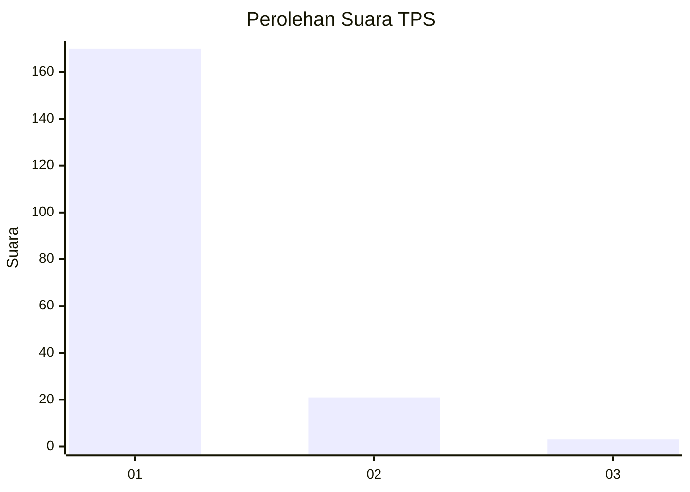
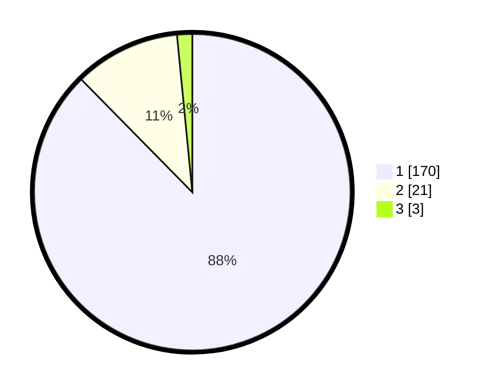

# Hasil

## Grafik

## Tabel

| No. | Nama Paslon    | Suara | Suara (raw) | Persentase |
|:--- |:-------------- | -----:| -----------:| ----------:|
| 1   | ANIES MUHAIMIN | 170   | [170][p-1]  | 87,63      |
| 2   | PRABOWO GIBRAN | 21    | [21][p-2]   | 10,82      |
| 3   | GANJAR MAHFUD  | 3     | [3][p-3]    | 1,55       |

[p-1]: https://github.com/gigit-pemilu/pemilu-2024-11-aceh/blob/main/pilpres/hitung-suara/sub/11-aceh/sub/08-aceh-utara/sub/06-muara-batu/sub/2007-kuala-dua/sub/002-tps/sub/paslon-1.txt
[p-2]: https://github.com/gigit-pemilu/pemilu-2024-11-aceh/blob/main/pilpres/hitung-suara/sub/11-aceh/sub/08-aceh-utara/sub/06-muara-batu/sub/2007-kuala-dua/sub/002-tps/sub/paslon-2.txt
[p-3]: https://github.com/gigit-pemilu/pemilu-2024-11-aceh/blob/main/pilpres/hitung-suara/sub/11-aceh/sub/08-aceh-utara/sub/06-muara-batu/sub/2007-kuala-dua/sub/002-tps/sub/paslon-3.txt

## Foto C Plano

https://sirekap-obj-formc.kpu.go.id/1141/pemilu/ppwp/11/08/06/20/07/1108062007002-20240215-113123--7d389d01-904f-435e-9eb6-3765e4a0439c.jpg

https://sirekap-obj-formc.kpu.go.id/1141/pemilu/ppwp/11/08/06/20/07/1108062007002-20240215-022208--5e172d7e-5df0-4a40-b063-3b0f06854e62.jpg

https://sirekap-obj-formc.kpu.go.id/1141/pemilu/ppwp/11/08/06/20/07/1108062007002-20240215-113149--2c2e25bd-5079-4f8d-8135-fd7e519d71db.jpg

## Metadata

| Key        | Value               |
| ---------- | ------------------- |
| Time Stamp | 2024-02-17 14:56:33 |

