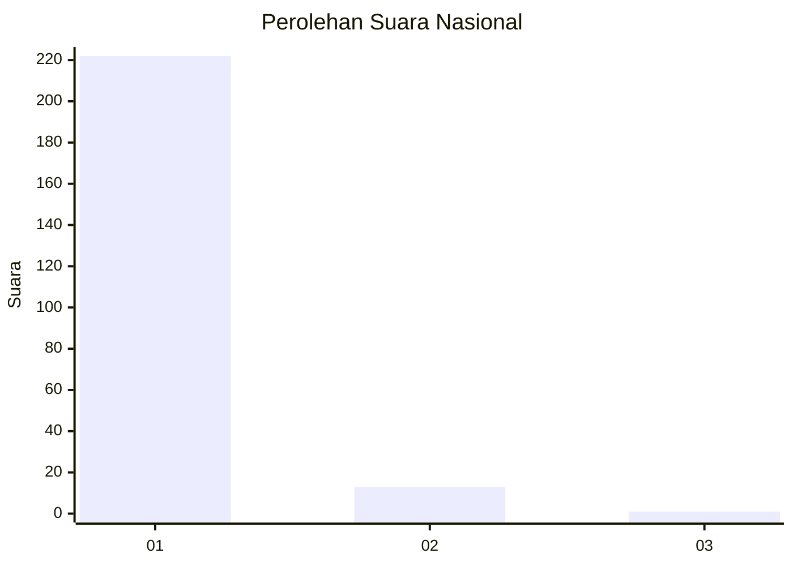
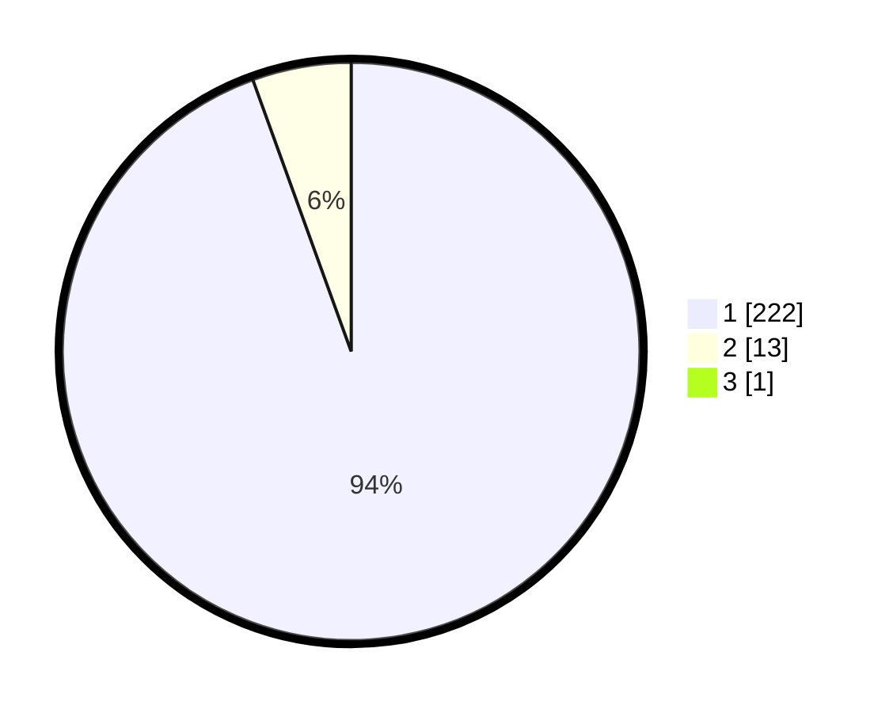

# Hasil

## Grafik

## Tabel

| No. | Nama Paslon    | Suara | Suara (raw) | Persentase |
|:--- |:-------------- | -----:| -----------:| ----------:|
| 1   | ANIES MUHAIMIN | 222   | [222][p-1]  | 94,07      |
| 2   | PRABOWO GIBRAN | 13    | [13][p-2]   | 5,51       |
| 3   | GANJAR MAHFUD  | 1     | [1][p-3]    | 0,42       |

[p-1]: https://github.com/gigit-pemilu/pemilu-2024/blob/main/pilpres/hitung-suara/sub/11-aceh/sub/08-aceh-utara/sub/06-muara-batu/sub/2009-keude-bungkaih/sub/002-tps/sub/paslon-1.txt
[p-2]: https://github.com/gigit-pemilu/pemilu-2024/blob/main/pilpres/hitung-suara/sub/11-aceh/sub/08-aceh-utara/sub/06-muara-batu/sub/2009-keude-bungkaih/sub/002-tps/sub/paslon-2.txt
[p-3]: https://github.com/gigit-pemilu/pemilu-2024/blob/main/pilpres/hitung-suara/sub/11-aceh/sub/08-aceh-utara/sub/06-muara-batu/sub/2009-keude-bungkaih/sub/002-tps/sub/paslon-3.txt

## Foto C Plano

https://sirekap-obj-formc.kpu.go.id/2204/pemilu/ppwp/11/08/06/20/09/1108062009002-20240215-104831--bc94b1d2-0b6d-40d1-b0f3-5d17c592738b.jpg

https://sirekap-obj-formc.kpu.go.id/2204/pemilu/ppwp/11/08/06/20/09/1108062009002-20240215-092938--5a1374e3-282f-430c-877c-4267aad96848.jpg

https://sirekap-obj-formc.kpu.go.id/2204/pemilu/ppwp/11/08/06/20/09/1108062009002-20240215-093044--f2bf77b4-1515-4967-b046-30f180e38cfc.jpg

## Metadata

| Key        | Value               |
| ---------- | ------------------- |
| Time Stamp | 2024-02-15 19:30:26 |

