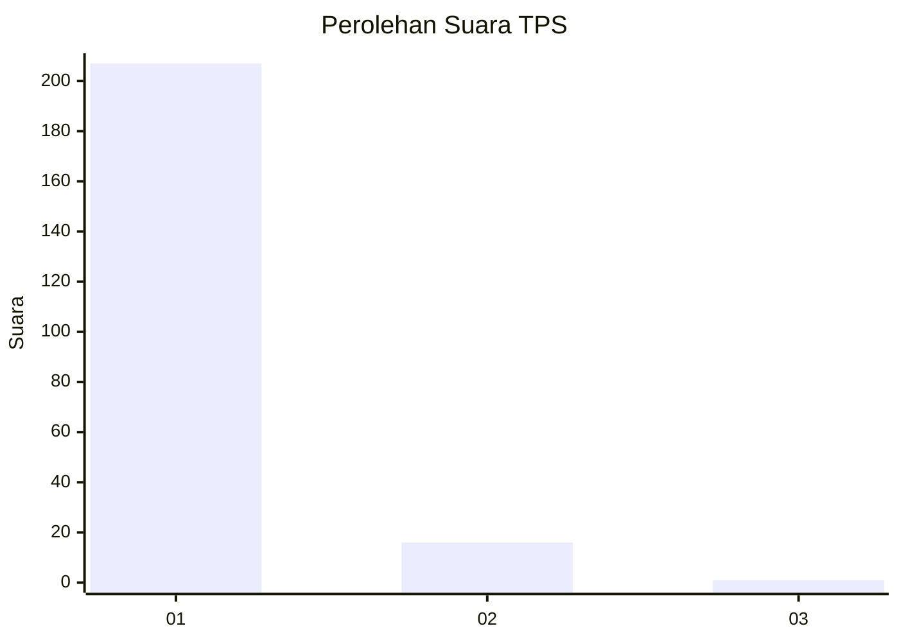
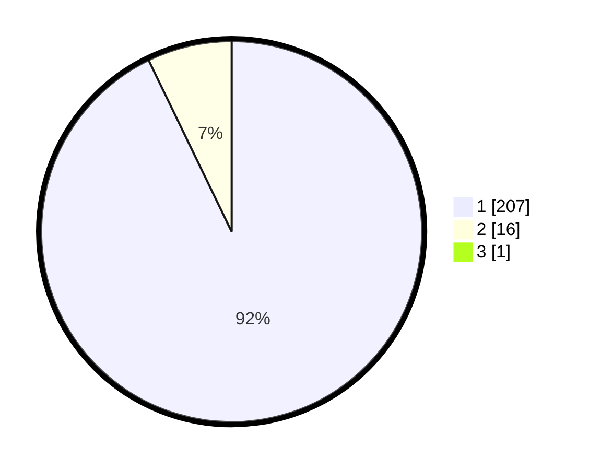

# Hasil

## Grafik

## Tabel

| No. | Nama Paslon    | Suara | Suara (raw) | Persentase |
|:--- |:-------------- | -----:| -----------:| ----------:|
| 1   | ANIES MUHAIMIN | 207   | [207][p-1]  | 92,41      |
| 2   | PRABOWO GIBRAN | 16    | [16][p-2]   | 7,14       |
| 3   | GANJAR MAHFUD  | 1     | [1][p-3]    | 0,45       |

[p-1]: https://github.com/gigit-pemilu/pemilu-2024-11-aceh/blob/main/pilpres/hitung-suara/sub/11-aceh/sub/08-aceh-utara/sub/06-muara-batu/sub/2010-kambam/sub/001-tps/sub/paslon-1.txt
[p-2]: https://github.com/gigit-pemilu/pemilu-2024-11-aceh/blob/main/pilpres/hitung-suara/sub/11-aceh/sub/08-aceh-utara/sub/06-muara-batu/sub/2010-kambam/sub/001-tps/sub/paslon-2.txt
[p-3]: https://github.com/gigit-pemilu/pemilu-2024-11-aceh/blob/main/pilpres/hitung-suara/sub/11-aceh/sub/08-aceh-utara/sub/06-muara-batu/sub/2010-kambam/sub/001-tps/sub/paslon-3.txt

## Foto C Plano

https://sirekap-obj-formc.kpu.go.id/a4c9/pemilu/ppwp/11/08/06/20/10/1108062010001-20240215-120249--55b97beb-2424-4414-8dda-ca9ca9b2105e.jpg

https://sirekap-obj-formc.kpu.go.id/a4c9/pemilu/ppwp/11/08/06/20/10/1108062010001-20240214-192107--72f9c570-104d-4fca-acc7-5ef73f238aad.jpg

https://sirekap-obj-formc.kpu.go.id/a4c9/pemilu/ppwp/11/08/06/20/10/1108062010001-20240214-200922--c521980f-1917-4821-ab84-0a1c452e29cf.jpg

## Metadata

| Key        | Value               |
| ---------- | ------------------- |
| Time Stamp | 2024-02-15 18:30:25 |

