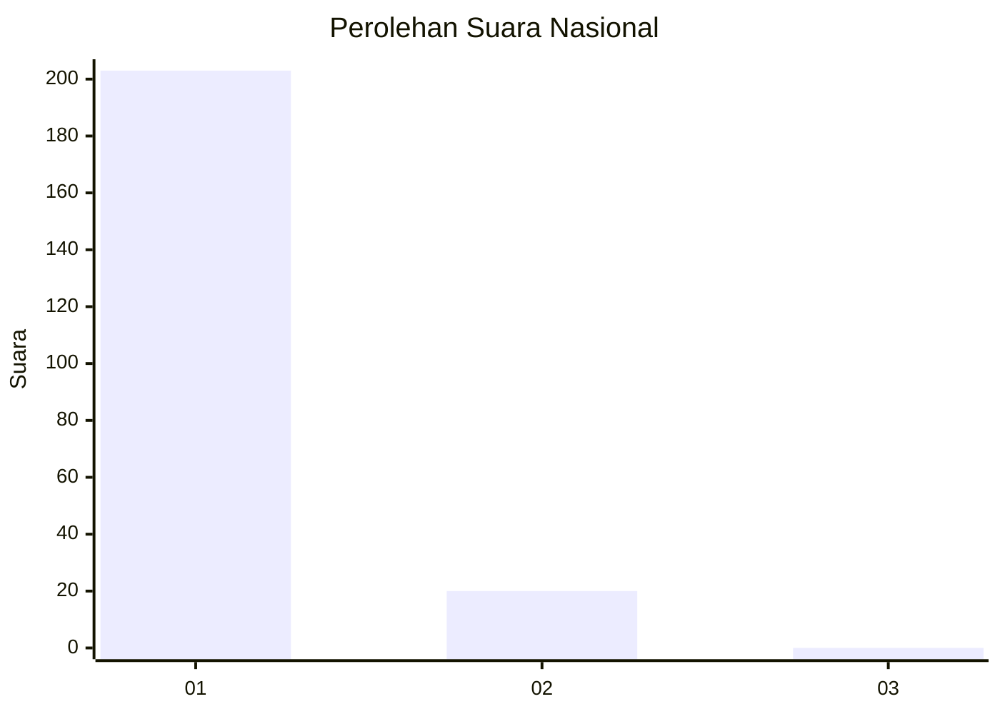
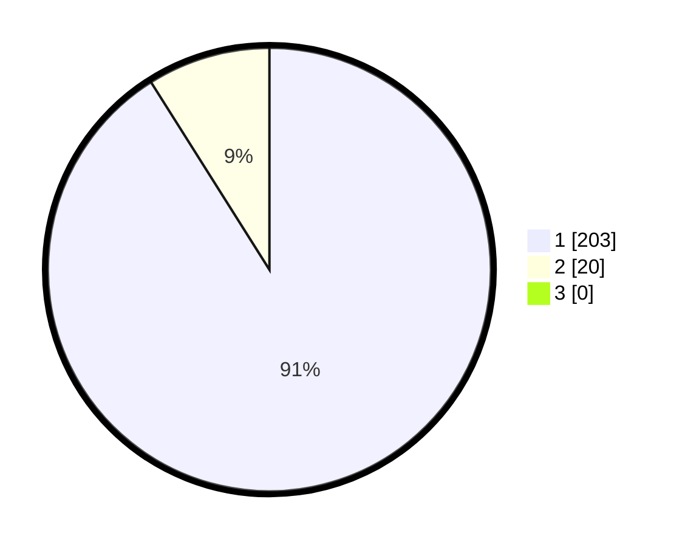

# Hasil

## Grafik

## Tabel

| No. | Nama Paslon    | Suara | Suara (raw) | Persentase |
|:--- |:-------------- | -----:| -----------:| ----------:|
| 1   | ANIES MUHAIMIN | 203   | [203][p-1]  | 91,03      |
| 2   | PRABOWO GIBRAN | 20    | [20][p-2]   | 8,97       |
| 3   | GANJAR MAHFUD  | 0     | [0][p-3]    | 0,00       |

[p-1]: https://github.com/gigit-pemilu/pemilu-2024/blob/main/pilpres/hitung-suara/sub/11-aceh/sub/08-aceh-utara/sub/06-muara-batu/sub/2010-kambam/sub/002-tps/sub/paslon-1.txt
[p-2]: https://github.com/gigit-pemilu/pemilu-2024/blob/main/pilpres/hitung-suara/sub/11-aceh/sub/08-aceh-utara/sub/06-muara-batu/sub/2010-kambam/sub/002-tps/sub/paslon-2.txt
[p-3]: https://github.com/gigit-pemilu/pemilu-2024/blob/main/pilpres/hitung-suara/sub/11-aceh/sub/08-aceh-utara/sub/06-muara-batu/sub/2010-kambam/sub/002-tps/sub/paslon-3.txt

## Foto C Plano

https://sirekap-obj-formc.kpu.go.id/8d45/pemilu/ppwp/11/08/06/20/10/1108062010002-20240215-054237--47aecd4d-b96c-42c2-8f69-e8cbdde3e3f1.jpg

https://sirekap-obj-formc.kpu.go.id/8d45/pemilu/ppwp/11/08/06/20/10/1108062010002-20240215-054341--5a92cc22-b04b-4ffb-922d-36da0471769d.jpg

https://sirekap-obj-formc.kpu.go.id/8d45/pemilu/ppwp/11/08/06/20/10/1108062010002-20240215-054439--fa100af7-591e-444a-8cf9-2c451af55208.jpg

## Metadata

| Key        | Value               |
| ---------- | ------------------- |
| Time Stamp | 2024-02-17 16:00:02 |

