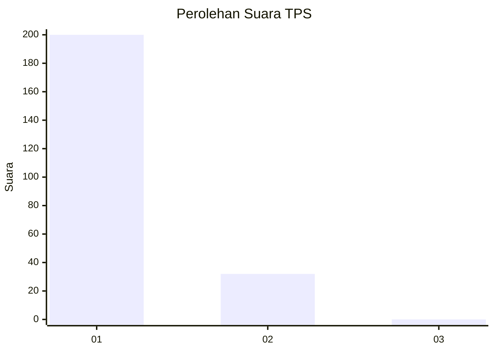
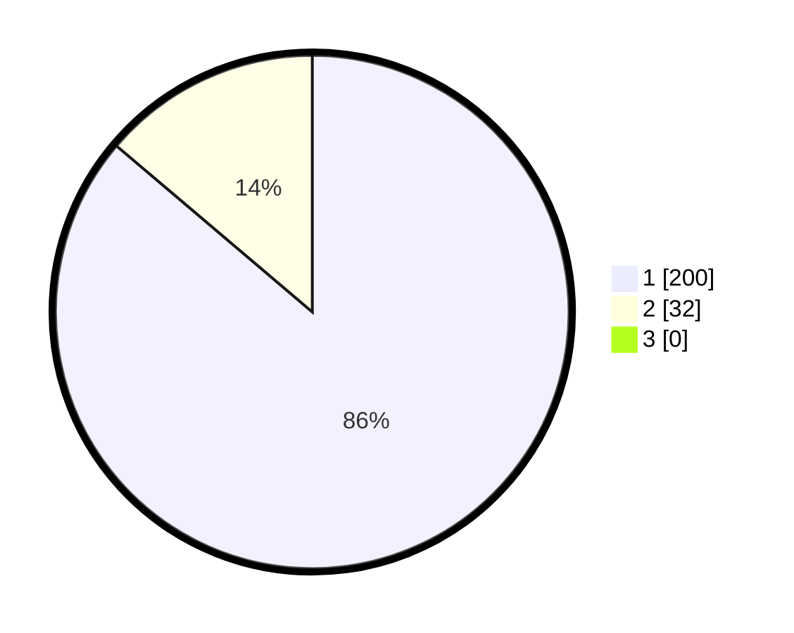

# Hasil

## Grafik

## Tabel

| No. | Nama Paslon    | Suara | Suara (raw) | Persentase |
|:--- |:-------------- | -----:| -----------:| ----------:|
| 1   | ANIES MUHAIMIN | 200   | [200][p-1]  | 86,21      |
| 2   | PRABOWO GIBRAN | 32    | [32][p-2]   | 13,79      |
| 3   | GANJAR MAHFUD  | 0     | [0][p-3]    | 0,00       |

[p-1]: https://github.com/gigit-pemilu/pemilu-2024-11-aceh/blob/main/pilpres/hitung-suara/sub/11-aceh/sub/08-aceh-utara/sub/06-muara-batu/sub/2011-meunasah-aron/sub/001-tps/sub/paslon-1.txt
[p-2]: https://github.com/gigit-pemilu/pemilu-2024-11-aceh/blob/main/pilpres/hitung-suara/sub/11-aceh/sub/08-aceh-utara/sub/06-muara-batu/sub/2011-meunasah-aron/sub/001-tps/sub/paslon-2.txt
[p-3]: https://github.com/gigit-pemilu/pemilu-2024-11-aceh/blob/main/pilpres/hitung-suara/sub/11-aceh/sub/08-aceh-utara/sub/06-muara-batu/sub/2011-meunasah-aron/sub/001-tps/sub/paslon-3.txt

## Foto C Plano

https://sirekap-obj-formc.kpu.go.id/9935/pemilu/ppwp/11/08/06/20/11/1108062011001-20240215-123935--4bb037f8-428c-4ffe-8a89-3d88bef12202.jpg

https://sirekap-obj-formc.kpu.go.id/9935/pemilu/ppwp/11/08/06/20/11/1108062011001-20240215-124044--4c6c6d66-9c2a-41df-9f59-feb565ebf580.jpg

https://sirekap-obj-formc.kpu.go.id/9935/pemilu/ppwp/11/08/06/20/11/1108062011001-20240215-124159--0c47742a-fcb0-4874-8374-5f7ed6ca95f3.jpg

## Metadata

| Key        | Value               |
| ---------- | ------------------- |
| Time Stamp | 2024-02-16 21:01:00 |

